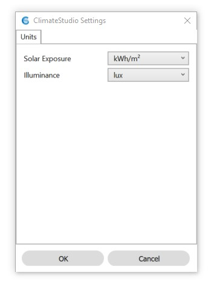

CS Settings
================================================
The CS settings panel is opened by typing  “CSSettings” on the Rhino command line.

Units
------------------------
**Solar Exposure** toggles radiation map results between kWh/m2 and kBTU/ft2 

**Illuminance** toggles point-in-time illumiance results between lux and foot candle. 

