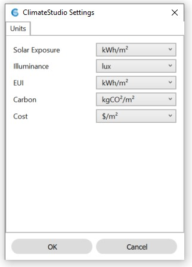

CS Settings
================================================
The CS settings panel is opened by typing  “CSSettings” on the Rhino command line.

Units
------------------------
**Solar Exposure** toggles radiation map results between kWh/m2 and kBTU/ft2 

**Illuminance** toggles point-in-time illumiance results between lux and foot candle

**EUI** toggles energy use intensity results in the thermal model results panel between kWh/m2 and kBTU/ft2

**Carbon** toggles greenhouse gas emissions in the thermal model results panel between kgCO2/m2 and lbCO2/ft2

**Cost** toggles operational energy costs in the thermal model results panel between $/m2 and $/ft2
 

