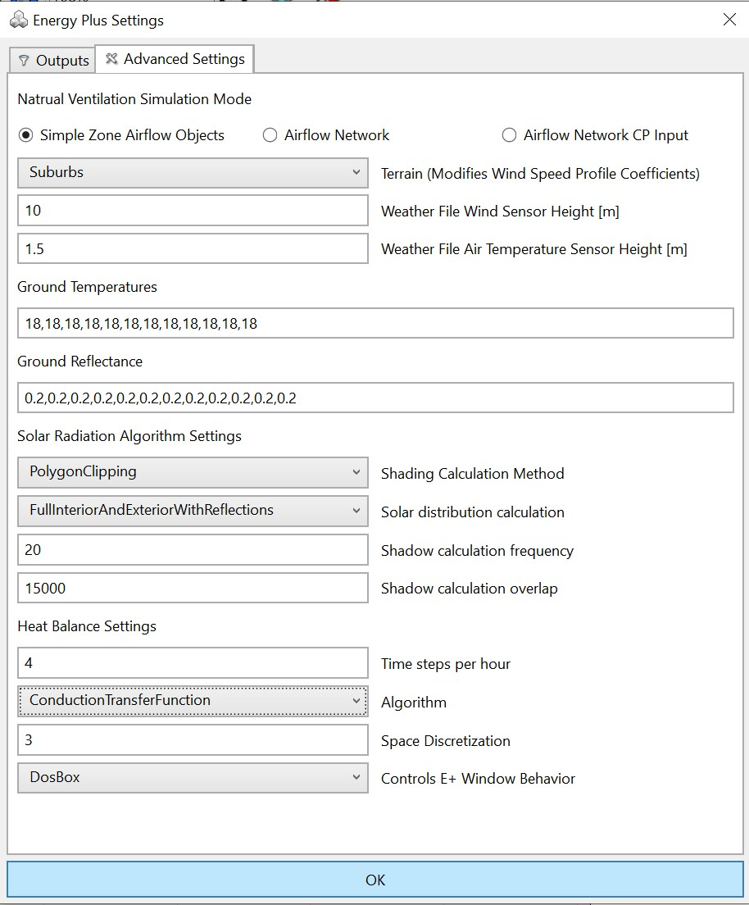

EnergyPlus Simulation Settings
================================================
This dialogue allows the user to set the start and end date of a simulation, as well as the time step at which the simulation results are being reported. EnergyPlus simulations are by default set to 4 times per hour (every 15 minutes). Results are usually saved at a one hour time steps and run through the whole calendar year. Changing these default settings causes the simulation results to not be displayed properly in the results panel.   

.. figure:: images/EnergyPlus.png
   :width: 600px
   :align: center

Advanced EnergyPlus Settings
---------------------------------
Users should consult the `EnergyPlus Engineering Reference`_ before adjusting any of the settings under the *Advanced Settings* tab. 

.. _EnergyPlus Engineering Reference: https://energyplus.net/documentation

**Natural Ventilation Simulation**
	ClimateStudio supports three modes of modeling natural airflow in buildings, simple airflow objects, airflow network and airflow network with CP input.

- `Simple airflow` This is the default meode in which zone air is only  exchanged with the outside and estimated based on empirical formulae that rely on window opening sizes and orientation vis-à-vis current wind direction.

- `Airflow network` In this mode multi-zone airflow between zones can be modeled and visualized as well.
 
- `Airflow network CP input`  In this mode the multi-zone airflow network further accepts externally calculated pressure coefficients for individual external windows in a model.

 
**Terrain | Weather file sensor height | Weather file air temperature**
	ClimateStudio applies a correction factor on wind speed and ambient temperature values from the EPW weather file based on these three parameters. 
 
**Ground Temperature**
	The 12 values (in oC) provided indicate the monthly mean ground temperatures below the building. These inputs are used by EnergyPlus for any zone surface that is set to `boundary condition ground`. It is assumed that the ground temperature stays constant for the duration of a month. For this input one should not use the monthly unperturbed ground temperatures provided in the EPW file. Instead, a widely used rule of thumb is to set monthly ground temperatures at 2 oC below the mean indoor temperature of the zone above the ground. 
 
**Ground Reflectance**
	Uniform monthly reflectance of the ground that is used for solar radiation and daylight calculations.

 
**Solar Radiation Algorithm Settings**
 
- `Shading Calculation Method` ClimateStudio supports two shading calculation methods. “PolygonClipping” calculates accurate shaded fractions by projecting shadow geometry. This algorithm is a legacy method and can be slow for complex geometries. “PixelCounting” computes shaded fraction by counting the number of pixels of a given surface from the position of the sun using computer graphics methods. [Hoover, J., & Dogan, T. (2017). Fast and Robust External Solar Shading Calculations using the Pixel Counting Algorithm with Transparency. Building Simulation,(August), 1083-1091.] If `PixelCounting` is selected and GPU hardware (or GPU emulation) is not available, a warning will be displayed and EnergyPlus will revert to PolygonClipping. Unlike PolygonClipping, PixelCounting has no limitations related to zone concavity when used with any “FullInterior” solar distribution options (i.e., it can accommodate both concave and convex zones equally). Use of the PixelCounting method requires some overhead in passing instructions between the CPU and the GPU. For low numbers of shading surfaces (less than about 200 for most hardware), PolygonClipping requires less runtime than PixelCounting. However, PixelCounting runtime scales significantly better at higher numbers of shading surfaces. Some computers have multiple GPUs. In this case, the highest performance GPU is not always used by default. You may want to select which GPU is used when running EnergyPlus by setting the graphics performance preferences on your computer.
 
- `Solar Distribution Calculation` This parameter sets how EnergyPlus attributes solar radiation incident on a zone to different zone surfaces. While this slows down the simulation, it is recommended to always use FulInterirorAndExteriorWithReflections in order to, for example, correctly capture solar radiation that is reflected form an interior floor into an interior zone through an interior window.
 
- `Shadow calculation frequency` Shadow calculation frequency determines how often the shaded fractions are recalculated. 1 = Every Day (slower but very accurate). 20 = Every 20 Days (faster and reasonably accurate).
 
- `Shading Calculation overlap` This numeric field will allow you to increase the number of figures in shadow overlaps in the PolygonClipping method. Due to the shadowing algorithm, the number of shadows in a figure may grow quite large even with fairly reasonable-looking structures. Of course, the inclusion of more allowed figures will increase calculation time. Likewise, too few figures may not result in as accurate calculations as you desire.
 
**Heat Balance Settings**
 
Time step per hour
	While EnergyPlus reports simulation results at a frequency of up to one hour, the simulation itself can actually run at lower times steps. E.g. a time step of 4 per hour indicates as simulation time step of 15 minutes.
 
Algorithm
	By default, EnergyPlus uses so-called `Conduction Transfer Functions` to calculate transient (thermal mass effect) heat flow between zones including time lag and dampening. A limitation of the method is that it only yields surface temperatures of construction assemblies. In order to better model thermal mass effects for thicker wall assemblies or for phase change materials, the `Conduction Finite Difference` method can also be chosen which divides a construction assembly  into slices and calculates temperatures at each time step at all of these points within a construction. `Conduction  FiniteDifference` takes longer to calculate but is considered to be more accurate.  
 
Space Discretization
	This field controls how the model determines spatial discretization or the count of nodes across each material layer in the construction. The model calculates the nominal distance associated with a node, ∆x, using ∆x = √ Cα∆t Where α is the thermal diffusivity of the material layer, in m2/s ∆t is the length of the timestep in seconds. C is a constant set by this field. The default is 3. Typical values are from 1 to 3. Lower values for this constant lead to more nodes and finer-grained space discretization.
 
Controls E+ Window Behavior
	The user may select for the DOS window which executes EnergyPlus to be visible or not. The advantage of seeing the window is that it becomes apparent whether the simulation actually started successfully or not. For an annual calculation, the current simulation date is displayed and updated regularly, allowing the user to gage how long the calculation may take. 

