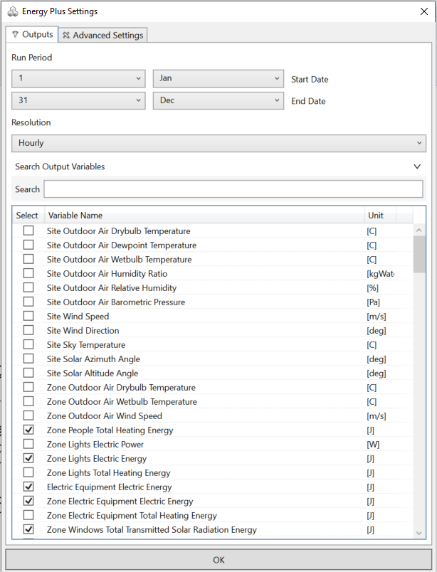

EnergyPlus Simulation Settings
================================================
This dialogue allows the user to set the start and end date of a simulation, as well as the time step at which the simulation results are being reported. EnergyPlus simulations are by default set to 4 times per hour (every 15 minutes). Results are usually saved at a one hour time steps and run through the whole calendar year. Changing these default settings causes the simulation results to not be displayed properly in the results panel.   

Users should consult the `EnergyPlus Engineering Reference`_ before adjusting any of the settings under the *Advanced Settings* tab. 

.. _EnergyPlus Engineering Reference: https://energyplus.net/documentation