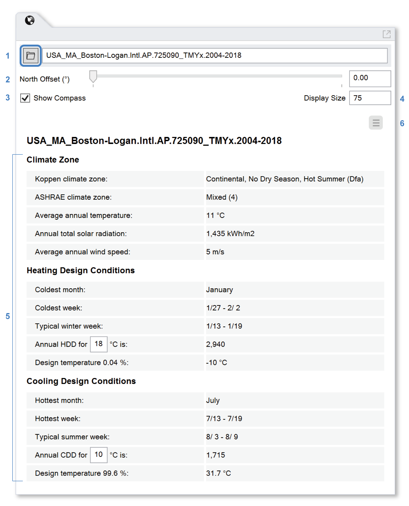

Location
================================================
The Location panel is used to specify the site's geolocation and weather data, based on the closest available weather file. ClimateStudio uses Typical Meteorological Year (TMY) weather files, which contain measured hourly data for a variety of physical quantities that are required for environmental performance analysis, including direct and diffuse solar radiation, temperature, relative humidity, and wind speed and direction.

.. _EPW: https://energyplus.net/weather/simulation

  
To choose a weather file, click the Browse Files button (1), which launches a `Weather Browser`_ containing over 30,000 TMY files.

.. _Weather Browser: searchWeather.html

The selected file will be used by ClimateStudio's simulation workflows when referencing weather conditions and sun angles. By default, ClimateStudio assumes the site's North arrow lies along Rhino's positive y-axis, but this can be adjusted using the **North Offset** control (2). A **compass** indicating the current direction will appear in the lower right corner of the Rhino viewport. It can be hidden (3) or resized (4).
 

Climate Summary
----------------------------------------------------
Below the weather and compass settings is a climate summary table (5), which includes climate type classifications and typical/extreme heating and cooling design conditions for the selected weather file. Note that the accuracy of this summary depends entirely on the weather file's contents. 

- **Köppen Climate Zone** is based on the *Köppen climate classification*, which divides the climate into five main groups, then into various subgroups based on temperature and seasonal patterns. 
- **ASHRAE climate zone** is based on *ASHRAE standard 169* which classifies climate data into nine climate zones, labeled 0 Extreme hot to 8 Extreme cold, based on annual heating and cooling degree days.
- **Average annual temperature** is the annual average dry bulb temperature. 
- **Annual total solar radiation** is the cumulative global horizontal irradiation.  
- **Coldest/Hottest Month** are calculated using the average dry bulb temperature of each month. 
- **Coldest/Hottest/Typical Week** are taken from the header of the climate file. 
- **Annual HDD/CDD** are *Heating Degree Days* and *Cooling Degree Days* which are calculated as the sum of the negative or positive difference between the target temperature and the daily average dry bulb temperature. 

To copy the climate summary to the clipboard or switch unit systems, use the menu (6).
