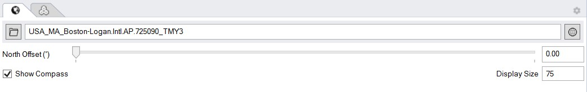

Location
================================================
The location subpanel is used to specify the position of the site on earth by selecting the closest available typical meteorological year (TMY) weather file. 
A TMY file contains hourly measured data for a variety of physical quantities that are required for an environmental performance analysis, 
including direct and diffuse solar radiation, temperature and relative humidity levels as well as wind speed and direction.  

**North Offset:** By default, North is along the positive y-axis. To adjust the North direction, use the slider or manually enter an angle.

**Show Compass:** Toggle to show the North arrow

**Display size:** Changes the relative size of the North arrow compared to other scene objects

The default site is the Boston, Logan International Airport. 
To select another file, left-click on the file selector icon next to the name of the current TMY file. A `search dialog`_ should pop up. 

Climate Summary
----------------------------------------------------
A summary of the climate selected is displayed on this page. Note that the accuracy of this summary entirely depends on the climate file selected. 

- **Koppen Climate Zone** is based on the **Köppen climate classification** which divides the climate into five main groups, then into various subgroups based on temperature and seasonal patterns. 
- **ASHRAE climate zone** is based on **ASHRAE standard 169** which classifies climate data into nine climate zones, labeled 0 Extreme hot to 8 Extreme cold, based on annual heating and cooling degree days.
- **Average annual temperature** is the annual average dry bulb temperature. 
- **Annual total solar radiation** is the sum of global horizontal irradiance.  
- **Coldest/Hottest Month** are calculated through the average dry bulb tempearture of each month. 
- **Coldest/Hottest/Typical Week** are taken from the headers of the climate file. 
- **Annual HDD/CDD** are **Heating Degree Days** and **Cooling Degree Days** which are calculated as the sum of the negative or positive difference between the target tempearture and the daily average dry bulb temperature. 

Click on the Menu button to **Copy Climate Summary Text to ClipBoard** or switch between **Unit Systems**

Climate File Formats
----------------------------------------------------
ClimateStudio uses the widely used `EnergyPlus weather file format`_ (file extension EPW). EPW files are available for thousands of sites worldwide and can be downloaded from the following websites. 

- `Department of Energy EPW files`_ 
- `Climate.OneBuilding.org`_ 

.. _EnergyPlus weather file format: https://energyplus.net/weather/simulation

.. _Department of Energy EPW files: https://energyplus.net/weather

.. _Climate.OneBuilding.org: http://climate.onebuilding.org/

.. _search dialog: searchWeather.html