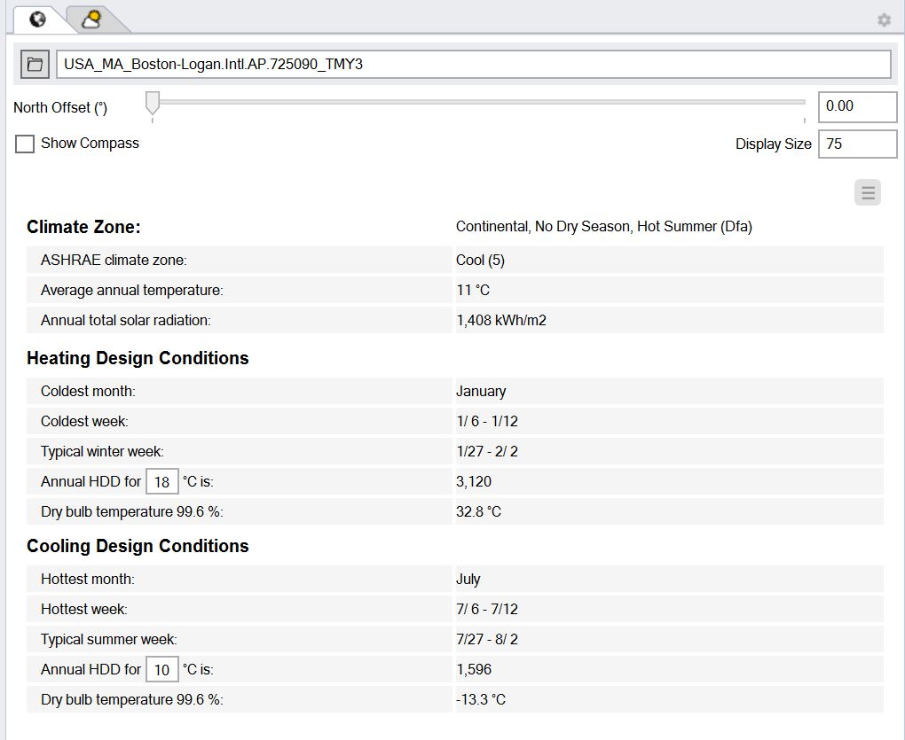

Location
================================================
The location subpanel is used to select the site position of earth via a typical meteorological year (TMY). A TMY contains hourly measured data for a variety of environmental variables that are requires for a environmental performance analysis such as direct and diffuse solar radiation, temperature and relative humidity levels as well as wind speed and direction. 

ClimateStudio uses the widely used `EnergyPlus weather file format`_ (file extension EPW). EPW files are available for thousands of sites worldwide and can be downloaded from the following web sites. 

- `Department of Energy EPW files`_ 
- `Climate.OneBuilding.org`_ 

.. _EnergyPlus weather file format: https://energyplus.net/weather/simulation

.. _Department of Energy EPW files: https://energyplus.net/weather

.. _Climate.OneBuilding.org: http://climate.onebuilding.org/

**North Offset:** Be default North is along the positive y-axis. To see the direction of North use the slider or manually enter an angle.

**Show Compass:** Toggle to show the North arrow

**Display size:** Changes the relative size of the North arrow compared to other scene objects
