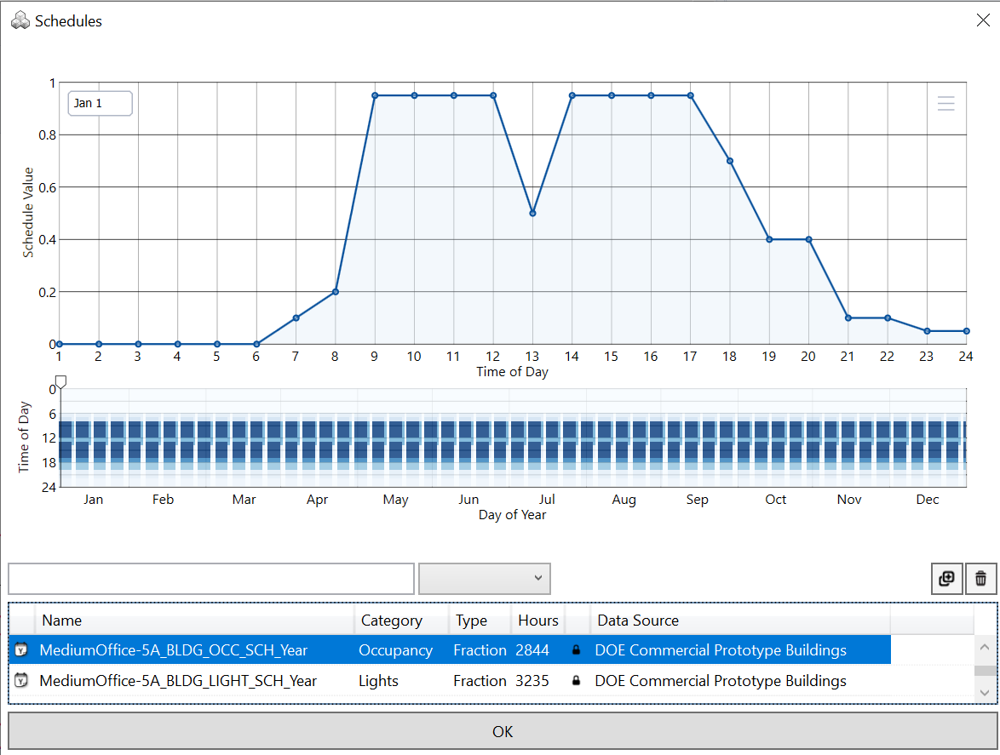
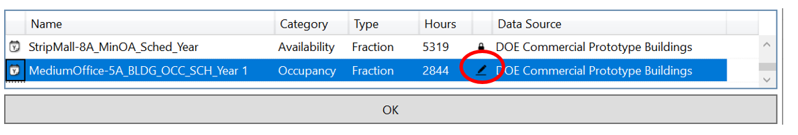
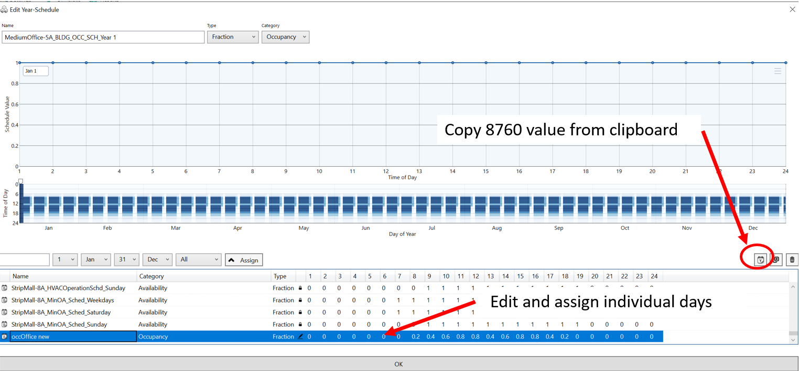

Schedule Editor
================================================

The Schedule Editor is used to view, select and edit schedules for a variety of inputs that consist of hourly time series such as internal loads from people, equipment and lighting or temperature set points.
The figure below shows the default occupancy schedule for the US DOOE Medium Office.  The top graph shows the hourly schedule for the first day of the year. The lower graph shows the schedule for all hours in the year. Clearly visible is the high occupancy on weekdays from 8am to 6pm, with a lunch period from noon until 2pm. A schedule value of 0.5 at 1pm on weekdays shows that half of the occupants are at lunch at that time. Between the weekdays, the weekends with markedly lower occupancy are clearly visible.

   
Schedules that come with the ClimateStudio library are locked. To modify a schedule, create a copy and rename it. Select the edit icon to modify the new schedule (see image below).

   
As shown below, annual schedules can be edited in two ways:

- Based on individual days that can then be assigned to any particular day in the year or to all weekdays/weekends, etc. Same as for annual schedules, to modify a day schedule, create a copy of an existing day schedule and modify the 24 hours values for the day as needed. 

- Another option is to import a custom series of 8760 values from the clipboard. 

