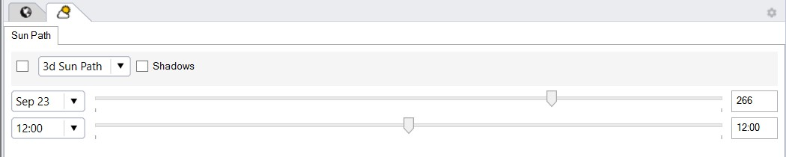
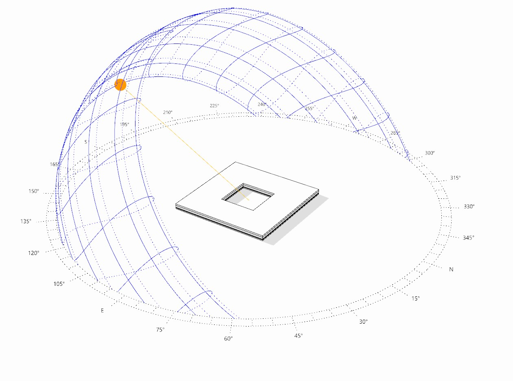

Sun Path
================================================

2D Sun Path
----------------------------------------------------

The sun path subpanel controls how the current sun position and the 3D sun path diagram are displayed in the Rhino viewport. 

The projection from 3D to 2D can be changed from **Angular** to **Hemispheric** or **Stereographic** through the drop down menu. 

3D Sun Path
----------------------------------------------------

The toggle changes the Rhino viewport from its current setting to a ClimateStudio-specific render mode that shows the different 3D Sun Path elements as well as 
the shadow created by all scene objects on the ground and neighboring objects. 

*Example 3D Sun Path on winter solstice at noon in Boston*

The 3D Sun Path diagram is highly customizable:

- **Show Annual Sun:** Shows the position of the sun on key days in the year, such as winter/summer solstice and equinox days.
- **Show Annual Sun Path Analemmas:** Shows the position of the sun at the same time of day throughout the year.
- **Show Compass:** Toggles the compass on the ground plane on or off.
- **Show Sun Position:** Shows the current sun position in the 3D Sun Path.
- **Show Sun Ray:** Displays a ray from the current sun position to the center of the 3D Sun Path.
- **Show Day Sun Path:** Shows the position of the sun for the current day.
- **Render Ground Plane:** Displays shadows of scene objects on the ground plane (z-coordinate=0).

**Position:** Sets the center of the 3D Sun Path

**Radius:** Sets the radius of the 3D Sun Path in model units

*Date* and *time of day* can be set using the slider option, using preset dates and times or by manually entering the Julian date or time of day.

