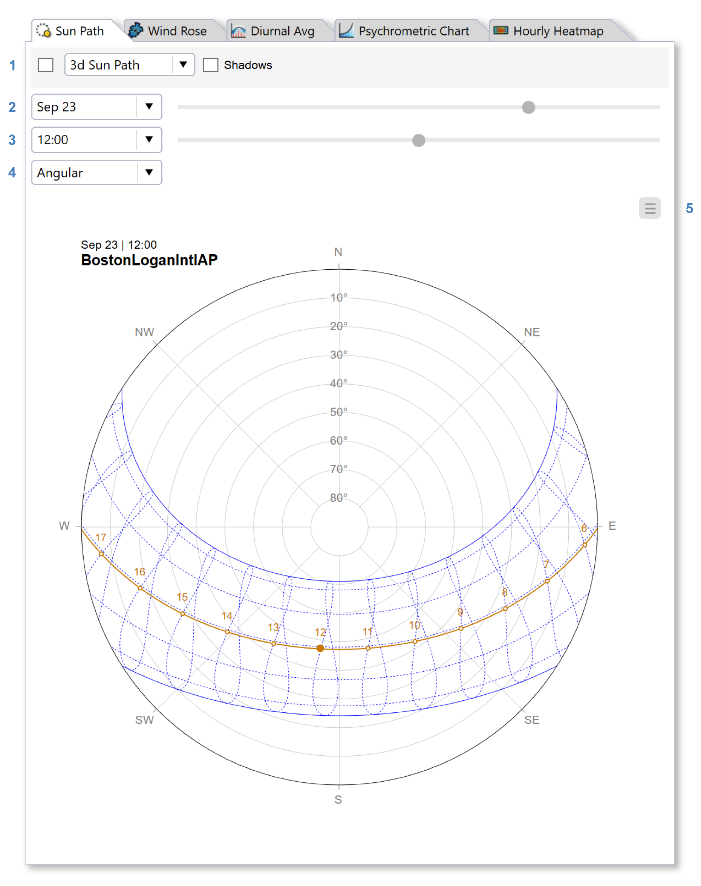
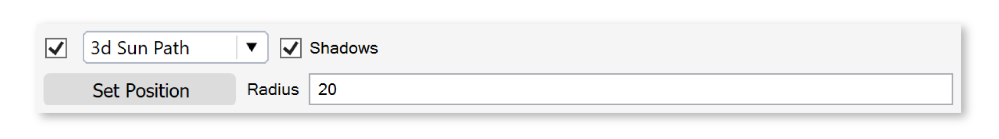
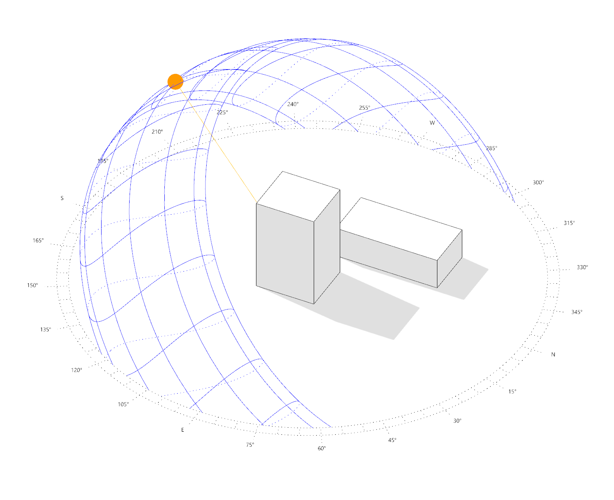

Sun Path
================================================
The sun path tab generates 2D and 3D sun path diagrams and direct shading studies.

   
The date and time settings (2 and 3) control the day arc and sun position. To fine tune the slider position, try using the left and right arrows on your keyboard. The projection dropdown (4) can be used to switch between angular, hemispheric, and stereographic 2D projections. Use the menu (5) to `export`_ the 2D plot to PNG or PDF.

.. _export: exportPlots.html

To visualize the sun path in the Rhino viewport, check the 3d sun path option (1). Use the Set Position button to relocate the center of the 3d sun path, and the Radius value to change its size. Elements of the diagram, such as the compass or analemmas, can be enabled or disabled using the "3d Sun Path" dropdown. Checking the Shadows box enables a custom display mode that casts direct shadows for the current sun position in the Rhino viewport.

