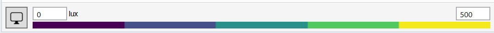

Viewport Display
================================================
The Viewport Display editor is located at the bottom of the results panel and can be used to customize the viewport results display.

Simulation Results
------------------------
**On** toggles the display on or off.

**Show Values** displays simulation results at each sensor position.

**Show Nodes** displays a point at each sensor location.

**Show Normals** displays the sensor orientation at each sensor location.

**Style** toggles between a continuous surface and individual disks at each sensor position.

**Surface Edge Thickness** modifies the line weight of the end of the result surfaces.

**Edit Falsecolor** offers a series of color mappings.

Dynamic Glazings
------------------
**Show Window Normals** shows the orientation of each dynamic window surface.

**Show Window Borders** highlights the edges of dynamic window surfaces.

