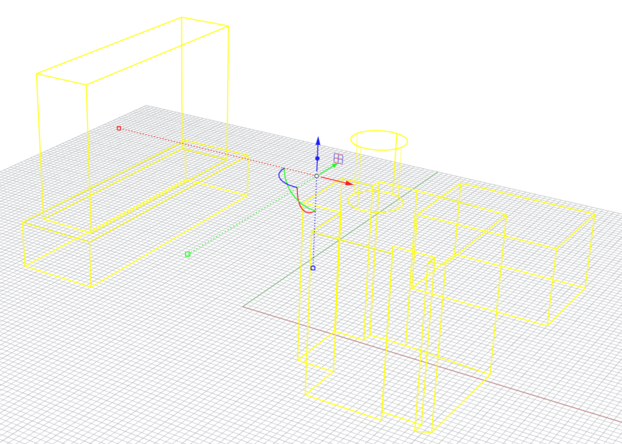
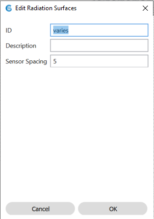
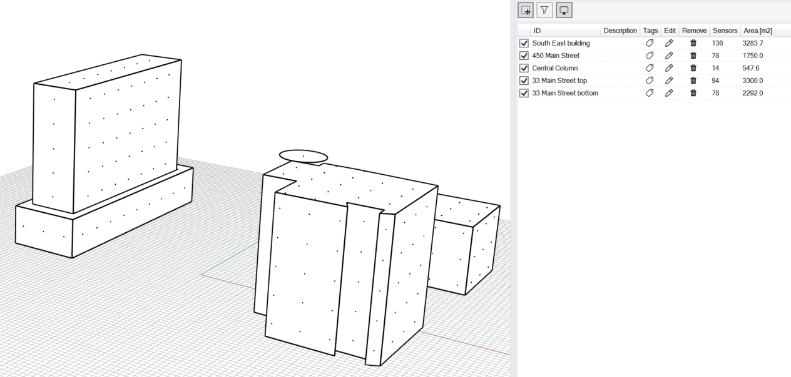

Add Analysis Surfaces
================================================
This subpanel is used to specify analysis surfaces for a radiation map analysis. These surfaces are often coincident with the floor but may be objects on layers without any assigned material properties. To define an analysis surface  left-click on the *Add Surface* button and select one of more reference surfaces.

.. figure:: images/AddAnalysisSurfaces.jpg
   :width: 900px
   :align: center

In the example below, all building breps in the scene have been selected and are marked in yellow.

After selecting the surfaces and pressing *Enter* the *Edit Radiation Surfaces* panel opens.

   
While analysis surfaces are displayed as surfaces, radiation map calculations conduct simulations at discrete sensor points that are distributed on a grid pattern across an analysis surface and that are oriented along the surface normal areas. The *Edit Analysis Surfaces* panel includes the following customization settings:

**ID:** Brief area description such as conference room or open office

**Sensor Spacing:** The distance between sensors in model units

Once all analysis surfaces have been selected and specified, they appear in the Rhino Viewport and are added to a list in the *Add Analysis Surfaces* subpanel. The list provides statistics for each analysis surface area such as its area and annual radiation falling onto it. The *Tag* item therefore allows to organize analysis surfaces areas by, for example, building and/or orientation. Once tagged, areas can be displayed selectively using the filter and tag functions above the table.

   
