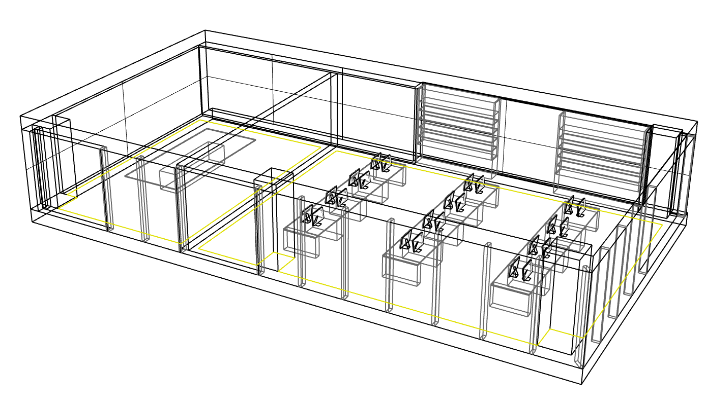
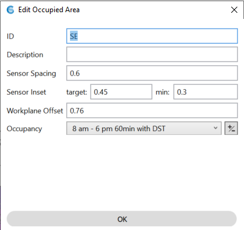
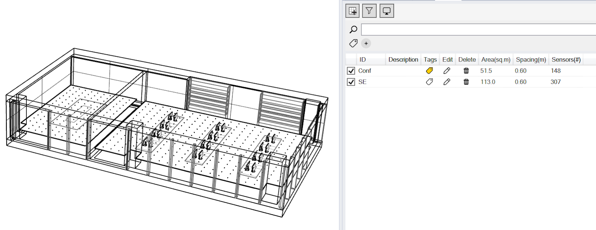

Add Areas
================================================
This subpanel is used to specify regularly occupied spaces within a building such a workareas, circulation spaces etc. Many standard green building rating systems rely on the concept of “regularly occupied areas” to analyze the environmental performance of a building, such as daylighting, glare and thermal comfort, where it matters. In ClimateStudio, regularly occupied areas are defined via reference surfaces. These surfaces are often coincident with the floor but may be objects on layers without any assigned material properties. To define a regularly occupied area, left-click on the *Add Area* button and select one or more reference surfaces.  

.. figure:: images/AddAreas.jpg
   :width: 900px
   :align: center

In the example below, the two reference surfaces are coincident with the floor and marked in yellow. 

After selecting the surfaces and pressing *Enter,* the *Edit Occupied Areas* panel opens. The panel slightly differs for different workflows.

While occupied areas are continuous surfaces, lighting calculations conduct simulations at discrete sensor points that are distributed on a grid pattern across an occupied area and that are oriented along the surface normal areas. The *Edit Occipied Areas* panel includes the following customization settings:

	**Space ID:** Space identifier (e.g. “Room 104”)
	
	**Description:** Space description or type (e.g. “Open office”)
	
	**Sensor Spacing:** Distance between sensors in model units
	
	**Sensor Inset:** Distance of sensors from the edge of the surface area. Some standards and lighting measurement specifications require a minimum sensor distance from walls and windows.
	
	**Workplane Offset:** Distance between the reference surface and the sensor plane. 
	
	**Occupancy:** Allows the user to specify the times in the year when the area is occupied. The user can select from a selection of provided schedules or import a custom schedule in csv (comma separated value) format.
	
Once the occupied areas have been selected and specified, they appear in the Rhino Viewport and are added to a list in the *Add Areas* subpanel. The list provides statistics for each occupied area, such as its area and number of sensors as well as the ability to edit or delete an area. A larger building may include hundreds of occupied areas. The *Tag* item therefore allows the user to organize areas by, for example, floor, program type and/or orientation. Once tagged, areas can be displayed selectively using the filter and tag functions above the table. 
	

	