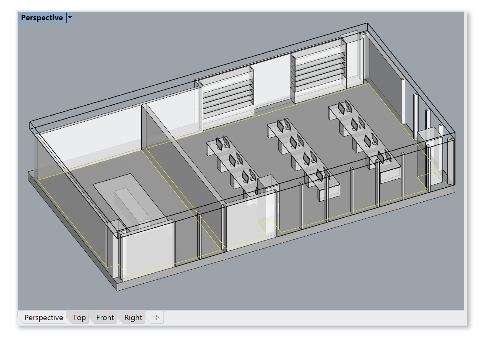

Occupied Areas
================================================
This panel is used to specify regularly occupied floor areas within a building. Many standards and green-building rating systems rely on the concept of regularly occupied areas when assessing access to daylight and views. Generally speaking, these areas are spaces that people occupy for significant periods of time -- e.g. more than an hour per person per day, according to the LEED v4 BD+C Reference guide. 

In ClimateStudio, occupied areas are defined via reference surfaces. We recommend modeling these surfaces at the finish floor, as separate objects on their own material-less layer. This allows precision in setting room boundaries independently from floor surfaces (which, depending on model construction, may span multiple rooms or slide beneath walls and columns). To define an occupied area, left-click the Add Area button (1) and select one or more reference surfaces.  

In the example below, two reference surfaces (highlighted in yellow) are selected in the Rhino viewport:

Once selection is complete, press the *Enter* key, and a dialog will appear: 

In order to be used by lighting simulation and view analysis workflows, occupied areas must be divided into a discrete set of sensor points. The positioning and spacing of these sensors, along with other room-specific properties, can be set in the dialog. Available properties vary based on the active simulation workflow, but may include the following:

	**Space ID:** Space identifier, typically a room number (e.g. “104”)
	
	**Description:** Space description or type (e.g. “Open office”)
	
	**Sensor Spacing:** Distance between sensors in model units. For the LEED Daylight credit, spacing must be no more than 2 feet (0.6096 meters). Reducing spacing increases the number of sensors, which increases simulation time.
	
	**Sensor Inset:** Distance of sensors from the edge of the surface area. Some standards and lighting measurement specifications invoke minimum sensor distance ranges from walls and windows. The *target* inset determines the initial placement of sensors relative to the untrimmed surface edge. The *minimum* inset removes any sensors too close to the trimmed surface edge. The minimum should be less than the target to avoid cropping the first row of sensors. The default settings (18 and 12 inches respectively) generally maintain a 1-2 foot swath around the room perimeter sensor free, per LEED requirements.
	
	**Workplane Offset:** Distance between the reference surface and the sensor plane. Assuming the reference surface is placed at the finish floor, this distance should be the height of desks or other work surfaces (30 inches by default).
	
	**Viewplane Offset:** Distance between the reference surface and the view plane. Assuming the reference surface is placed at the finish floor, this distance should be the eye height of an occupant in seated position (4 feet by default). This parameter is used to place sensors for view quality and glare analysis.
	
	**Occupancy:** Allows the user to specify the times of year when the area is occupied. The user can choose from a selection of provided schedules or import a custom schedule in CSV (comma separated value) format. The schedule is used by daylighting metrics only when running a daylight availability analysis in `Custom`_ mode.
	
	**Lux and Time% Targets:** Allow altering lux and time percentage thresholds for UDI and sDA metrics. These settings affect only the Custom daylight availability workflow.
	
.. _Custom: daylightCustom.html
	
Once the occupied areas have been created, they appear in the Rhino viewport and the Occupied Areas Table. The table provides statistics for all occupied areas in the model, as well as the ability to rename, tag, edit or delete them. For larger buildings, which may include hundreds of occupied areas, use of the *Tag* feature may prove useful for binning rooms by floor, program type, and/or orientation. Once tagged, groups of rooms can be isolated using the filter functions (2) above the table. The sensor grid display style can be edited using the viewport settings dropdown (3).
	

	
The checkbox in the table's far left column, along with the visibility of the reference surface in Rhino, determines whether a room is included in ClimateStudio's analysis workflows. **Only areas that are visible and enabled at the moment a simulation starts are included in the analysis.**