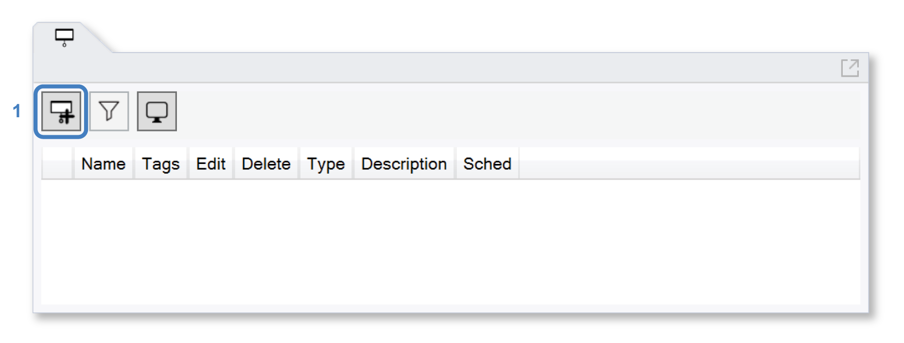
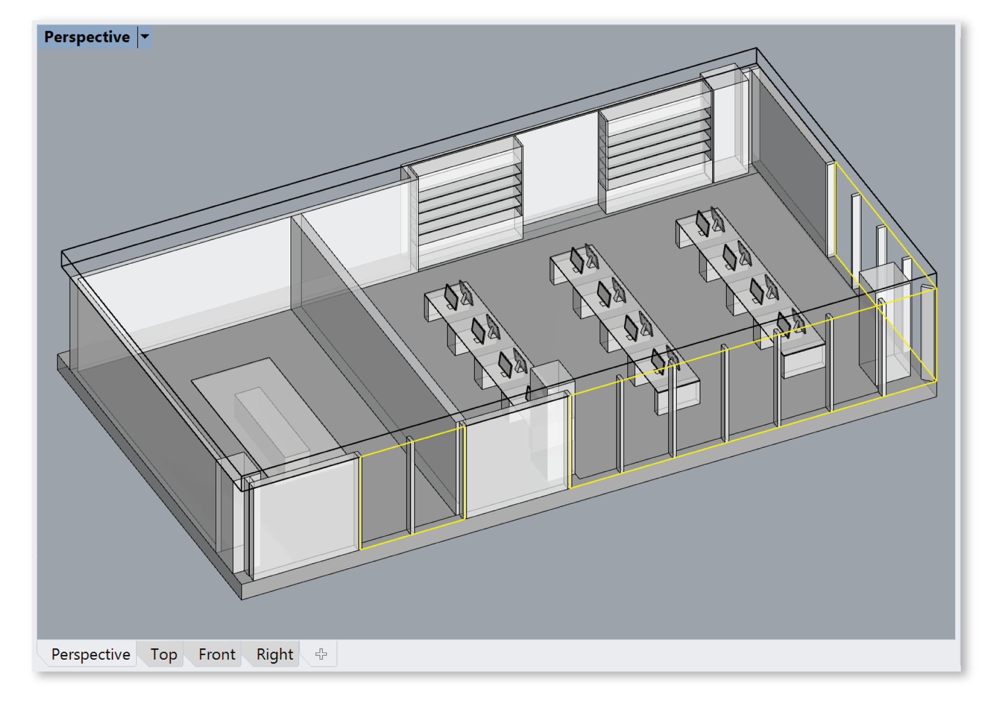
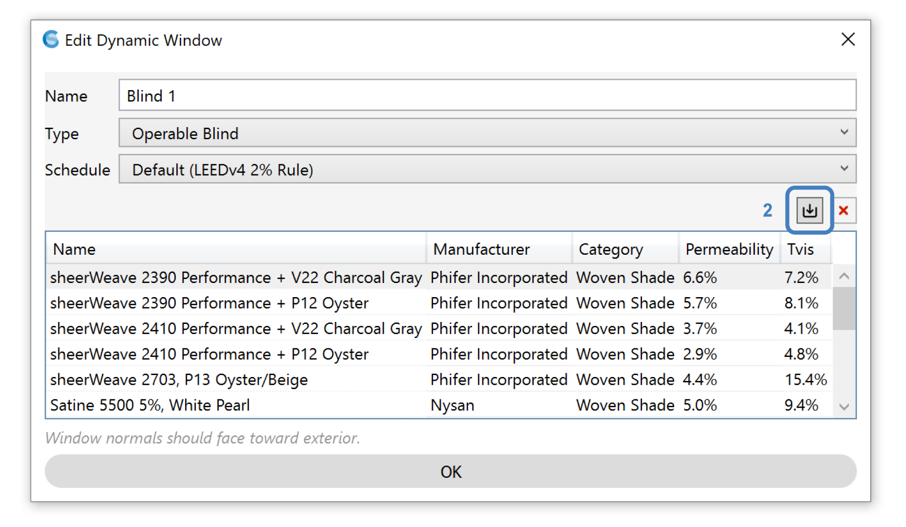
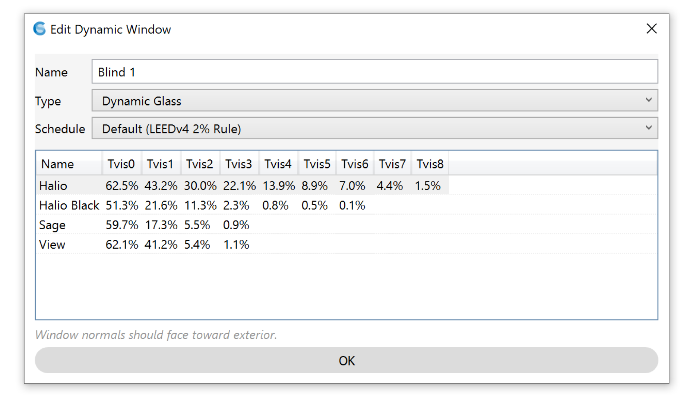
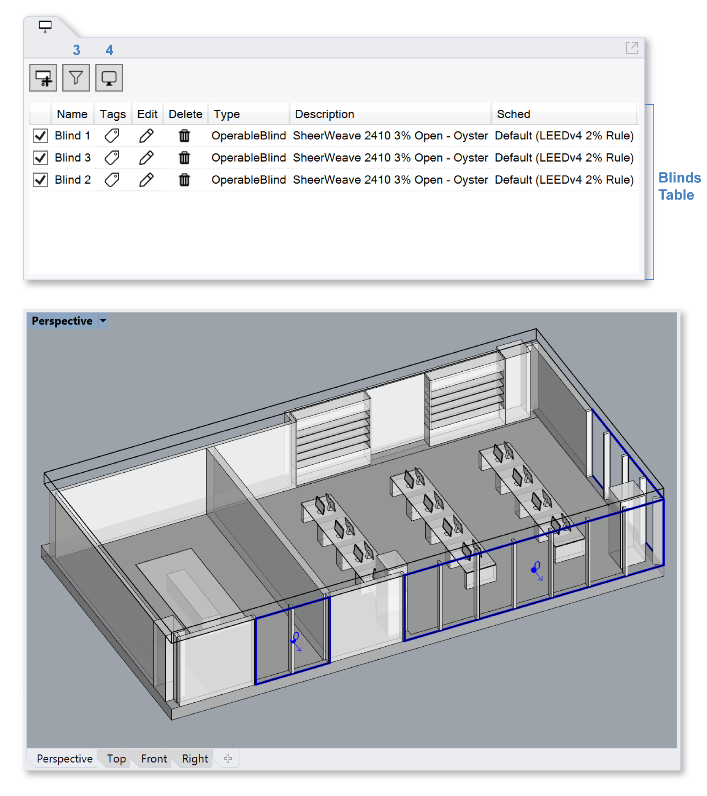

Blinds
================================================
ClimateStudio supports modeling dynamic shading systems such as fabric blinds and switchable glazings. These systems and their operation are simulated by the `Daylight Availability`_ worklfow when calculating hourly illuminance distributions. In many cases, the inclusion of dynamic shading is not optional. The calculation of Spatial Daylight Autonomy (sDA) and eligibility for the LEED v4 Dayight credit (Option 1) require dynamic shading to be modeled on all exterior windows. To assign a shading system to one or more glazing surfaces, left-click the Add Blind button (1) atop the Blinds panel and select the desired surfaces in the Rhino model.

.. _Daylight Availability: daylightAvailability.html

In the example below, three window surfaces, one in the conference room and two in the corner office have been selected. 

	**Tip:** A quick way to select mutiple windows is to pick all objects on the *glazing* layer.

   
Once selection is complete, press the *Enter* key, and a dialog will appear with the following options: 

   
.. _Daylight Availability: daylightAvailability.html

  **Type:** ClimateStudio offers two types of dynamic shade: *operable blinds* and *dynamic glass*. For both types, ClimateStudio comes with a list of real-world products, sourced from the International Glazing Database (IGDB) and measured manufacturer data. For operable blinds, it is assumed that the shading system is either fully opened or fully closed. Additional fabric shades or venetian blinds can be imported as BSDF files using the *Add XML File* button (2). For dynamic glass, several intermediate tint states, as provided by the manufacturer, are supported. In the example below, Halio comes with one clear and eight tint states ranging from 62.5% to 1.5% visible light transmittance.
  

   
.. _Daylight Availability: daylightAvailability.html

  **Schedule:** The schedule input sets the dynamic shading control strategy, i.e when it is opened or closed.  The following controls are currently supported:

  - **Default (LEEDv4 2% Rule):** When using this control algorithm, dynamic windows are automatically assigned to the nearest occupied area at the beginning of a simulation. Each room's windows are then grouped by shading type, material, and orientation. For each hour of the year, if more than 2% of the occupied area receives direct sunlight (defined as more than 1000 lux directly from the solar disc), the transmitting window groups are instructed to close (starting with the worst offender) until fewer than 2% of the room's sensors are sunlit. For dynamic glass, the transmittance of the glass is lowered until either the sensors are brought below 1000 lux or the glass is in its darkest tint state. 

  - **Custom (CSV file):** Alternatively, the user can provide a CSV (comma seperated value ) file with 8760 values for every hour of the year. The file format is single column. The dynamic shading state is 0 for wide open and an integer depending on the number of shading states supported, i.e. 1 for blinds drawn or 1, 2 and 3 for dynamic glass with one clear and three tint states.

   
Once a system and control strategy have been specified, the dynamic shading surfaces area added to Blinds Table, which list all blinds in the building. Similar to `occupied areas`_, the blinds can be organized using tags and filtered (3). The display style can be edited using the viewport settings dropdown (4).

.. _occupied areas: addAreas.html

The checkbox in the table's far left column, along with the visibility of the reference glazing surface in Rhino, determines whether a dynamic shading element is included in ClimateStudio's daylight availability workflow. **Only blinds that are visible and enabled at the moment a simulation starts are included in the analysis.**

