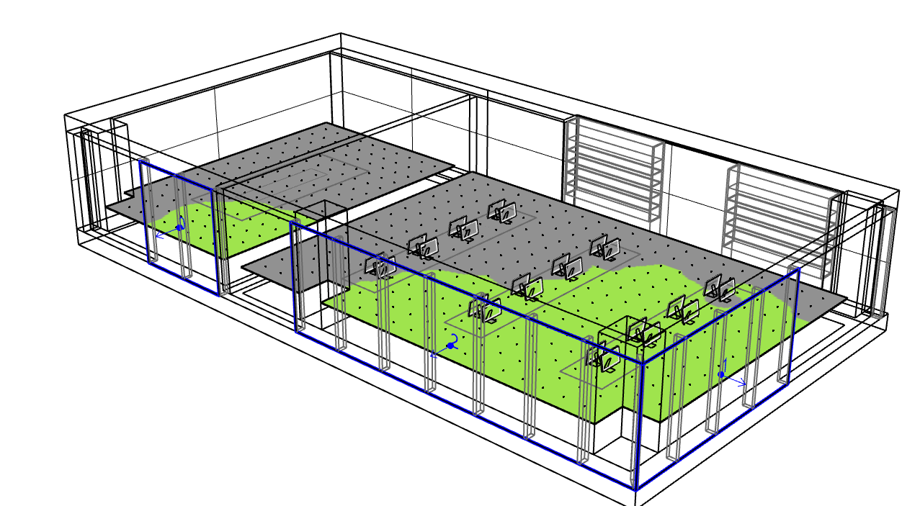

Add Blinds
================================================
Several workflows such as `Daylight Availability`_ and `Annual Glare`_ support the setting of dynamic shading systems such as fabric shades or switchable glazings. Specifying such a system requires identifying windows that have a dynamic shading system and specifying a shading type and control strategy for each window. The process is initiated via the Add Blinds subpanel. Left-click on the Add Area button and select one of more reference surfaces.

.. _Daylight Availability: daylightAvailability.html

.. _Annual Glare: annualGlare.html

.. figure:: images/AddBlinds.jpg
   :width: 900px
   :align: center

In the example below, the three window surfaces, one in the conference room and two for the corner office are selected. 

	**Tip:** A quick way to do so is to pick all objects on the *glazing* layer.

   
Once all window surfaces with a shading system have selected the *Edit Dynamic Windows* panel opens. 

**Type:** As shown below, the dialogue allows setting the shading type and control strategy, *operable blinds* and *dynamic glass.* For both cases LCimateStudio comes with a list of actual materials. For operable blinds, it is assumed that the shading system is fully opened or closed at any time. For dynamic glass several shading states as provided by the manufacturer are supported. In the example below Halio Black comes with one clear and six tint states ranging from 50.6% to 0.1% visual light transmittance.

**Schedule:** The schedule input sets the dynamic shading control strategy for the shading, i..e when it is opened or closed.  The following controls are currently supported:

- **Default (LEEDv4 2% Rule):** According to this control algorithm a shading system is closed if more than 2% of an occupied area associated with a window is illuminated by more than 1000lux of direct sunlight. For dynamic glass the transmittance of the glass is lowered until either the 1000lux criterion is not met any more or the glass is in its darkest tint state.

- **Custom (CSV file):** Alternatively, the user can provide a simple CSV file with 8760 values for every hour of the year.  

.. figure:: images/blinds2.png
   :width: 900px
   :align: center
   
Once dynamic shading systems have been specified, they appear in the *Add Blinds* subpanel table as shown below. Same as *Occupied Areas,* the different window shading systems can be organized via tags and selections can be edited.

.. figure:: images/blinds3.png
   :width: 900px
   :align: center
   
Simulation Details
--------------------
Once a simulation involving dynamic shading has started, CliamteStudio organizes all dynamic shading systems into blind groups. These groups depend on shading type and schedule suggested as well as on window orientation, proximity to nearby *Occupied Areas* and any external shading from neighboring objects. Once a simulation has been run, the shading group number of each shading system is shown along with the surface normal. For example, the image below shows that the three windows have been divided into three glind groups. The blind group number has no specific meaning.

