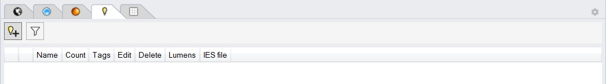

Add Luminaires
================================================
ClimateStudio supports lighting calculations for daylit and electrically lit scenes. The daylight portion is set via the `sky subpanel.`_ For electric lighting only simulations, the sky can simply be set to nighttime. 

The panel supports the selection of actual luminaire products and to place and organize them individuals or in groups in a scene. The *Photometric Web* and *Size* entry fields at the bottom of the panel control the size and appearance of luminaires in the Rhino viewport (see below.)

.. _sky subpanel.: sky.html

To add a new luminaire to the scene, left-clink on the *Add Luminaire* icon. The resulting dialogue panel allows the user to browse through a series of IES files that come with ClimateStudio. An IES file is a manufacturer-supplied text file that provides the luminous intensity distribution of actual lighting products on a spherical grid. This data is usually displayed either three dimensionally as a photometric web or in horizontal and vertical sections. Most lighting manufacturers provide IES files of their products on their web sites. If you are experiencing difficulties locating an IES file for a specific product, try the `IES library.`_ 

.. _IES library.: https://ieslibrary.com/en/home

As an example, the luminarie in the image below corresponds to a suspended linear luminaire with a large direct (down lit) and a small indirect (up lit) component. 

IMAGE

An imported luminaire is placed at the model origin. The user can then move the luminaire to its desired position within the scene and add additional copies of the same luminaire to a group via the *copy* or *array* commands in Rhino. Copying luminaires places them on the same lighting group as the original luminaire. The luminaire type of all elements in a group can be changed via the edit button in the Add Luminaire panel. The image below shows the direct/indirect suspended luminaire from above placed on a 3 x 3 grid in a corner open office.

IMAGE
