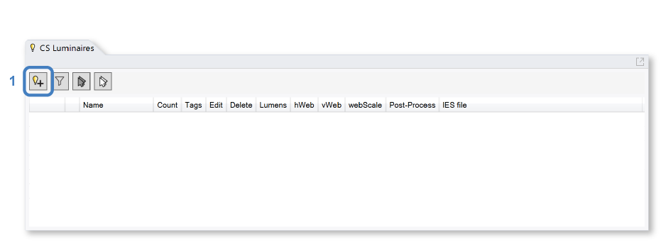

Luminaires
================================================
ClimateStudio supports lighting calculations for daylit and electrically lit scenes. The daylight source is set via the `Sky panel`_. For electric-lighting-only simulations, the sky can simply be set to nighttime. 

.. _Sky panel: sky.html

The Luminaires panel is used to select real-world luminaire products and place them in the Rhino model, either individually or in groups. To place a luminaire, left-click on the *Add Luminaire* icon (1).

   
A dialog will appear, allowing the user to browse through a series of IES files that come with ClimateStudio. An IES file is a manufacturer-supplied text file that provides the luminous intensity distribution of a lighting product on a spherical grid. This data is usually displayed three dimensionally as a photometric web or in horizontal and vertical sections. Most lighting manufacturers provide IES files of their products on their web sites. If you are experiencing difficulty locating an IES file for a specific product, try the `IES library`_. In the file below, the luminarie is a suspended linear fixture with direct (down lit) and indirect (up lit) components. 

.. _IES library: https://ieslibrary.com/en/home

.. figure:: images/subPanel_selectLuminaire.png
   :width: 900px
   :align: center

In addition to selecting an IES file, the dialog provides a multiplier field for scaling its total brightness (this is sometimes referred to as a loss factor). Once selection is complete, click the *Add to Model* button, which places the luminaire in the Rhino model at the world origin. You can then move the luminaire to its desired position. To create additional copies of the luminaire, simply use the *copy* or *array* commands in Rhino. Copying luminaires places them in the same lighting group as the original luminaire (using block instances), which means the entire group can be edited in concert. In the scene below, nine instances of the luminare have been arranged in a 3x3 grid. The Luminaires Table lists all luminaire groups in the model, and facilitates editing and deleting groups, as well as controlling their display in the viewport. The *hWeb* and *vWeb* toggles control the visibility of the 3d photometric web preview, while the *webScale* column controls its size. 

.. figure:: images/subPanel_luminairesTable.png
   :width: 900px
   :align: center

The checkbox in the table's far left column, along with the visibility of the luminaire blocks in Rhino, determines whether a luminaire is included in renderings and point-in-time illuminance calculations. **Only luminaires that are visible and enabled at the moment a simulation starts are included in the analysis.**