Add Objects
================================================
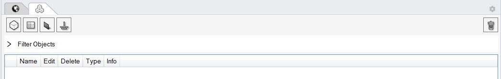

This subpanel is used to build up a multi-zone EnergyPlus model. ClimatStudio supports the following geometric objects: Zones, Windows, Adiabatic/Ground and Shading. 

Thermal Zones
----------------
Thermal zones are modeled as closed breps in Rhino. Thermal zones are the fundamental building blocks of thermal simulation programs. They consist of areas within a building that are conditioned to the same temperature, have the same programmatic use (such as office or classroom) and experience comparable loads from solar radiation etc. A thermal zone is not necessarily the same as a room. A row of identical, south facing classrooms can be treated as a single zone since there will be no heat flow between the classrooms if they are used in the same way. On the other hand, a large open office area should be divided into perimeter zones bordering the building envelope with a depth of around 5m (15 feet)  and a core zone (see below). Combining core and perimeter zones in a single zone leads to an underprediction of conditioning loads since a surplus of solar gains in an equator facing zones is credited to heating required on the non equator-facing side whereas in reality local cooling and heating may be required at the same time. 

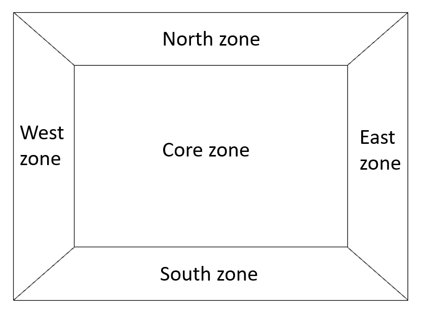

Spaces on different floors should also not be combined into a single zone because ClimateStudio identifies downward facing surfaces as floors and assigns internal loads for equipment and occupants by floor area. Combining two floors into a single zone thus halves those loads.  

The figure below shows an example zoning model of a two story wing with bands of classrooms boarding a central circulation area. The whole wing should me modeled as six zones with north and south facing classroom on both floors and a core zone for the aisle.  

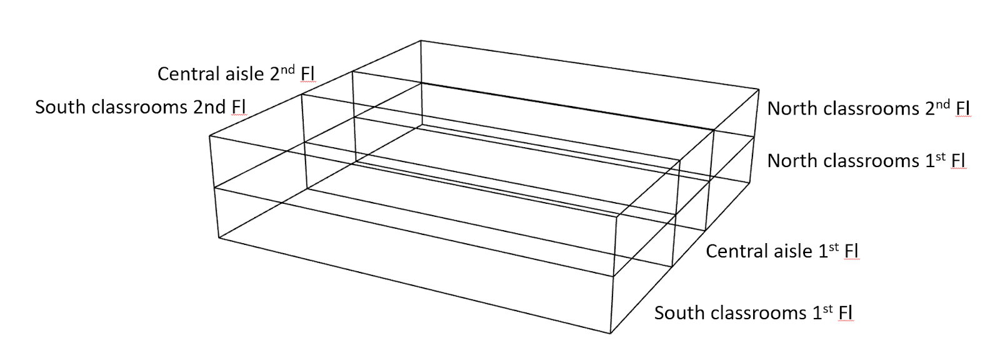

Neighboring zones have to be modeled carefully so that their surfaces actually touch so that EnergyPlus understands that the overlapping surface area between them is interior.

Once one or several breps have been selected as thermal zones, the user should press enter and the Zone dialogue appears.

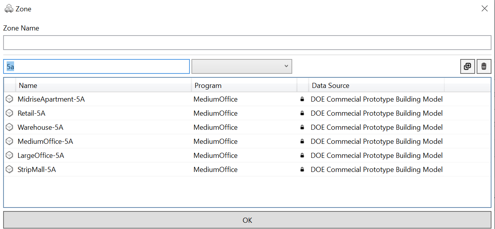

ClimateStudio comes with a large election of predefined thermal zone descriptions including the USE Department of Energy (DOE) Commercial `Prototype Building models.`_ These preset zone templates are descriptions of typical commercial US buildings located in different ASHRAE climate zones. For example, BOston is located in climate zone 5A. By using the filter function in the Zone dialogue the user can , for example, all benchmark building types available in the ClimateStudio database such as Midrise Apartment, Medium Office and Strip Mall.  

.. _Prototype Building models.: https://www.energy.gov/eere/slsc/building-energy-use-benchmarking

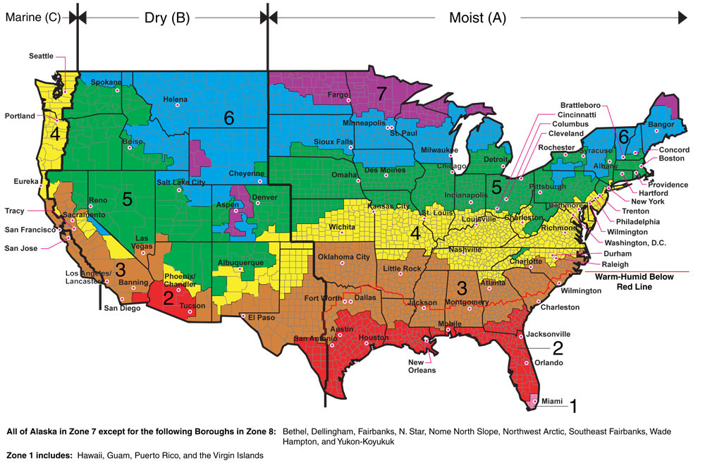

The `Thermal Zone Settings`_ page describes a description of all modeling inputs. 

.. _Thermal Zone Settings: thermalZoneSettings.html

Once a zone template has been assigned, the zones appear in the objects table on the right. The image below show a tow zone model representing the conference room and open office in the `ClimateStudio example file.`_ 

.. _ClimateStudio example file.: https://solemma.com/tutorial/CS%20Two%20Zone%20Office.3dm

It is worthwhile pointing out that it is assumed that the thermal model is built separately from the daylighting model in ClimateStudio. Both models can be stored on separate layers in the same Rhino file.  

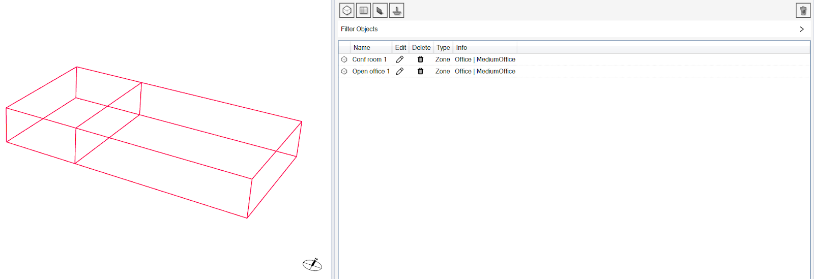

Windows
-----------
Any type of envelope opening such as windows or skylights are models as flat surfaces with three or four corner points.Window surfaces have to be completely embedded in a zone surface to be recognized as a child object of a zone wall or roof. 

Note: 
	While window surfaces in EnergyPlus may not touch the edge of a zone surface, you may draw a window in CLimateStudio by just snapping at the corner points of a wall. ClimateStudio will then slightly offset the corner of the window for the wall surface.     

Once all windows have been selected, the Windows dialogue appears. 

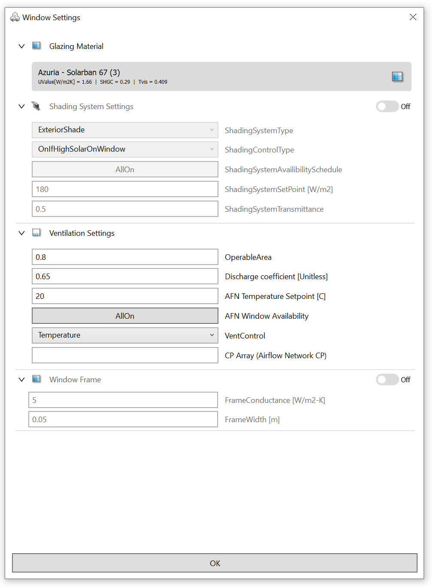

**Glazing Construction:** ClimateStudio comes with a large selection of actual glazing units that can be selected by the glazing construction dialogue. The input data for these glazing units are based on measurements stored in the `International Glazing Database (IGDB).`_ The glazing construction panel supports sorting the glazing units in the ClimateStudio database by, for example, visual light transmittance or solar heat gain coefficient. Once a glazing is selected, its main elements such individual glass panes and any fillings between the panes is displayed above.

.. _International Glazing Database (IGDB).: https://windows.lbl.gov/software/igdb

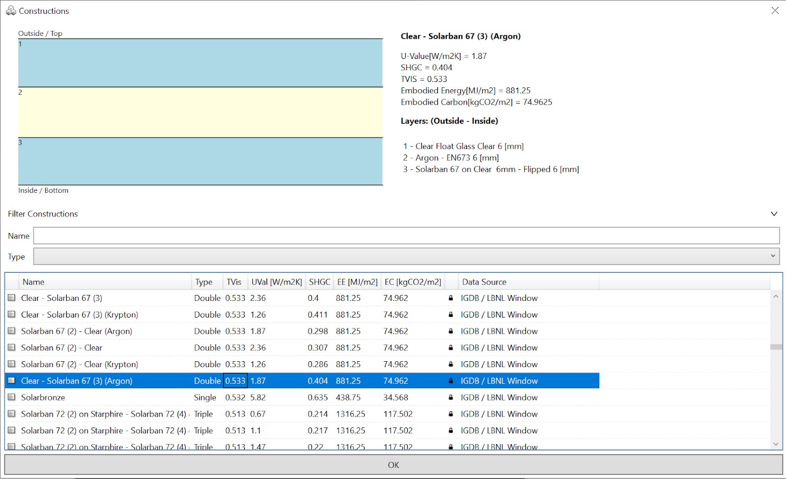

Under **Ventilation Settings** the user can specify whether a window is operable for natural ventilation purposes, the fraction of the window area that is operable and at what indoor zone temperature the window will be opened. 

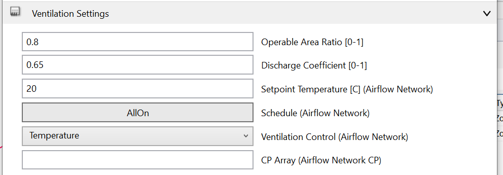

**Window Frame:** By default, EnergyPlus assumes that the thermal properties of a glazing unit extend across the rough opening of the window. To consider the thermal properties of a frame, its out frame width and U value can be set to account for heat losses across the frame.

**Shading System:** Setting Any shading system can be modeled by setting an shading plus shading control. The schedule determines when the control is being activated throughout the year.  

Once all window surfaces have been selected, they are added to the thermal zone object table and are marked as turquoise in the viewport.

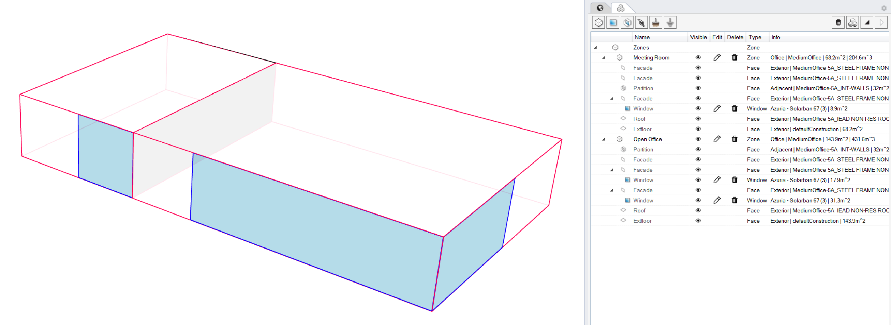

Shading
--------------
Shading surfaces may represent an overhang or parts of a neighboring building that shade thermal zone or window objects. EnergyPlus will create a shading mask for each window and all shading surfaces. This process is both slow as well as somewhat unstable so it is recommended that shading surfaces are assigned somewhat selectively. For example, in the urban massing model below shading surfaces are the overhangs as well as walls from neighboring buildings facing the apartment building in the center. 

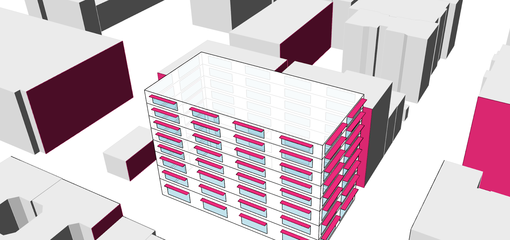

Boundary Conditions
-----------------------
Boundary conditions are surfaces such as interior adiabatic surfaces of the ground. They have to be defined  as 3 or 4 corner surface objects in Rhino that are coincident with a thermal zone surface. I a surface is defined as adiabatic no heat flow will go through it during a simulation.

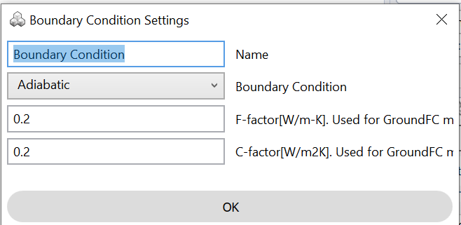

In the case of the ClimateStudio demo file, one may assume that the model only represents part of a larger building and that the three surfaces towards the West and North are adiabatic. The figure below shows how this would be modeled in ClimateStudio.

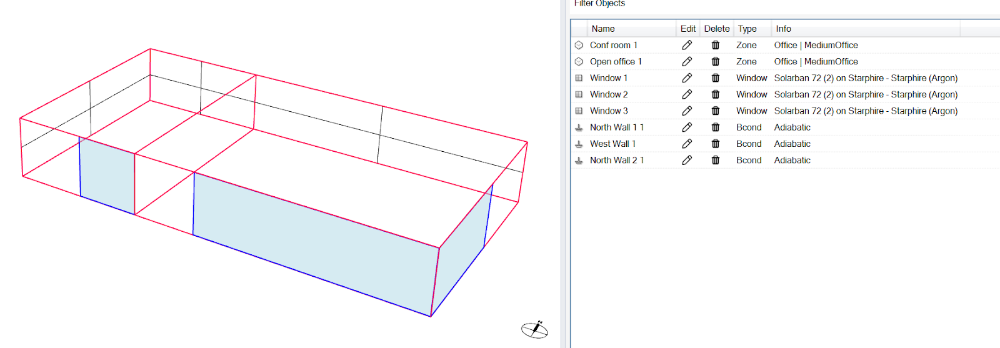

Note: 
	As shown above, the model assumes that the building is single story. If the model rather represents a typical corner part of a multi story building, roof and floor surfaces would also have to be modeled as adiabatic.   

