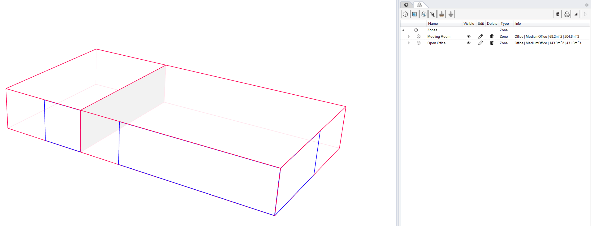
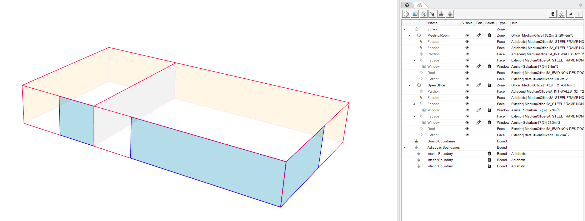

Add Objects
================================================
.. figure:: images/AddObjects.jpg
   :width: 900px
   :align: center

This subpanel is used to build up a multi-zone EnergyPlus model. ClimateStudio supports the following geometric objects: Zones, Windows, Adiabatic/Ground and Shading. 

Thermal Zones
----------------
Thermal zones are modeled as closed breps in Rhino. Thermal zones are the fundamental building blocks of thermal simulation programs. They consist of areas within a building that are conditioned to the same temperature, have the same programmatic use (such as office or classroom) and experience comparable loads from solar radiation etc. A thermal zone is not necessarily the same as a room. A row of identical, south facing classrooms can be treated as a single zone since there will be no heat flow between the classrooms if they are used in the same way. On the other hand, a large open office area should be divided into perimeter zones bordering the building envelope with a depth of around 5m (15 feet)  and a core zone (see below). Combining core and perimeter zones into a single zone leads to an underprediction of conditioning loads since a surplus of solar gains in an equator facing zones is credited to heating required on the non equator-facing side whereas in reality, local cooling and heating may be required at the same time. 

Spaces on different floors should also not be combined into a single zone because ClimateStudio identifies downward facing surfaces as floors and assigns internal loads for equipment and occupants by floor area. Combining two floors into a single zone thus halves those loads.  

The figure below shows an example zoning model of a two story wing with bands of classrooms bordering a central circulation area. The whole wing should be modeled as six zones, with North and South facing classrooms on both floors and a core zone for the aisle.  

Neighboring zones have to be modeled carefully so that their surfaces actually touch. This is so that EnergyPlus understands that two zones are touching and any areas between them are hence interior.

Once one or several breps have been selected as thermal zones, the user should press enter and the Zone dialogue appears.

ClimateStudio comes with a large selection of predefined thermal zone descriptions including the US Department of Energy (DOE) Commercial `Prototype Building models.`_ These preset zone templates are descriptions of typical commercial US buildings located in different ASHRAE climate zones. For example, Boston is located in climate zone 5A. By using the filter function in the Zone dialogue, the user can select all building types available in the ClimateStudio database such as Midrise Apartment, Medium Office and Strip Mall.  

.. _Prototype Building models.: https://www.energy.gov/eere/slsc/building-energy-use-benchmarking

The `Thermal Zone Settings`_ page gives a description of all modeling inputs. 

.. _Thermal Zone Settings: thermalZoneSettings.html

Once a zone template has been assigned, the zones appear in the objects table on the right. The image below shows a two-zone model representing the conference room and open office in the `ClimateStudio example file.`_ 

.. _ClimateStudio example file.: https://climatestudiodocs.com/ExampleFiles/CS_Two_Zone_Office.3dm

It is worthwhile pointing out that it is assumed that the thermal model is built separately from the daylighting model in ClimateStudio. Both models can be stored on separate layers in the same Rhino file.  

Windows
-----------
Any type of envelope opening such as windows or skylights are models as flat surfaces with three or four corner points. Window surfaces have to be completely embedded in a zone surface to be recognized as a child object of a zone wall or roof. 

Note: 
	While window surfaces in EnergyPlus may not touch the edge of a zone surface, you may draw a window in ClimateStudio by just snapping to the corner points of a wall. ClimateStudio will then slightly offset the corner of the window from the wall surface.     

Once all windows have been selected, the Windows dialogue appears. 

**Glazing Construction:** ClimateStudio comes with a large selection of actual glazing units that can be selected via the glazing construction dialogue. The input data for these glazing units are based on measurements stored in the `International Glazing Database (IGDB).`_ The glazing construction panel supports sorting the glazing units in the ClimateStudio database by, for example, visual light transmittance or solar heat gain coefficient. Once a glazing is selected, its main elements, such as individual glass panes and any fillings between the panes is displayed above.

.. _International Glazing Database (IGDB).: https://windows.lbl.gov/software/igdb

Under **Ventilation Settings,** the user can specify whether a window is operable for natural ventilation purposes, the fraction of the window area that is operable and at what indoor zone temperature the window will be opened. 

**Window Frame:** By default, EnergyPlus assumes that the thermal properties of a glazing unit extend across the rough opening of the window. To consider the thermal properties of a frame, its outer frame width and U value can be set to account for heat losses across the frame.

**Shading System:** Dynamic shading systems can be modeled by setting a shading plus shading control. The schedule determines when the control is being activated throughout the year.  

Once all window surfaces have been selected, they are added to the thermal zone object table and are marked as turquoise in the viewport.

Shading
--------------
Shading surfaces may represent an overhang or parts of a neighboring building that shade thermal zone or window objects. EnergyPlus will create a shading mask for each window and all shading surfaces. This process is both slow, as well as somewhat unstable, so it is recommended that shading surfaces are assigned somewhat selectively. For example, in the urban massing model below, shading surfaces are the overhangs as well as walls from neighboring buildings that face the apartment building in the center. 

Boundary Conditions
-----------------------
Boundary conditions are surfaces such as interior adiabatic surfaces or the ground. They have to be defined  as 3 or 4 corner surface objects in Rhino that are coincident with a thermal zone surface. 

Adiabatic
	If a surface is defined as `adiabatic`, no heat flow will go through it during a simulation. Adiabatic surfaces are colored in red..

.. figure:: images/addObjects12.png
   :width: 500px
   :align: center

In the case of the ClimateStudio demo file, one may assume that the model only represents part of a larger building and that the three surfaces towards the West and North are adiabatic. The figure below shows how this would be modeled in ClimateStudio.

Ground
	If a surface is defined as `ground`, it is assumed that it touches ground at the constant monthy temperature set under `Advanced EnergyPlus settings`_. Ground surfaces are colored in green. Please note that nearly every thermal model needs ground surfaces as the building otherwise floats above the ground as if on stilts.

.. _Advanced EnergyPlus settings: EnergyPlus.html	

Ground FC
	If a surface is defined as `ground FC`, it is assumed that it touches if uses the so-called FC method from the ASHRAE Handbook of Fundamental as explained in the `EnergyPlus Engineering Reference`_.   
	
.. _EnergyPlus Engineering Reference: https://bigladdersoftware.com/epx/docs/8-7/engineering-reference/ground-heat-transfer-calculations-using-c.html	

Ground in KIVA (Grasshopper only)
	If a surface is assigned a 'KIVA' boundary condition object, it uses the KIVA source ground heat transfer calculation tool in EnergyPlus as documented under
	https://bigladdersoftware.com/epx/docs/8-7/engineering-reference/ground-heat-transfer-calculations-using-kiva.html and https://kiva.readthedocs.io/en/stable/.

