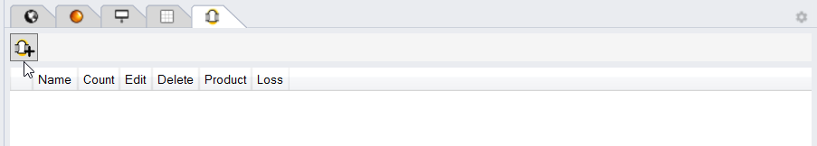
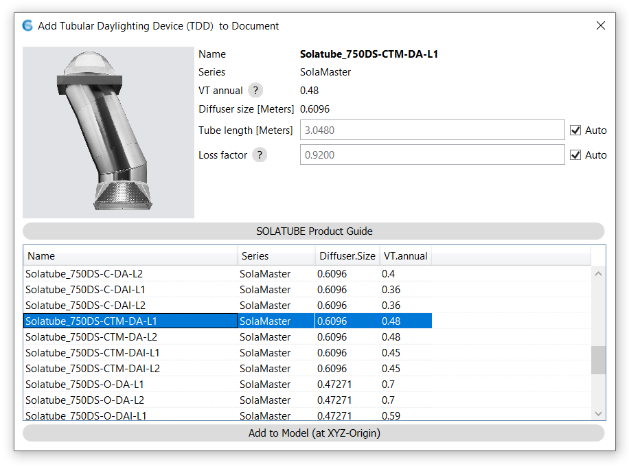
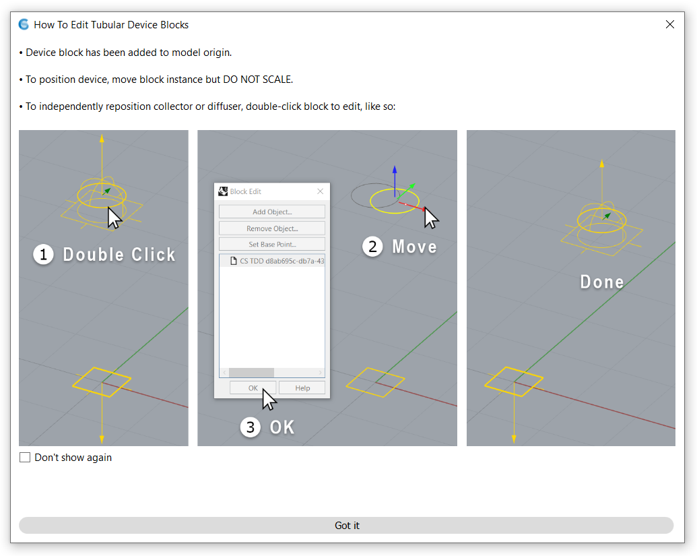
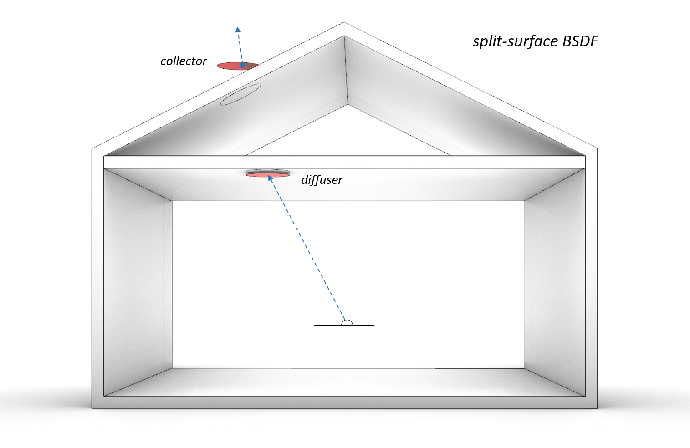

Add Tubular Daylighting Devices
================================================
ClimateStudio's daylighting workflows support the modeling of tubular daylighting devices (TDDs). These devices harvest daylight at a rooftop collector and transfer it along a highly reflective tube to a diffuser at the ceiling, allowing even distribution to interior spaces. To insert a TDD into the scene, open the TDD subpanel and left-click on the *Add Tubular Daylighting Device* button:

This button will launch a dialog for selecting among several standard TDD products manufactured by `Solatube International`_. For a better understanding of the available Brighten Up, Solamaster, and Skyvault product lines, we recommend reviewing Solatube's online `product guide`_. In addition to product selection, the dialog lets the user override the default tube length and loss factor. Setting the tube length at this stage affects only the initial height of the TDD block placed in the model, and is unimportant if you intend to manually re-position the collector or diffuser (as discussed below). Overriding the loss factor will bypass ClimateStudio's built-in loss-factor calculation, which is based on the final locations of the collector and diffuser in the model. 

.. _Solatube International: https://www.solatube.com/
.. _product guide: https://www.solatube.com/commercial/products

   
Once a device is selected, clicking the *Add to Model (at XYZ-Origin)* button will insert the TDD as a block instance at the model origin. To reposition the entire device, simply select and move the block. To reposition only the collector or diffuser, *double-click* the block to open it for editing. A pop-up will appear on first use, offering guidance:

   
The collector and diffuser should be placed in their actual installed locations. Take care to place the diffuser just below the finish ceiling, so it is not obscured by the ceiling surface itself. **Do not cut a hole** in the ceiling or roof assembly, or otherwise attempt to model the connecting tube explicitly. ClimateStudio will handle the photon transport for you!

As with `Luminaires`_, copy-pasting a TDD block instance will create another instance of the same device. This is useful for generating arrays of devices of the same type, with the exact same positioning of diffuser relative to collector. To insert a new type of device, or one with different relative positioning, simply repeat the steps above, starting with the *Add Tubular Daylighting Device* button.

.. _Luminaires: addLuminaires.html

How It Works
------------------
The internal optics of TDDs, which include multiple lenses and specular bounces, are not straightforward to simulate via path tracing. Instead of attempting such a feat, ClimateStudio uses `product data measured by the manufacturer`_. These data, which take the form of Bidirectional Scattering Distribution Functions (BSDFs), quantify the outgoing light distribution at the diffuser for each incident light direction at the collector. Light losses along the way, due to factors such as dirt, additional tube length, and number of 90-degree elbows, are approximated using a function:

.. _product data measured by the manufacturer: https://www.solatube.com/technical-resources/bidirectional-spectral-distribution-function-data-files/

    *Loss = dirt \* (1 - .05\*elbows - lossPerFoot\*excessLength)*

In "auto" mode, ClimateStudio uses a constant dirt factor of 0.92. If the collector and diffuser are separated by less than 6ft. in the XY plane, ClimateStudio assumes a straight tube run with no 90-degree elbows. Otherwise, an "over then up" path with two 90-degree elbows is assumed.

In order to transport virtual photons between the collector and diffuser, ClimateStudio uses a custom version of Radiance that implements *split-surface BSDFs*. These are similar to traditional BSDFs, except that the reference coordinate system is transformed at the moment of transmission, allowing virtual photons to teleport from one surface to another (and reorient their directions). As a result, ClimateStudio TDDs have no positioning constraints, and can be inserted into daylight models without requiring holes to be cut in the ceiling and roof assemblies. For collectors that are not isotropic, ClimateStudio assumes a BSDF up-vector oriented toward the equator -- or toward the zenith for near-vertical mounts.

