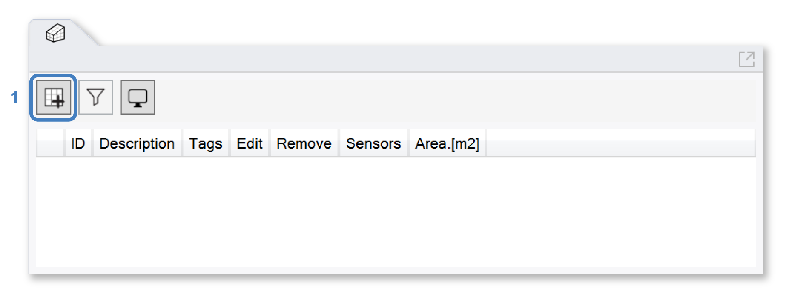
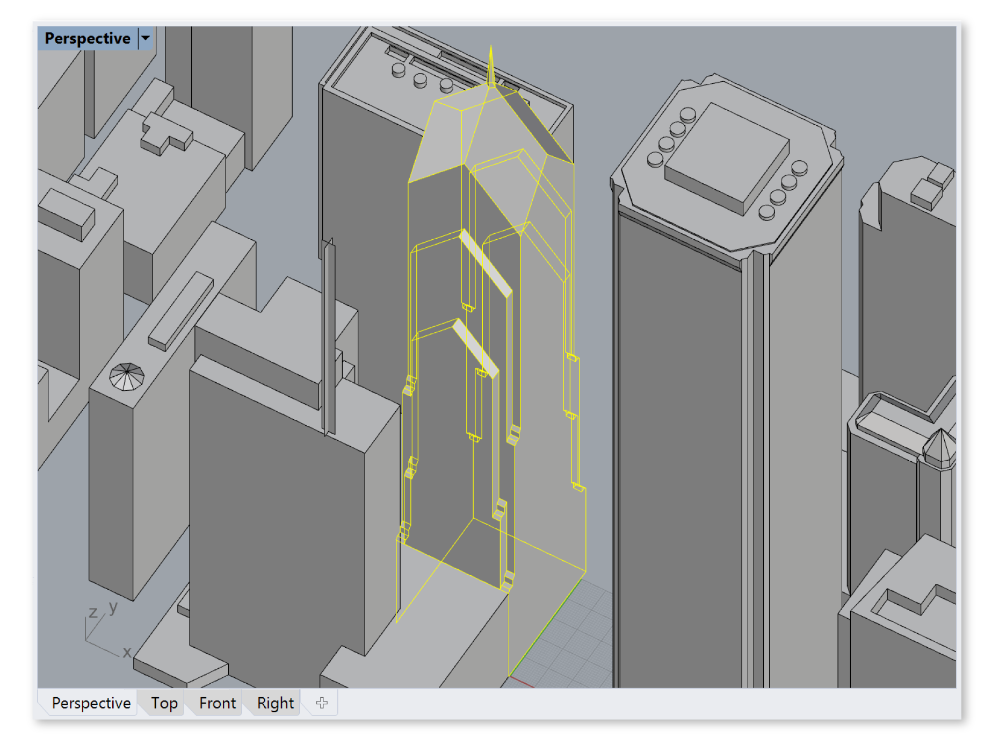
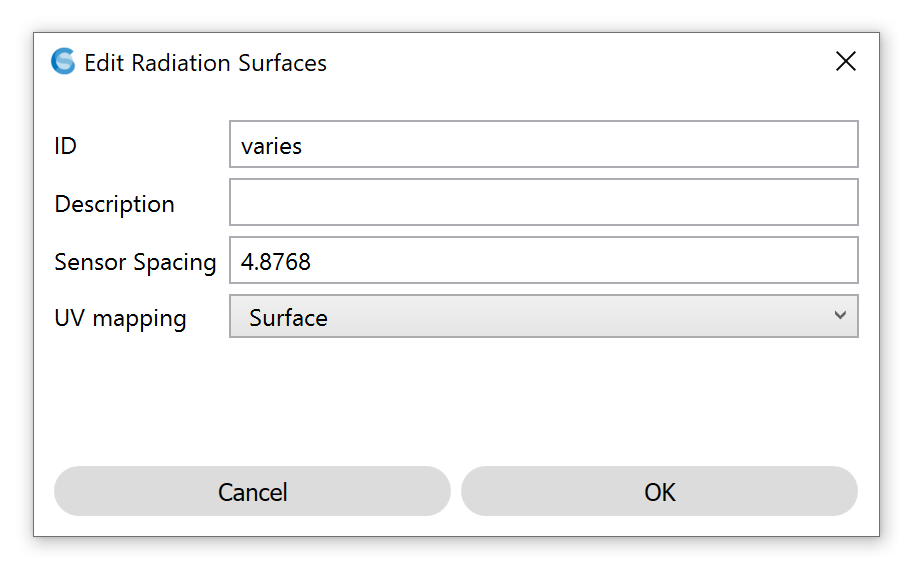
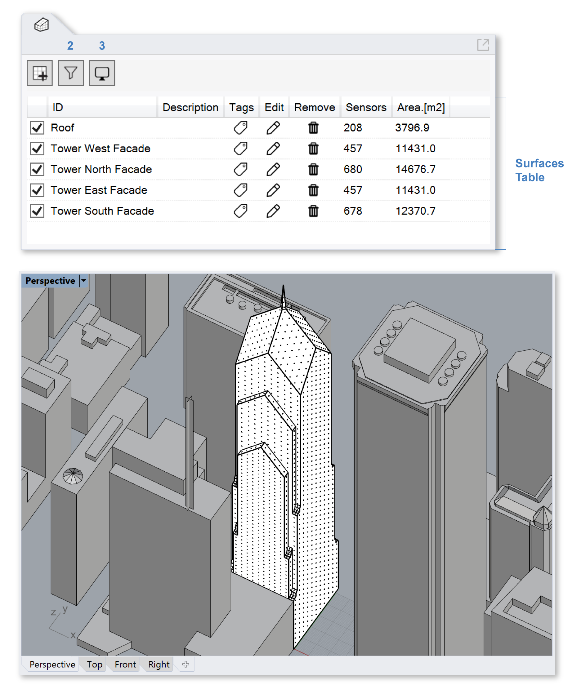

Analysis Surfaces
================================================
This panel is used to specify analysis surfaces for the `Radiation Map`_ workflow. To define an analysis surface, left-click the *Add Surface* button (1) at the top of the panel and select one or more reference surfaces.

.. _Radiation Map: radiationMap.html

In the example below, five reference surfaces composing an office tower facade (highlighted in yellow) are selected in the Rhino viewport.

	**Tip:** If a building is modeled as a solid, breaking it up into multiple faces (East, North, Roof, etc.) may be of interest if reporting orientation-specific averages is desirable.

Once selection is complete, press the *Enter* key, and a dialog will appear: 

   
In order to be used by the Radiation Map workflow, the analysis surfaces must be divided into a discrete set of sensor points. The positioning and spacing of these sensors, along with surface descriptors, can be set in the dialog:

  **ID:** Surface identifier (e.g. "Tower East Facade").

  **Description:** Optional description.

  **Sensor Spacing:** The distance between sensors in model units. Tighter spacing increases the number of sensors, which increases simulation time.

  **UV Mapping:** Controls the texture mapping of the object, which dictates both sensor placement and falsecolor display. *Box* mapping uses a world-axis-aligned box texture. *Surface* mapping (available only for NURBS surfaces) uses UV surface parameters. Surface mapping is preferable for curved surfaces.

Once the analysis surfaces have been created, they appear in the Rhino viewport and the Analysis Surfaces Table. The table lists all analysis surfaces in the model, and allows renaming, tagging, editing or deleting them. As with `occupied areas`_, the surfaces can be organized using filters (2). The display style can be edited using the viewport settings dropdown (3).

.. _occupied areas: occupiedAreas.html

   
The checkbox in the table's far left column, along with the visibility of the reference surface in Rhino, determines whether an analysis surface is included in the radiation map workflow. **Only surfaces that are visible and enabled at the moment a simulation starts are included in the analysis.**