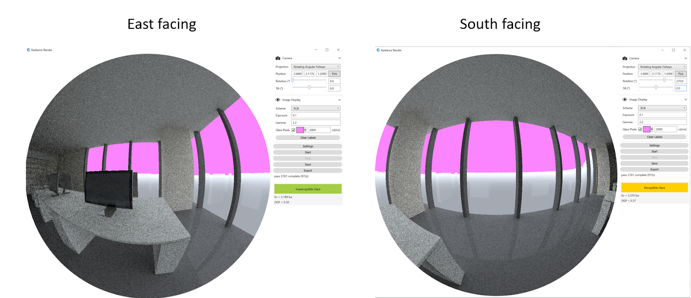
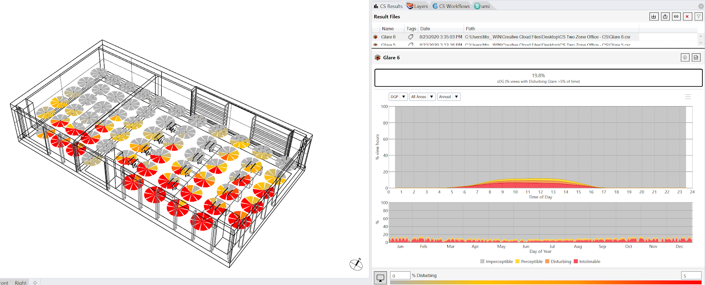
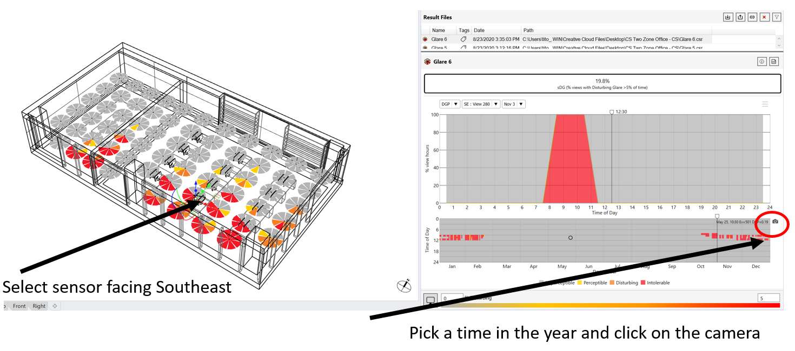

Annual Glare
================================================
A unique feature of ClimateStudio is its ability to calculate annual glare distributions across an occupied area. The glare calculations are based on the `Daylight Glare Probability (DGP) metric`_ developed by Wienold and Christofferen. DGP is an image based metric meaning that it predicts the likelihood that somebody positioned at where the camera is located and facing in a certain direction is experiencing discomfort glare. The required camera type is a fisheye lens meaning that it has an opening angle of 180o. DGP can have values between 0% and 100% which are divided into four bands:

.. _Daylight Glare Probability (DGP) metric: https://www.radiance-online.org/community/workshops/2014-london/presentations/day1/Wienold_glare_rad.pdf

.. figure:: images/annualGlare.png
   :width: 900px
   :align: center

The image below shows an interior office view on May 25 at 10:30am facing East and South with “imperceptible glare” and “perceptible” glare conditions, respectively. 

Simulation Setup
-----------------------
For annual DPG simulations ClimateStudio relied on the vertical illuminance portion of the DGP formula, DGPs.  To set up an annual glare simulation, the following subpanel inputs are required:

.. figure:: images/AnnualGlare_GUI.jpg
   :width: 900px
   :align: center

- The `Location Subpanel`_ 

- The `Assign Materials Subpanel`_

- The `Add Areas Subpanel`_

.. _Location Subpanel: Location.html

.. _Assign Materials Subpanel: assignMaterials.html

.. _Add Areas Subpanel: addAreas.html

Please note that at this point ClimaterStudio does not support annual glare calculations that consider the use of dynamic shading systems.

If you have not done any lighting simulations in ClimateStudio, it is recommended that you go through the `Lighting Model Setup video tutorial`_ (5 minutes) followed by a video tutorial specifically focussed on `Annual Glare Analysis.`_ The Rhino file used in the tutorial is available for `download.`_

.. _Lighting Model Setup video tutorial: https://vimeo.com/392379928

.. _Annual Glare Analysis.: https://vimeo.com/392380942

.. _download.: https://solemma.com/tutorial/CS%20Two%20Zone%20Office.3dm

Run Simulation
------------------
Once all required input subpanels have been populated, a simulation is invoked by pressing the start button. ClimateStudio uses a `progressive path-tracing`_ version of the Radiance raytracer to simulate illuminance distributions. While a simulation is in progress new iterations are added to the simulation results until the user-specified number of passes has been reached. Details on the simulation settings can be found in the `Path-tracing Settings Subpanel.`_

.. _progressive path-tracing: https://www.solemma.com/Speed.html

.. _Path-tracing Settings Subpanel.: path-tracingSettings.html

Simulation Results
-----------------------
Upon completion of the first pass, the simulation automatically switches into the ClimateStudio results panel. A General overview of the Results panel is provided `here.`_ The image below shows an annual glare analysis on the CLimateStudio example scene. The annual galre distribution is shown in  Rhino viewport to the left. Since glare results and view direction-dependent, the height of the occupied area sensors are by default at 1.2m (eye height of a sitting human) and facing into eight directions, each represented as a slice of pie. The color of each pie depends on the percentage of occupied time in the year that a person, located at the sensor and facing in the direction of the pie, is experiencing disturbing or intolerable glare. The default threshold level is 5% of occupied time but can be reset using `Viewport Display`_ in the lower left corner.  

.. _here.: results.html

.. _Viewport Display: ViewportDisplay.html

The left part of the results display shows the percentage of the occupied area with disturbing glare for more than 5% of the occupied time (19.8% for the example above) . The two graphs below show the mean variation of the DGP distribution by time of day (top) and day in the year (bottom). The user can also select a specific sensor, date and time of day to see the DGP distribution for any particular point in time and for a particular sensor. For example, the figure below shows the DGP distribution on Nov 1 at 8.30am for a workplace facing East in the center of the open office area. By selecting one of the glare pies, the display on the right dynamically changes.  

To understand what might be causing glare at a particular sensor and point in time, left-click on the temp[oral map on the lower right. A balck camera will appear to the right (see above). Left-click on the camera to initial a `Radiance Rendering`_ using the sky condition corresponding to the time of year currently selected and centered on the sensor point chosen on the left.

.. _Radiance Rendering: radianceRender.html

