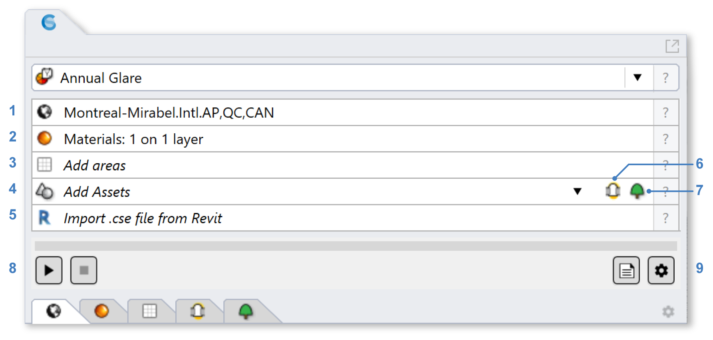
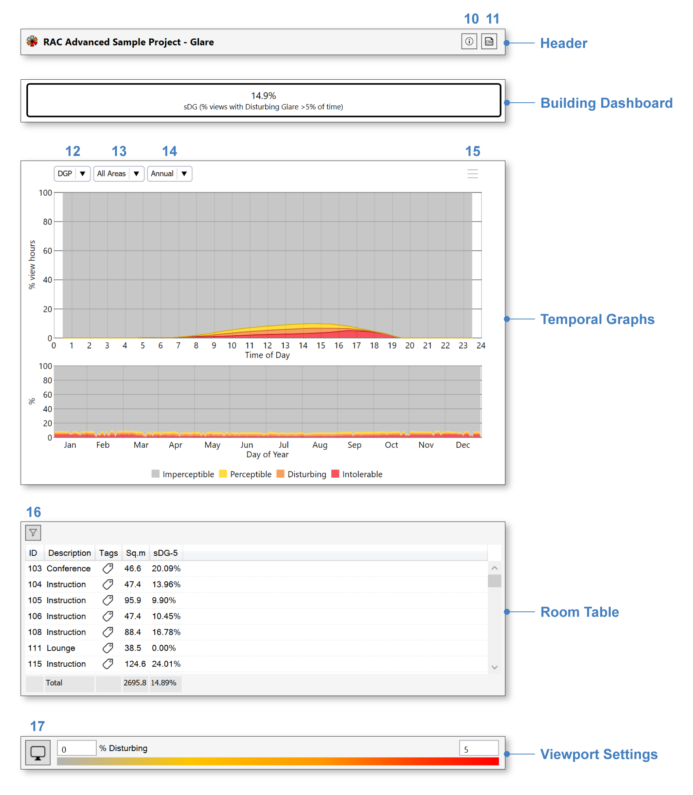
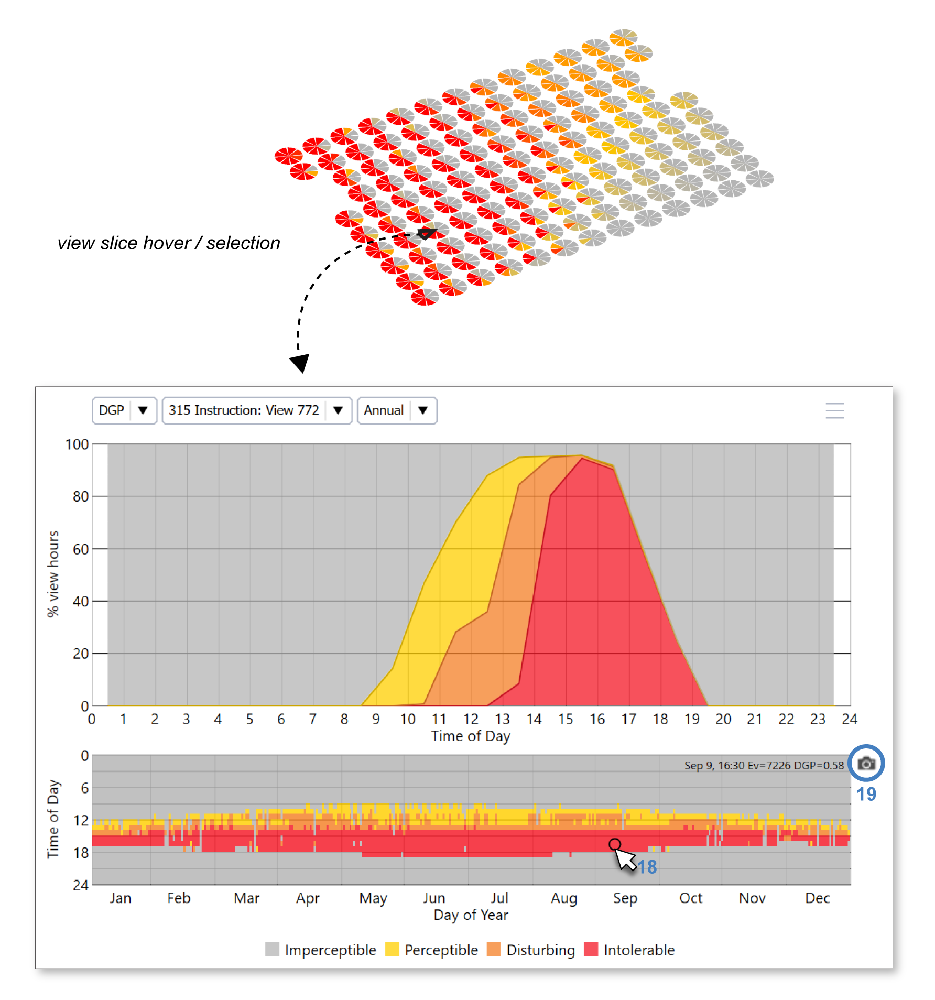

	
Annual Glare
================================================
A unique feature of ClimateStudio is its ability to calculate annual glare distributions across an occupied floor area. These glare calculations are based on the `Daylight Glare Probability (DGP) metric`_, developed by Wienold and Christofferen. DGP predicts the likelihood that an observer at a given view position and orientation will experience discomfort glare. The metric is usually calculated using a fisheye rendering with an opening angle of 180 degrees. DGP can have values between 0% and 100%, which are divided into four bands:

.. _Daylight Glare Probability (DGP) metric: https://www.radiance-online.org/community/workshops/2014-london/presentations/day1/Wienold_glare_rad.pdf

.. figure:: images/annualGlare.png
   :width: 900px
   :align: center
   
For annual DPG simulations, ClimateStudio relies on the vertical illuminance portion of the DGP formula, plus a contrast measurement from the solar disc.

Simulation Setup
-----------------------

   
To prepare a model for simulation, work your way through the four subpanels labeled 1-4 in the figure above.

| 1 - `Location`_
| 2 - `Materials`_
| 3 - `Occupied Areas`_ 
| 4 - `Tubular Daylighting Devices`_ (optional)

.. _Location: Location.html

.. _Materials: assignMaterials.html

.. _Occupied Areas: addAreas.html

.. _Tubular Daylighting Devices: addTDDs.html

Please note that at this point, ClimateStudio does not support annual glare calculations that consider the use of dynamic shading systems.

If you have not done any lighting simulations in ClimateStudio, it is recommended that you go through the `Lighting Model Setup video tutorial`_ (5 minutes) followed by a video tutorial specifically focused on `Annual Glare Analysis.`_ The Rhino file used in the tutorials is available for `download.`_

.. _Lighting Model Setup video tutorial: https://vimeo.com/392379928

.. _Annual Glare Analysis.: https://vimeo.com/392380942

.. _download.: https://climatestudiodocs.com/ExampleFiles/CS_Two_Zone_Office.3dm

Once all required inputs have been populated, a simulation is invoked by pressing the start button (5). ClimateStudio uses a `progressive path-tracing`_ version of the Radiance raytracer to simulate luminance distributions. While a simulation is in progress, traced light paths accumulate until the user-specified number of passes has been reached. Details on the simulation settings can be found by opening the `settings dialog`_ (6).
 
.. _progressive path-tracing: https://www.solemma.com/blog/why-is-climatestudio-so-fast
.. _settings dialog: path-tracingSettings.html

Simulation Results
-----------------------
Upon completion of the first simulation pass, or upon loading a saved result, the `results panel`_ will show a dashboard showing the following building-wide metric:

.. _results panel: results.html

   
- **Spatial Distrubing Glare (sDG)**: The percentage of views across the regularly occupied floor area that experience Disturbing or Intolerable Glare (DGP > 38%) for at least 5% of occupied hours. The calculation is based on hourly DGP values for eight different view directions at each position in the building. The default view height is 1.2 meters off the finish floor (eye height for a seated observer). The frequency of disturbing glare is visualized in the Rhino viewport using eight directional pie slices, with the color indicating frequency from 0 to 5%:
   
 .. figure:: images/result_viewportGlare.png
    :width: 900px
    :align: center

Interface Components
^^^^^^^^^^^^^^^^^^^^^^^^^^^^^

The results interface has five sections:

- The **Header** includes the result name, a CSV export (2), and an information dialog (1), which provides an accounting of simulation inputs.

.. _report generator: #reporting

- The **Building Dashboard** lists the sDG percentage for the entire building, as discussed above.

.. _report generator: #reporting

- The **Temporal Graphs** show the frequency of each DGP bin across all views, grouped by hour of day and day of year. In this example, the occurence of perceptible, disturbing, and intolerable glare is unsurprisingly higher in the afternoons, since the building features rooms with Western but not Eastern exposures. The floor area(s) included in the graph can be altered using the dropdown (4) or by filtering and/or selecting areas in the Room Table. The rightmost dropdown (5) permits switching between annual and single-day statistics. In the latter mode, time sliders let you scrub through individual hours of year, which causes timestep DGP data to be previewed in the Rhino viewport.

.. _report generator: #reporting

- The **Room Table** lists results for each regularly occupied floor area in the building. Selecting rooms by filtration (7) or row selection isolates their preview in the temporal graphs and the Rhino viewport, and updates the statistics in the "Totals" row at the bottom of the table.

.. _report generator: #reporting

- The **Viewport Settings** bar contains a viewport preview legend and viewport settings menu (8), which provides options for customizing the falsecolor display. Altering the upper bound of the falsecolor will also change the time percentage threshold used by the sDG metric in the Building Dashboard.

.. _report generator: #reporting

Hovering over a view slice in the Rhino viewport will update the temporal graphs to show all DGP data for the selected view:

   
.. _report generator: #reporting
   
In this case, the selected view faces the Western glazing, and has severe issues with afternoon glare throughout the entire year. To better understand cause and directionality of glare at any particular moment in time, you can select a point in the lower graph, which corresponds to a specific date and hour (9). Subsequently clicking on the camera icon (10) will initiate a `Radiance Rendering`_ using the sky condition for the corresponding step in the weather file:

.. _Radiance Rendering: radianceRender.html

The brightest pixels in the image can be flagged (color and threshold are editable). Here the red pixels show the sun and circumsolar region positioned straight ahead, near the center of the glazing. Unless the building is reoriented, this condition is likely unsolvable without movable shades or dynamic glazing. Rotating the rendering shows that turning the observer away from the glazing (e.g by facing North) can reduce discomfort glare, though veiling glare is likely to remain an issue. 
  

