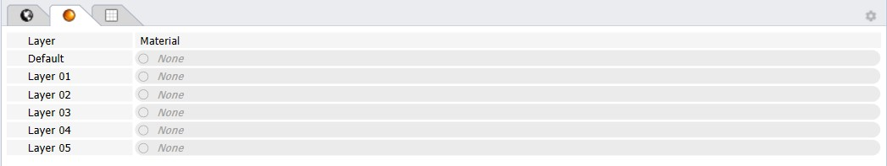
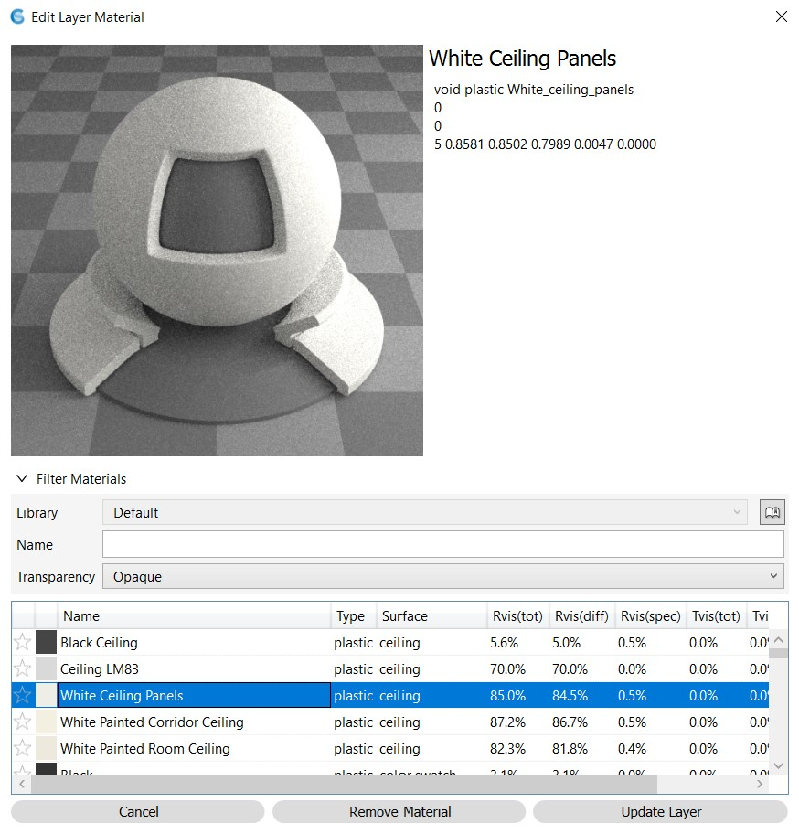

Assign Materials
================================================
Each object in a Rhino scene is located on a single layer. ClimateStudio uses these layers to assign material properties to scene objects. 
Objects on layers without an assigned material are **ignored** by all lighting simulations. 

To assign a material to a layer, double-click on the material row next to the layer and the Edit Layer Material panel (see below) will appear.
ClimateStudio comes with an extensive library of measured materials which are divided into opaque, transparent and translucent elements. 
The top part of the Edit Layer Material panel shows a visualization of the currently selected material (left) along with its Radiance 
material modifier to the right. The filter below allows the user to search the material database by material type or certain properties, such as total visual reflectance (Rvis(total)). 
Expert users may further link their own `custom Radiance materials.`_ 

.. _custom Radiance materials.: customRadianceMaterials.html

