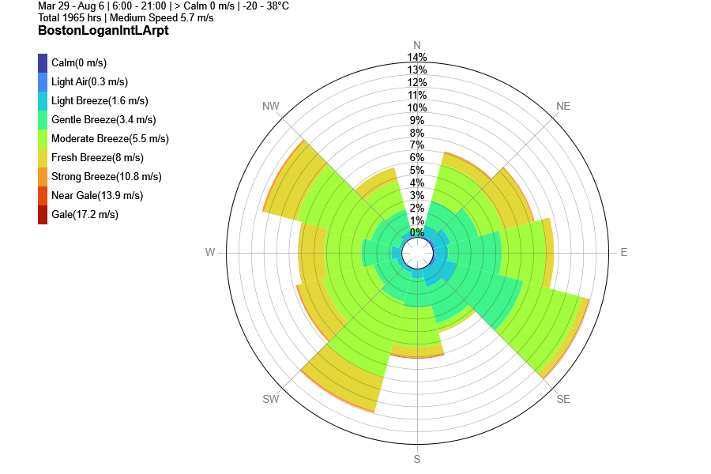
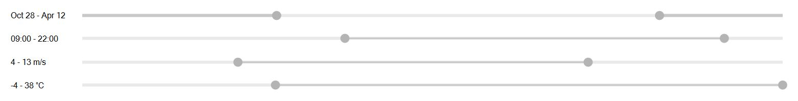
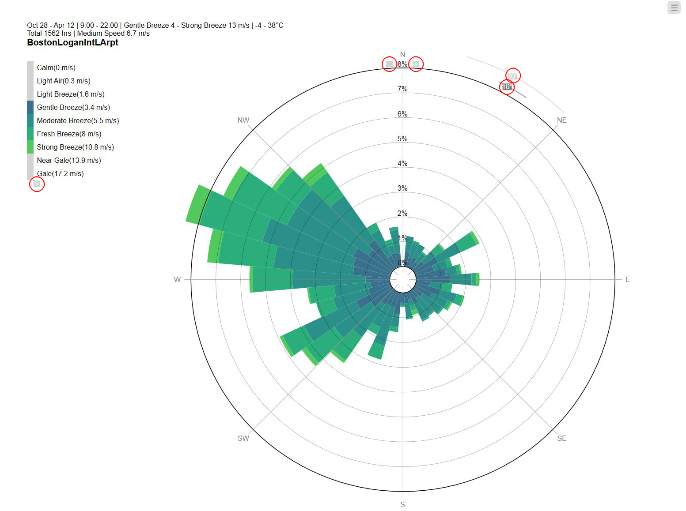

Climate Charts
================================================
- `2D Sun Path`_

- `3D Sun Path`_

- `2D Wind Rose`_

.. _2D Sun Path: climateCharts.html#id2

.. _3D Sun Path: climateCharts.html#id3

.. _2D Wind Rose: climateCharts.html#id4

2D Sun Path
----------------------------------------------------

The sun path subpanel controls how the current sun position and the 3D sun path diagram are displayed in the Rhino viewport. 

.. figure:: images/SunPath.jpg
   :width: 900px
   :align: center

3D Sun Path
----------------------------------------------------

The toggle changes the Rhino viewport from its current setting to a ClimateStudio-specific render mode that shows the different 3D Sun Path elements as well as 
the shadow created by all scene objects on the ground and neighboring objects. 

.. figure:: images/3dSunPathExample.jpg
   :width: 900px
   :align: center

*Example 3D Sun Path on winter solstice at noon in Boston*

The 3D Sun Path diagram is highly customizable:

- **Show Annual Sun:** Shows the position of the sun on key days in the year, such as winter/summer solstice and equinox days.
- **Show Annual Sun Path Analemmas:** Shows the position of the sun at the same time of day throughout the year.
- **Show Compass:** Toggles the compass on the ground plane on or off.
- **Show Sun Position:** Shows the current sun position in the 3D Sun Path.
- **Show Sun Ray:** Displays a ray from the current sun position to the center of the 3D Sun Path.
- **Show Day Sun Path:** Shows the position of the sun for the current day.
- **Render Ground Plane:** Displays shadows of scene objects on the ground plane (z-coordinate=0).

**Position:** Sets the center of the 3D Sun Path

**Radius:** Sets the radius of the 3D Sun Path in model units

*Date* and *time of day* can be set using the slider option, using preset dates and times or by manually entering the Julian date or time of day.

2D Wind Rose
----------------------------------------------------

Wind Rose diagram displays a radial bar-chart showing the occurrence frequency of wind speed across all directions. 

4 filters can be applied to Wind Speed/Direction Data: 

- **Days** of the year as range (wraps around)
- **Hours** of day as range (wraps around)
- **Wind speed** as range
- **Temperature** as range

The 2D Wind Rose diagram is customizable: 

- **Y-axis** increase / decrease of bar chart maximum
- **10 - 30 degrees** bin switching
- **Color** gradient selection

