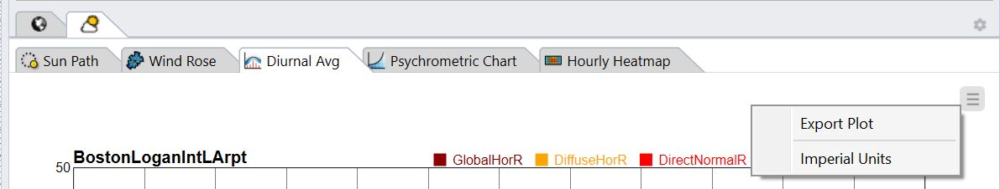

Climate Charts
================================================

The Climate Charts panel contains five tabs that help with visualizing, comprehending, and analyzing the local site and climate: 

- `Sun Path`_

- `Wind Rose`_

- `Diurnal Averages`_

- `Psychrometric Chart`_

- `Hourly Heatmap`_

A general control menu is located at the upper right corner of each tab, providing the following functionalities: 

- `Export Plots`_

- **Switch Unit System** between imperial and metric

All the plots described above are also available as `grasshopper components`_. 

.. _Sun Path: SunPath.html

.. _Wind Rose: windRose.html

.. _Diurnal Averages: diurnalAverages.html

.. _Psychrometric Chart: psychrometricChart.html

.. _Hourly Heatmap: hourlyHeatmap.html

.. _Export Plots: exportPlots.html

.. _grasshopper components: climateChartsGrasshopper.html

