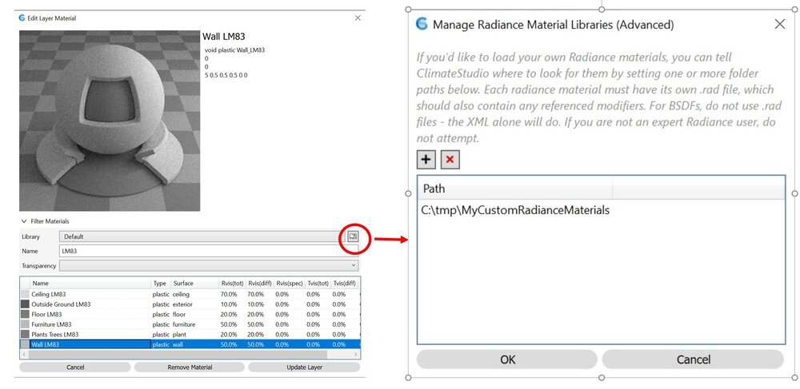
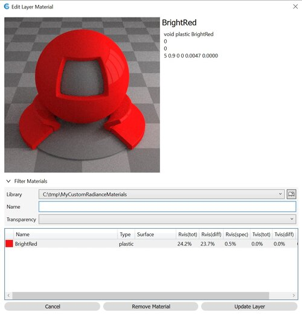

Custom Radiance Materials
================================================
ClimateStudio allows you to set up your own Radiance materials via BSDFs and .rad files and use them in conjunction with the Default library that comes with ClimateStudio. Please note that you need to be familiar with the `Radiance material modifiers`_ to use this option. 

.. _Radiance material modifiers: https://www.radiance-online.org/learning/documentation

Step 1: Create a Library Directory
	Create a directory in which you want to store your custom Radiance materials, e.g. ``C:\tmp\MyCustomRadianceMaterials``.  

Step 2: Create a Radiance Material File
	An example file for a bright red material can be downloaded from `here.`_ Download and copy the file into your library directory.
	
.. _here.: https://climatestudiodocs.com/ExampleFiles/BrightRed.rad

Step 3: Link the Material Library to ClimateStudio
	Under *Assign materials,* open the Edit Layer Material dialogue and add your custom library.
	

Step 4: Select Your Custom Library and Assign a Material
	Under *Assign materials,* open the Edit Layer Material dialogue and add your custom library.
	
