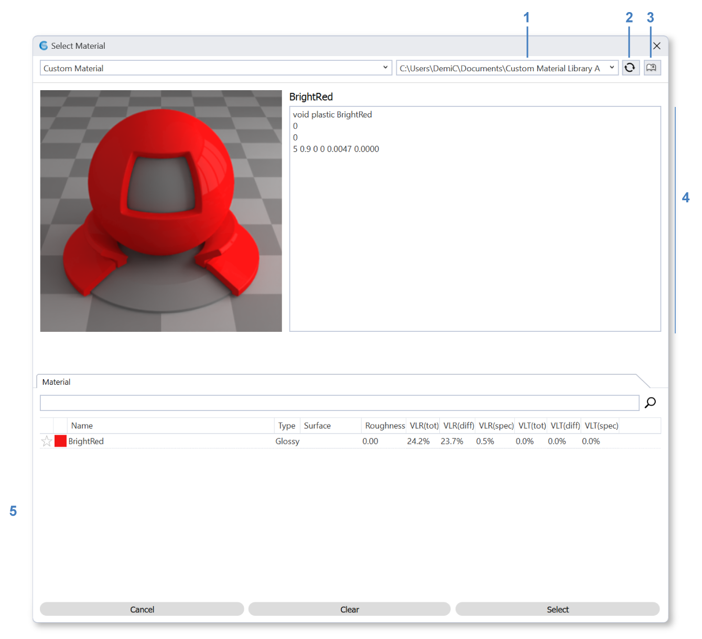

Custom Radiance Material
================================================
ClimateStudio allows you to set up your own Radiance `materials`_ via BSDFs and .rad files and use them in conjunction with the Default library that comes with ClimateStudio. Please note that you need to be familiar with the `Radiance material modifiers`_ to use this option. 

Use **library dropdown (1)** to switch between different custom libraries. 

**Reload (2)** a library to pull new changes of library files. 

Manage your custom libraries with the **library button (3)**. 

The **radiance definition (4)** is shown in the text box. 

Materials in this library are shown in the **table (5)**, click on one to select. 

Defining a Custom Library
----------------------------------------------------

Step 1: Create a Library Directory
	Create a directory in which you want to store your custom Radiance materials, e.g. ``C:\tmp\MyCustomRadianceMaterials``.  

Step 2: Create a Radiance Material File
	An example file for a bright red material can be downloaded from `here.`_ Download and copy the file into your library directory.
	

Step 3: Link the Material Library to ClimateStudio
	Click on the **library button (3)** to open the custom library manager window: 
	

   .. figure:: images/matBrowser_custom_add.png
      :width: 900px
      :align: left

   Click on the **"+" button (6)** to add a library, navigate to the library directory you created and select the entire folder. 
   
   To remove a library, select the library and click on the **delete button (7)**. 
   
   A list of your **loaded libraries** are shown in the **table (8)**. These will be the options available in the **library dropdown (1)**. 

Step 4: Select Your Custom Library and Assign a Material
   Exit the custom library manager and select your material library in the **library dropdown (1)**. Click on one of your custom materials in the **table (5)** to select it then click the "Select" button on the bottom. 

.. _Radiance material modifiers: https://www.radiance-online.org/learning/documentation
.. _here.: https://climatestudiodocs.com/ExampleFiles/BrightRed.rad
.. _materials: materials.html