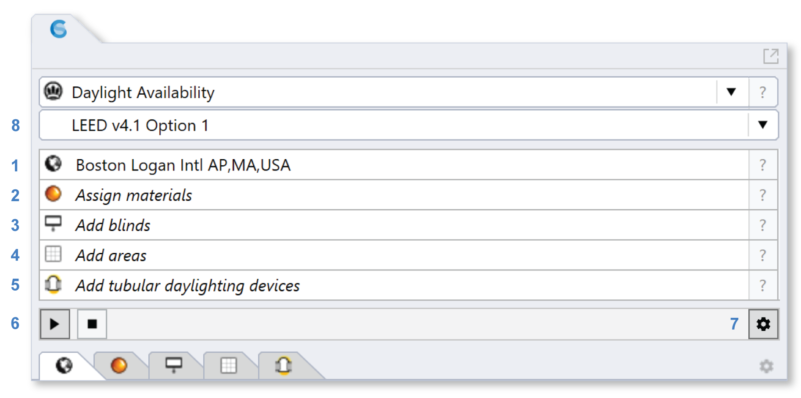

Daylight Availability
================================================
This workflow supports the calculation of a variety of illuminance-based daylight availability metrics. As the name suggests, these metrics are based on indoor illuminance distributions due to daylight under 
either a few select sky conditions, such as 9am/3pm on equinox days or all hours in the year. The purpose of these metrics is to devide an occupied area into daylit and non-daylit portions.

The workflow relies on five subpanels: 

- `Location`_

- `Assign Materials`_

- `Add Blinds`_

- `Add Areas`_

- `Add Tubular Daylighting Devices`_

.. _Location: Location.html

.. _Assign Materials: assignMaterials.html

.. _Add Blinds: addBlinds.html

.. _Add Areas: addAreas.html

.. _Add Tubular Daylighting Devices: addTDDs.html

This workflow is organized into several “sub-workflows” for a variety of daylight availability standards. Depending on the standard chosen, the number of required input subpanels varies. The following standards are supported.
 

   
LEED version 4 Environmental Quality Credit 8
----------------------------------------------------
According to the US Green Building Council, the intent of Environmental Credit 8, `Daylighting and View,`_ is to “provide building occupants with a connection between indoor spaces and the outdoors through 
the introduction of daylight and views into the regularly occupied areas of the building.” ClimateStudio supports various compliance paths for both LEED version 4.0 and 4.1. 

.. _Daylighting and View,: https://www.usgbc.org/credits/?Version=%22v4.1%22&Rating+System=%22New+Construction%22

- **Option 1** calculates spatial daylight autonomy (sDA) for a target illuminance of 300lux and occupant hours from 8am to 6pm daily. sDA is defined as the percentage of occupied hours during which the target illuminance is met through daylight alone. sDA calculations are based on annual, climate-based simulations of thousands of different sky conditions throughout the year. Dynamic shading devices such as blinds or electrochromic glazings have to be specified for all window units. Another metric called annual solar exposure (ASE), corresponds to the percentage of occupied time when the illuminance at a point due to direct sunlight is above 1000lux. The design goal is usually to maximize the daylit area with an sDA above 50%, meaning that there is daylight at a space for at least half of the year. At the same time, the ASE has to be kept below 10% of the occupeid area to avoid glare and overheating. LEED versions 4.0 and 4.1 differ in how strict ASE calculations are being handled. It is worthwhile pointing out that ASE is calculated for the dynamic shading system fully opened all year whereas sDA takes the actual use of dynamic shading into account. 

- **Option 2** is based on two point-in-time illuminance distributions on equinox days at 9am and 3pm under CIE clear sky conditions. The daylit area corresponds to the part of the space with more than 300lux and less than 3000lux at both 9am and 3pm. 

BREEAM
------------
BREEAM is a UK-based green building rating system maintained by the Building Research Establishment Group (`BRE`_). ClimateStudio supports the calculation of BREEAM credits for the achievement of good-practice daylighting levels. The user can choose among five 
pathways to the credit:

- BREEAM UK 4a: Daylight factor based (UK projects) 
- BREEAM UK 4b: Annual illuminance based (UK projects) 
- BREEAM UK 4c: Daylight factor based (UK hospital projects) 
- BREEAM International 4a: Daylight factor based (international projects) 
- BREEAM International 4b: Annual illuminance based (international projects)  

.. _BRE: https://www.breeam.com/

The daylight factor pathways impose thresholds for average daylight factor and daylight-factor uniformity ratios. The annual illuminance pathways require spaces to achieve minimum average and worst-point illuminance levels for a certain number of hours throughout the year. 
The targets are building and space-type specific, and are documented in detail here: https://www.breeam.com/discover/technical-standards/newconstruction/

**Daylight Factor:** The daylight factor is defined as the ratio between the illuminance at a point in a building divided by the illuminance at an upward facing, unshaded outside sensor. The reference sky for the daylight factor is the CIE overcast sky.  The daylight factor serves as a daylight availability metric in multiple building standards world-wide with minimum requirements typically ranging between 2% and 5%.  

**Custom:** This sub-workflow allows users to conduct a climate-based annual illuminance calculation including dynamic shading systems. Rather than following a particular standard, the workflow allows users to set custom minimum, target and exceeding illuminance levels to calculate, for example, the useful daylight illuminance (UDI) between 300lux and 1000lux. The levels can be set through the `Add Areas subpanel.`_

.. _Add Areas subpanel.: addAreas.html

Depending on the sub-workflow selected, a varying number of input subpanels are required, namely: 

- The `Location Subpanel`_ (LEED option 1, BREEAM 4b  and custom only)

- The `Assign Materials Subpanel`_

- The `Add Blinds Subpanel`_ (LEED and custom only)

- The `Add Areas Subpanel`_

.. _Location Subpanel: Location.html

.. _Assign Materials Subpanel: assignMaterials.html

.. _Add Blinds Subpanel: addBlinds.html

.. _Add Areas Subpanel: addAreas.html

If you have not done any lighting simulations in ClimateStudio, it is recommended that you go through the `Lighting Model Setup video tutorial`_ (5 minutes) followed by two video tutorials specifically focussed on daylight availability simulations, namely `Daylight Availability Study`_ and `LEEDv4 Daylight Simulation - Iterative.`_ The Rhino file used in the tutorials is available for `download.`_

.. _Lighting Model Setup video tutorial: https://vimeo.com/392379928

.. _Daylight Availability Study: https://vimeo.com/392380513

.. _LEEDv4 Daylight Simulation - Iterative.: https://vimeo.com/392380721

.. _download.: https://climatestudiodocs.com/ExampleFiles/CS_Two_Zone_Office.3dm

Once all required input subpanels have been populated, a simulation is invoked by pressing the start button.

.. figure:: images/StartButton.jpg
   :width: 300px
   :align: center

ClimateStudio uses a `progressive path-tracing`_ version of the Radiance raytracer to simulate illuminance distributions. While a simulation is in progress, traced light paths accumulate until the user-specified number of passes has been reached. Details on the simulation settings can be found in the `Path-tracing Settings Subpanel.`_

.. _progressive path-tracing: https://www.solemma.com/Speed.html

.. _Path-tracing Settings Subpanel.: path-tracingSettings.html

Simulation Results
--------------------
Upon completion of the first pass, the simulation automatically switches into the ClimateStudio results panel. A General overview of the Results panel is provided `here.`_ 
The image below shows the LEED v4.1 option 1 results panel with the sDA300lux/50% distribution shown in the Rhino viewport on the left and various statistics on the right. 
In the example, the two-zone office space achieves a daylit area of 40.3%, which makes it eligible for a maximum of one daylighing credit. The Rhino viewport results can be modified using the `Viewport Display`_ editor.

.. _here.: results.html

.. _Viewport Display: ViewportDisplay.html

Apart from the annual daylit area (sDA300lux/50%), the graphs to the right show the mean dayit area (% of space > 300lux) by time of day (top) and day of the year (bottom). The two figures show that the daylit area peaks in the middle of the day and the summer season, respectively. 

By default, the two figures on the right show average results for all sensors and times of day/year. However the user can also isolate a specific specific sensor by selecting it in the viewport, or scrub through time steps to see the daylight distribution at specific dates and times.

The user can also display other metrics such as ASE, illuminance distributions and blind position by selecting the different quantities on the top. 

The display settings are very flexible. For example, the figure below shows the illuminance distribution on July 11 at 8:30am for a sensor near the South facing facade. (To select a sensor, just hover the mouse over it.) The lower figure on the right figure shows the so-called, temporal map for the sensor with illuminances, generally peaking from mid April to mid August.

While sliding through a given day, apart form showing the illuminance distribution across the occupied areas, ClimateStudio also indicates the status of any dynamic shading system. In the example figure above, the two South facing windows have the shading fully openend whereas the East facing roller shade is closed. 

A temporal map shows 8760 values for a given quantity with time of day shown on the y-axis and day in the year shown on the x-axis. ClimateStudio allows exporting the illumiance charts via an export dialogue at the
top right of the two images. An example output is shown below.

Reporting
-----------
A key ClimateStudio feature is the ability to create automated simulation results in PDF file format. To generate a report, select the PDF icon to the far right of the simulation result. 

.. figure:: images/daylightAvailability5.png
   :width: 900px
   :align: center

The report generator allows you to customize your report by adding your company logo. In the case of LEED v4 reporting, you can also provide a reason for ASE exceedance, if applicable. See the LEEDv4 technical menu for details. 

.. figure:: images/daylightAvailability6.png
   :width: 400px
   :align: center

An example report can be `downloaded here`_. As of summer 2020, the US Green Building Council accepted ClimateStudio reports for compliance for LEEDv4 Daylighting Credit option 1. 
Follow the procedure below during submission. The LEED Online form will soon be updated to allow for this option.

	**Add this language to the “Special Circumstances” section of the LEED Online credit form**: 

	Thank you for your request for approval of the Solemma ClimateStudio daylight simulation report for LEED EQ credit: Daylight documentation. The ClimateStudio report may be used in lieu of the Daylight and Quality Views Calculator documentation requirements outlined in the LEED Online credit form.  The report or supporting documentation must include daylight details for all regularly occupied spaces in the project. 

	GBCI reviewer questions may be directed to Larissa Oaks at USGBC (loaks@usgbc.org)

	

.. _downloaded here: https://solemma.com/Daylight_LEEDv4.1Report.pdf

