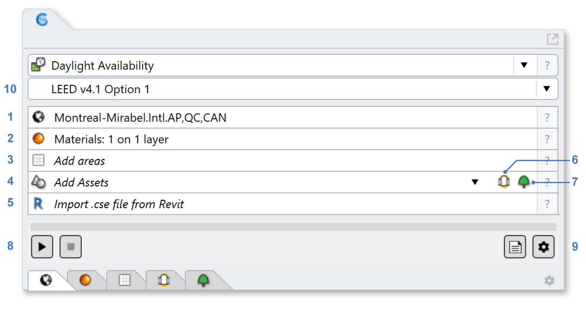

Daylight Availability
================================================
This workflow supports the calculation of a variety of daylight availability metrics. As the name suggests, these metrics assess indoor illuminance distributions due to daylight -- either under select conditions or throughout the entire year. Their purpose is to evaluate the sufficiency of daylight for carrying out work tasks and other indoor activities.

Simulation Setup
-----------------------
There are numerous conventions, compliance guidelines, and accreditation systems centered on the measurement of daylight availability. To cover these bases, ClimateStudio offers several sub-workflows (available via dropdown 8 in the figure below). If you don't have a specific standard in mind, the LEED Option 1 setting is a reasonable place to start.

Depending on the sub-workflow selected, you will see up to five subpanels (labeled 1-5 in the figure above). To prepare a model for simulation, work your way through the available subpanels, entering site and material data as required.

| 1 - `Location`_
| 2 - `Materials`_
| 3 - `Blinds`_
| 4 - `Occupied Areas`_ 
| 5 - `Tubular Daylighting Devices`_ (optional)

.. _Location: location.html

.. _Materials: materials.html

.. _Blinds: blinds.html

.. _Occupied Areas: occupiedAreas.html

.. _Tubular Daylighting Devices: TDDs.html

Please note that **modeling blinds is required** for the LEED Option 1 credit, and for achieving realistic predictions of annual daylight levels in buildings. Dynamic blinds are not considered for sub-workflows that assess point-in-time conditions (LEED Option 2, Daylight Factor, and BREEAM 4a/c). 

If you have not done any lighting simulations in ClimateStudio, it is recommended that you initially go through the `Lighting Model Setup`_ video tutorial (5 minutes). 
The Rhino file used in the tutorial is available for `download`_.

.. _Lighting Model Setup: https://vimeo.com/392379928 
.. _download: https://climatestudiodocs.com/ExampleFiles/CS_Two_Zone_Office.3dm

Once all required inputs have been populated, a simulation is invoked by pressing the start button (6). ClimateStudio uses a `progressive path tracing`_ version of the Radiance raytracer to simulate illuminance distributions. While a simulation is in progress, traced light paths accumulate until the user-specified number of passes has been reached. Details on the simulation settings can be found by opening the `settings dialog`_ (7).
 
.. _progressive path tracing: https://www.solemma.com/blog/why-is-climatestudio-so-fast
.. _settings dialog: pathTracingSettings.html

Simulation Results
------------------------
Daylight availability results vary depending on the sub-workflow selected prior to simulation. Use the links below to skip ahead to the option of interest:

.. toctree::
   :maxdepth: 1
   
   LEED v4 Option 1<daylightLEEDOpt1.rst>
   LEED v4 Option 2<daylightLEEDOpt2.rst>
   BREEAM UK/Intl 4a/c<daylightBREEAM4a.rst>
   BREEAM UK/Intl 4b<daylightBREEAM4b.rst>
   EN 17037<daylightEN17037.rst>
   Daylight Factor<daylightFactor.rst>
   Custom<daylightCustom.rst>
