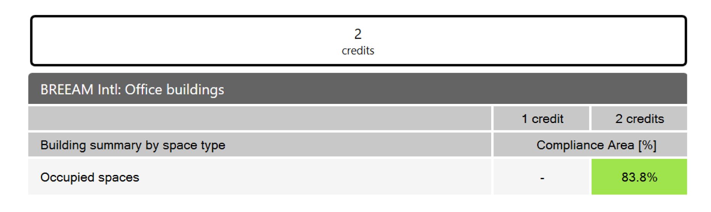

BREEAM Daylight 4a/c
================================================
BREEAM is a UK-based green building rating system maintained by the Building Research Establishment Group (`BRE`_). ClimateStudio supports the calculation of BREEAM credits for the achievement of good-practice daylighting levels. The user can choose between two types of daylight assessment. The daylight-factor-based pathways (UK/Intl. 4a/c) are described below. For the annual-illuminance-based pathways (UK/Intl. 4b), see `BREEAM Daylight 4b`_.

.. _BRE: https://www.bregroup.com/
.. _BREEAM Daylight 4b: daylightBREEAM4b.html

Upon completion of the first simulation pass (`setup instructions here`_), or upon loading a saved result, the `results panel`_ will show a dashboard similar to the following:

.. _setup instructions here: daylightAvailability.html
.. _results panel: results.html

   
The scoring matrix will depend on the region, the type of building, and the type of rooms the building contains. Room types should be set by the user prior to simulation while creating or editing `occupied floor areas`_. In general, the BREEAM assessment works by checking each room for two criteria:

.. _occupied floor areas: daylightAvailability.html

  1. The room must achieve the required **average daylight factor** (usually 2%).
  2. The room must have a **uniformity ratio** of at least 0.3. (Or, a minimum point daylight factor of at least 0.3 times the required average.)

Once all rooms are assessed, the rooms are binned by space type. For each type, it must be shown that the compliant rooms make up at least a minimum percentage of the floor area (usually 80%). If all space types meet this requirement, the building is eligble for 1-2 daylight credits. The compliance status of each room is color-coded in the Rhino viewport:

For full documentation of region, building, and space-specific targets, please refer to BREEAM's `Technical Standards`_ for UK and International projects.

.. _Technical Standards: New Constrictionhttps://www.breeam.com/discover/technical-standards/newconstruction/

Interface Components
--------------------------

The results interface has four sections:

- The **Header** includes the result name, a CSV export (2), and an information dialog (1), which provides an accounting of simulation inputs.

.. _report generator: #reporting

- The **Building Dashboard** provides a performance summary of the entire building, as discussed above.

.. _report generator: #reporting

- The **Room Table** lists results for each regularly occupied floor area in the building. Selecting rooms by filtration (3) or row selection isolates their preview in the Rhino viewport, and updates the statistics in the "Totals" row at the bottom of the table.

.. _report generator: #reporting

- The **Viewport Settings** bar contains a viewport preview legend, a settings menu (5), which provides options for customizing the falsecolor display, and a metric dropdown (4), which controls the type of data previewed. Options include compliance colors (as shown above) or daylight factor (below):

