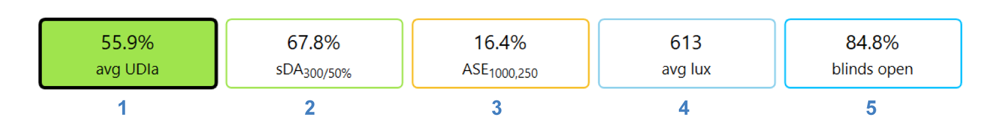
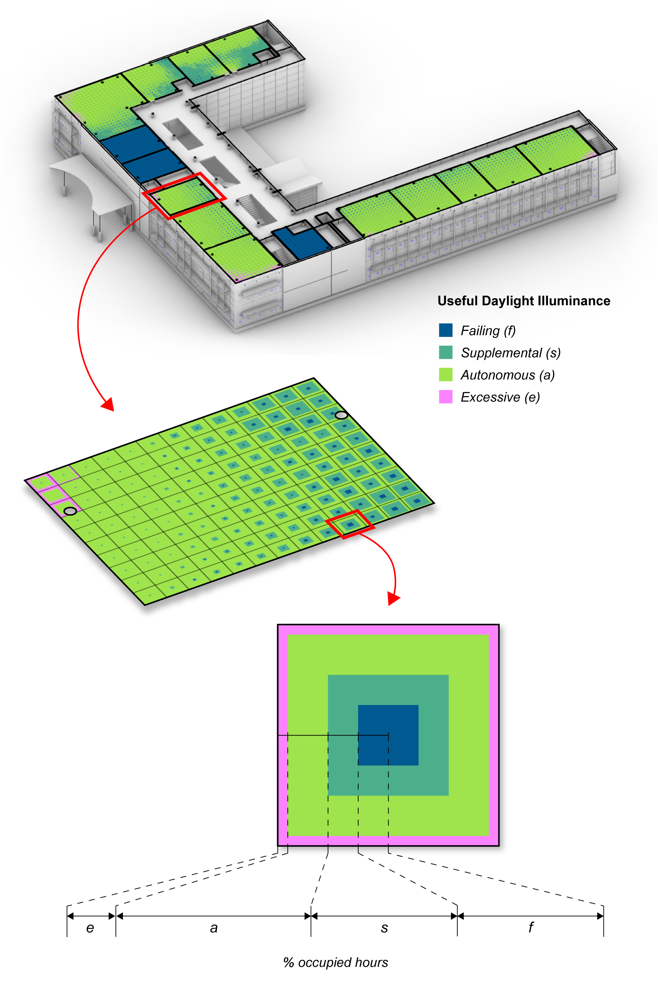
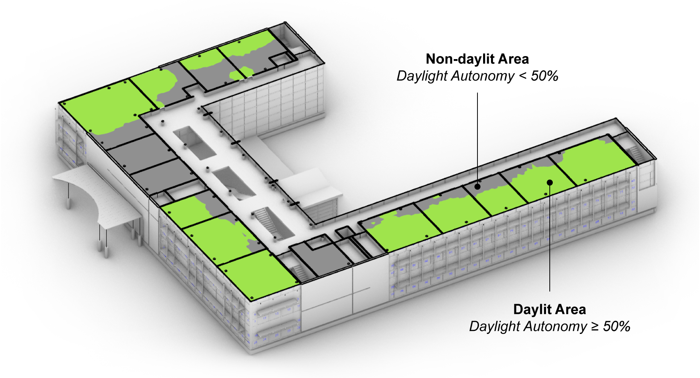
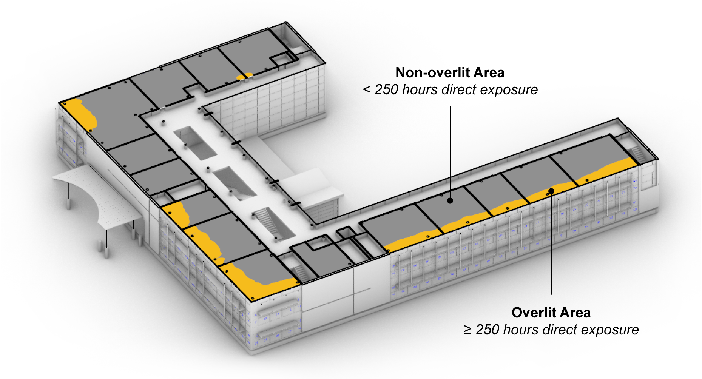
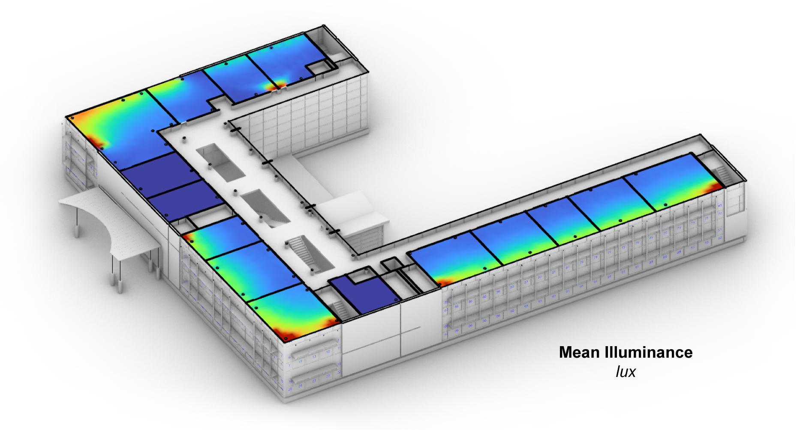
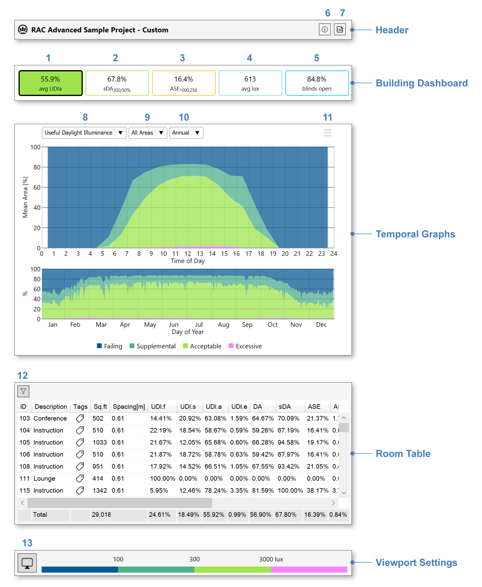

Custom Daylight Availability
================================================
The "custom" daylight availability workflow is useful if the design team isn't targeting a specific accreditation, or needs to adjust annual metrics to comply with a standard not listed in the sub-workflows dropdown. Of all the sub-workflows, it provides the widest set of annual daylight statistics, and the most flexibility in defining lighting thresholds and occupancy schedules (which are set in the `occupied areas panel`_).

.. _occupied areas panel: addAreas.html

Upon completion of the first simulation pass (`setup instructions here`_), or upon loading a saved result, the `results panel`_ will show a dashboard with five key metrics:

.. _setup instructions here: daylightAvailability.html
.. _results panel: results.html

1. **Useful Daylight Illuminance (UDI)**: This metric reports how often daylight levels fall into the following four bins:

  - *Failing (UDI_f)*: Less than 100 lux.
  - *Supplemental (UDI_s)*: Between 100 and 300 lux.
  - *Autonomous (UDI_a)*: Between 300 and 3000 lux.
  - *Excessive (UDI_e)*: More than 3000 lux.
  
.. _results panel: results.html

  For a particular location, the frequency of each bin is reported as a percentage of occupied hours. This is visualized in the Rhino viewport using four color-coded bands around each sensor, where the width of the band is proportional to the bin's time share.
   

   
.. _results panel: results.html

  The avg UDI_a value displayed in the dashboard is the mean UDI_a value for all locations in the building. This number may also be interpreted as the mean autonomous *floor area* for all timesteps. While sDA measures only daylight sufficiency, UDI attempts to separate out excessively bright conditions that may cause visual discomfort. As such, UDI_a demarcates a Goldilocks zone, in which there is adequate daylight for work tasks, but not so much as to cause glare. Meanwhile, UDI_s indicates daylight levels sufficient to supplement but not replace electric lighting (e.g. via dimming). For assessing visual discomfort, it should be noted the `Annual Glare workflow`_ is preferable to both UDI_e and ASE.
  
.. _Annual Glare workflow: annualGlare.html

2. **Spatial Daylight Autonomy (sDA)**: The percentage of the regularly occupied floor area that is "daylit." In this context, "daylit" locations are those meeting target illuminance levels (300 lux) using daylight alone for at least 50% of occupied hours. Such locations are said to be 50% *daylight autonomous*. sDA calculations are based on annual, climate-based simulations of thousands of different sky conditions throughout the year. Per LM-83 guidelines, dynamic shading devices such as blinds or electrochromic glazings **must** be specified for all exterior window units.

3. **Annual Sunlight Exposure (ASE)**: The percentage of the regularly occupied floor area that is "overlit." In this context, "overlit" locations are those receiving direct sunlight (>1000 lux directly from the solar disc)  for more than 250 occupied hours. It is worth pointing out that ASE is calculated for the dynamic shading system fully opened all year, whereas sDA takes the operation of dynamic shading into account. This distinction can cause confusion, but is meant to encourage passive design strategies that minimize visual and thermal discomfort without relying on manual shade operation.

4. **Mean Illuminance**: The average illuminance over the regularly occupied floor area over all occupied hours. Selecting the metric in the dashboard enables perusal of both mean and hourly illuminance data in the Rhino viewport.
 

   
5. **Blinds Open**: The average percentage of dynamic window area that is *unshaded* during occupied hours. This metric is an important indication of the frequency of blinds use in response to direct solar exposure. Lower numbers here indicate higher rates of blinds use, which correspond to lower daylight levels and reduced views to the outside. As with ASE, blinds operation can be minimized through passive design strategies such as orientation, static shading, and reduced window-to-wall ratio.

Interface Components
--------------------------

The results interface has five sections:

- The **Header** includes the result name, a CSV export (2), and an information dialog (1), which provides an accounting of simulation inputs.

.. _report generator: #reporting

- The **Building Dashboard** provides a performance summary of the entire building, as discussed above. Clicking on items 1-5 will update the temporal graphs and (except in the case of the blinds) the viewport legend and preview.

.. _report generator: #reporting

- The **Temporal Graphs** show daylight levels or blinds operation binned by hour of day and day of year. The UDI, sDA and ASE graphs show the percentage of floor area in a given daylit category for each temporal bin. The graphed floor area(s) can be altered using the dropdown (9) or by filtering and/or selecting areas in the Room Table. The rightmost dropdown (10) permits switching between annual and single-day statistics. In the latter mode, time sliders let you scrub through individual hours of year, which causes timestep illuminance data and shading states to be previewed in the Rhino viewport.

.. _report generator: #reporting

- The **Room Table** lists results for each regularly occupied floor area in the building. Selecting rooms by filtration (12) or row selection isolates their preview in the Rhino viewport, and updates the statistics in the "Totals" row at the bottom of the table.

.. _report generator: #reporting

- The **Viewport Settings** bar contains a viewport preview legend and viewport settings menu (13), which provides options for customizing the falsecolor display.

