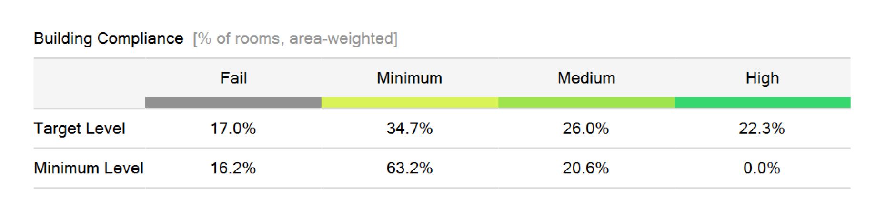
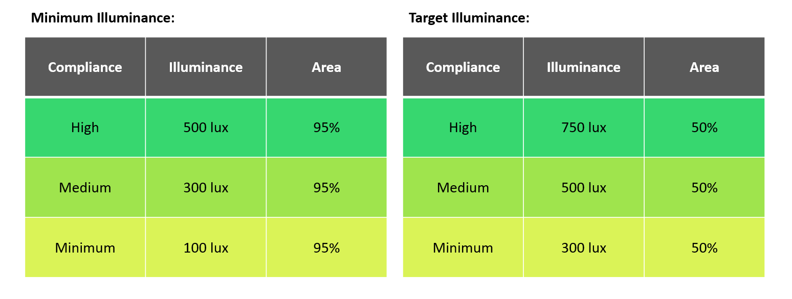
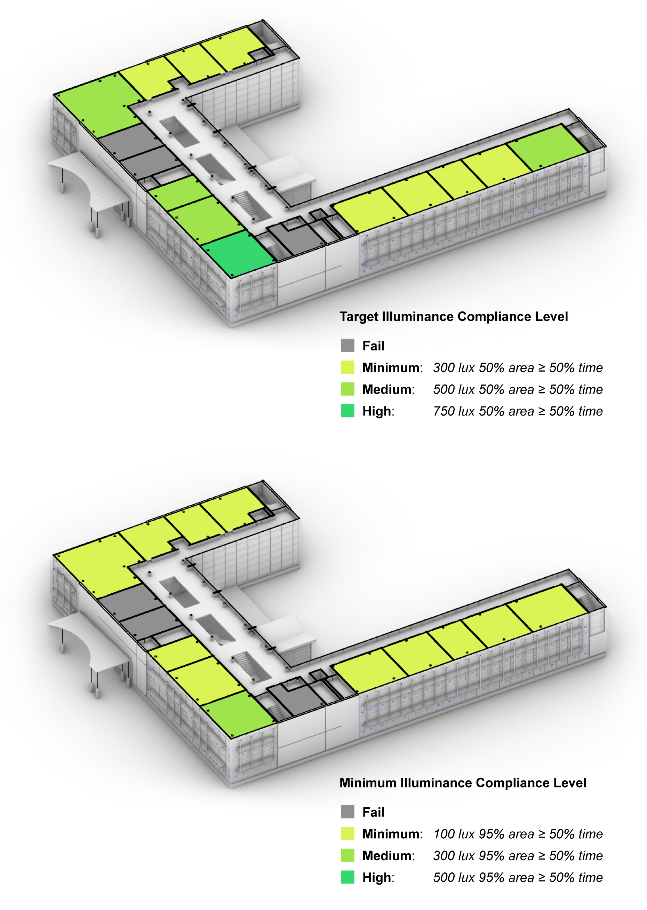
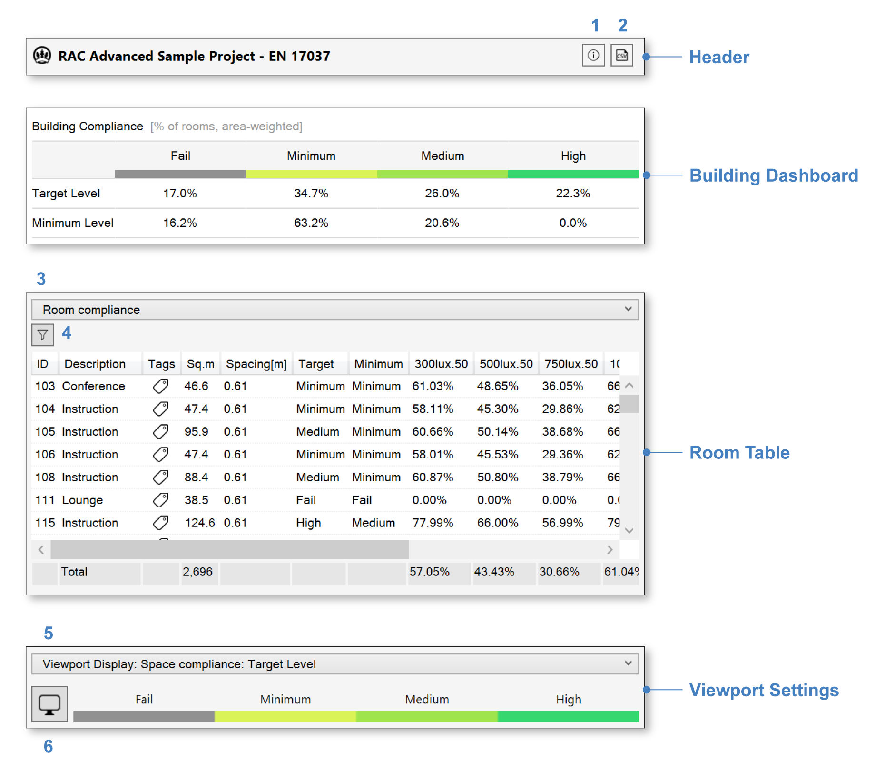
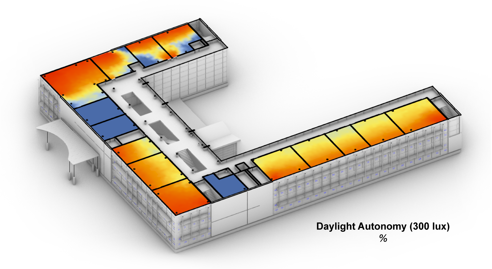

EN 17037 Daylight Provision
================================================
EN 17037 is a unified daylighting standard published by the European Committee for Standardization (`CEN`_) in 2018 (CEN 17037:2018). It covers four aspects of daylight in buildings, the first of which -- *Daylight Provision* -- is covered by ClimateStudio's Daylight Availability workflow (as of ClimateStudio v1.5). Upon completion of the first simulation pass (`setup instructions here`_), or upon loading a saved result, the `results panel`_ will show a dashboard with the following performance matrix, indicating the percentage of rooms (by area) meeting each level of EN 17037 compliance:

.. _CEN: https://www.cen.eu/
.. _setup instructions here: daylightAvailability.html
.. _results panel: results.html

   
The compliance calculation is based on an annual, climate-based simulation of interior illuminance distributions. For each hour of the year, the percentage of the floor area achieving minimum and target illuminance thresholds is measured on a room-by-room basis. To meet the standard, a room must achieve both of the following criteria:

- **Target Illuminance**: 300 lux over 50% of floor area for at least 50% of daylight hours.
- **Minimum Illuminance**: 100 lux over 95% of floor area for at least 50% of daylight hours.
  
Daylight hours are defined as the 4380 hours with the most diffuse horizontal illuminance in the weather file. In addition to this baseline (Minimum) requirement, rooms can achieve Medium and High levels of compliance by meeting higher illuminance thresholds, as outlined in the table below:

The compliance status of each room is color-coded in the Rhino viewport:

Interface Components
--------------------------

The results interface has four sections:

- The **Header** includes the result name, a CSV export (2), and an information dialog (1), which provides an accounting of simulation inputs.

.. _report generator: #reporting

- The **Building Dashboard** provides a performance summary of the entire building, as discussed above.

.. _report generator: #reporting

- The **Room Table** lists results for each regularly occupied floor area in the building. Selecting rooms by filtration (4) or row selection isolates their preview in the Rhino viewport, and updates the statistics in the "Totals" row at the bottom of the table. Above the table, a mode dropdown (3) allows switching to a *windows* view, which lists the window groups and blinds operation statistics for each room, if applicable.

.. _report generator: #reporting

- The **Viewport Settings** bar contains a viewport preview legend, a settings menu (6), which provides options for customizing the falsecolor display, and a metric dropdown (5), which controls the type of data previewed. Options include compliance colors for EN 17037 minimum and target illuminance thresholds (as shown above), mean illuminance, and timestep illuminance, which shows illuminance distributions and blinds states at specific moments throughout the year. Daylight autonomy (DA) values are also available for each of the relevant illuminance thresholds (100, 300, 500, and 750 lux). Strictly speaking, DA is not utilized by the compliance calculation, but the metric is useful for visualizing how often different parts of each room are daylit.

