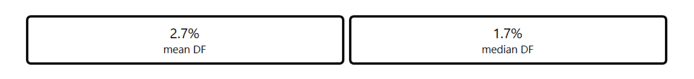
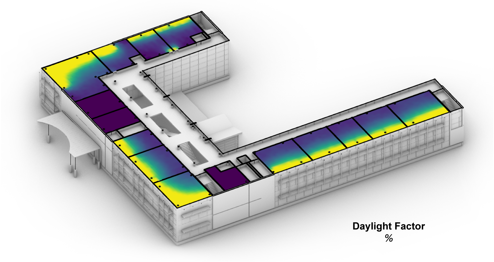
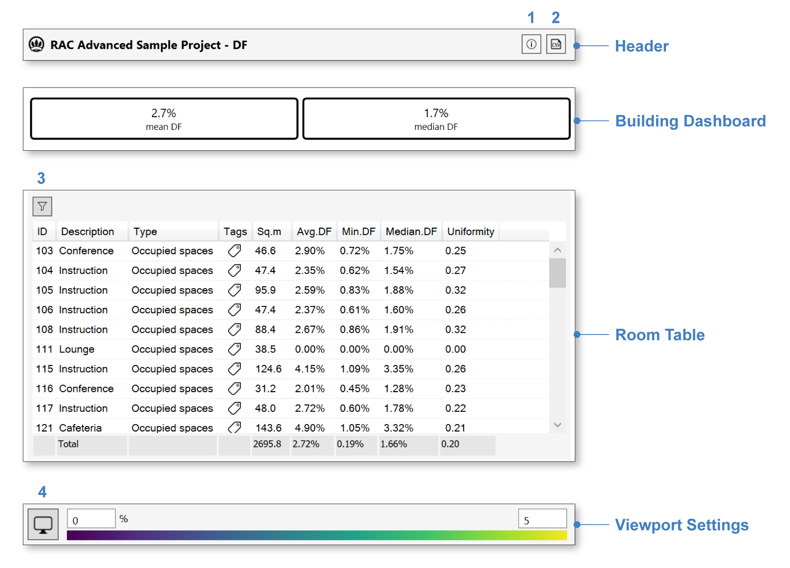

Daylight Factor
================================================
Daylight factor is defined as the ratio between the illuminance at a point in a building divided by the illuminance at an upward facing, unshaded outside sensor. The reference sky for the calculation is the CIE overcast sky.  Daylight factor serves as a daylight availability metric in multiple building standards world-wide, with minimum requirements typically ranging between 2% and 5%.   

Upon completion of the first simulation pass (`setup instructions here`_), or upon loading a saved result, the `results panel`_ will show a dashboard showing the mean and median daylight factors for all areas in the building:

.. _setup instructions here: daylightAvailability.html
.. _results panel: results.html

   
A falsecolor display of the daylight factor data will be shown in the Rhino viewport:

Interface Components
--------------------------

The results interface has four sections:

- The **Header** includes the result name, a CSV export (2), and an information dialog (1), which provides an accounting of simulation inputs.

.. _report generator: #reporting

- The **Building Dashboard** provides a performance summary of the entire building, as discussed above.

.. _report generator: #reporting

- The **Room Table** lists results for each regularly occupied floor area in the building. Selecting rooms by filtration (3) or row selection isolates their preview in the Rhino viewport, and updates the statistics in the "Totals" row at the bottom of the table.

.. _report generator: #reporting

- The **Viewport Settings** bar contains a viewport preview legend and viewport settings menu (4), which provides options for customizing the falsecolor display.

