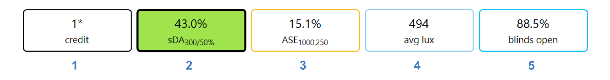
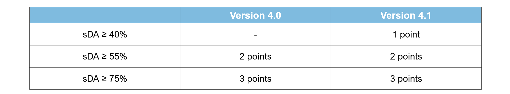
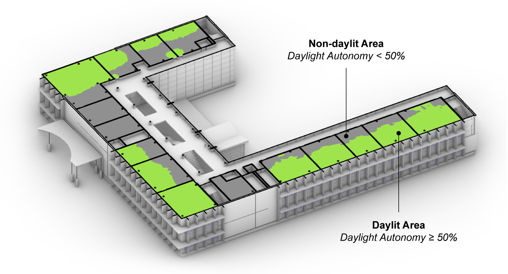
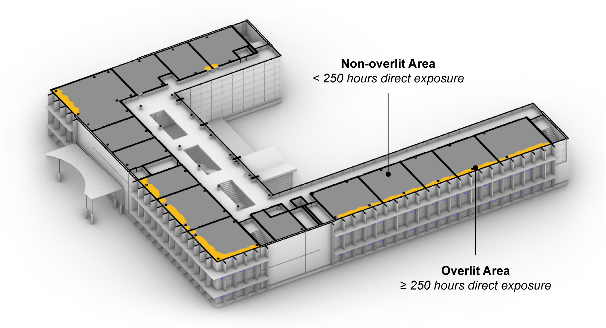
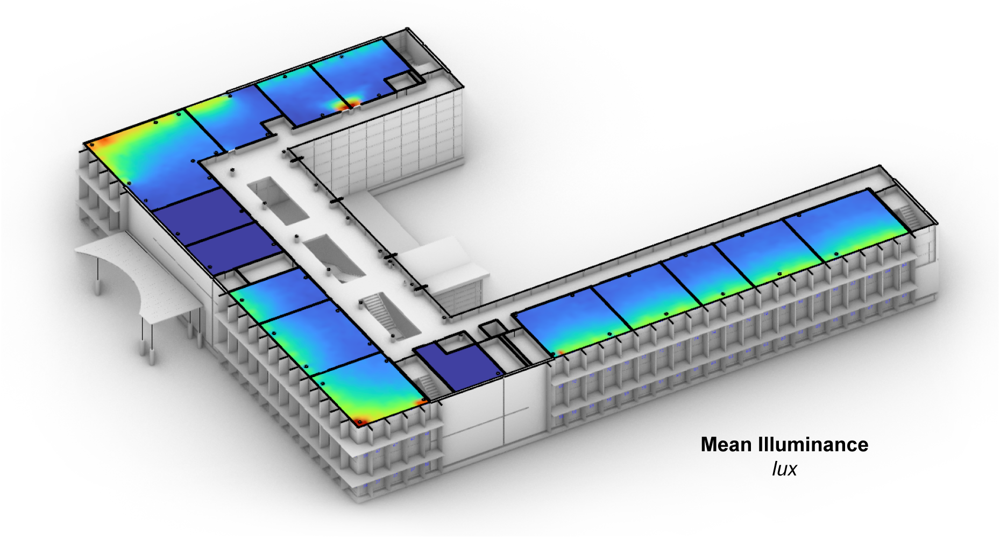
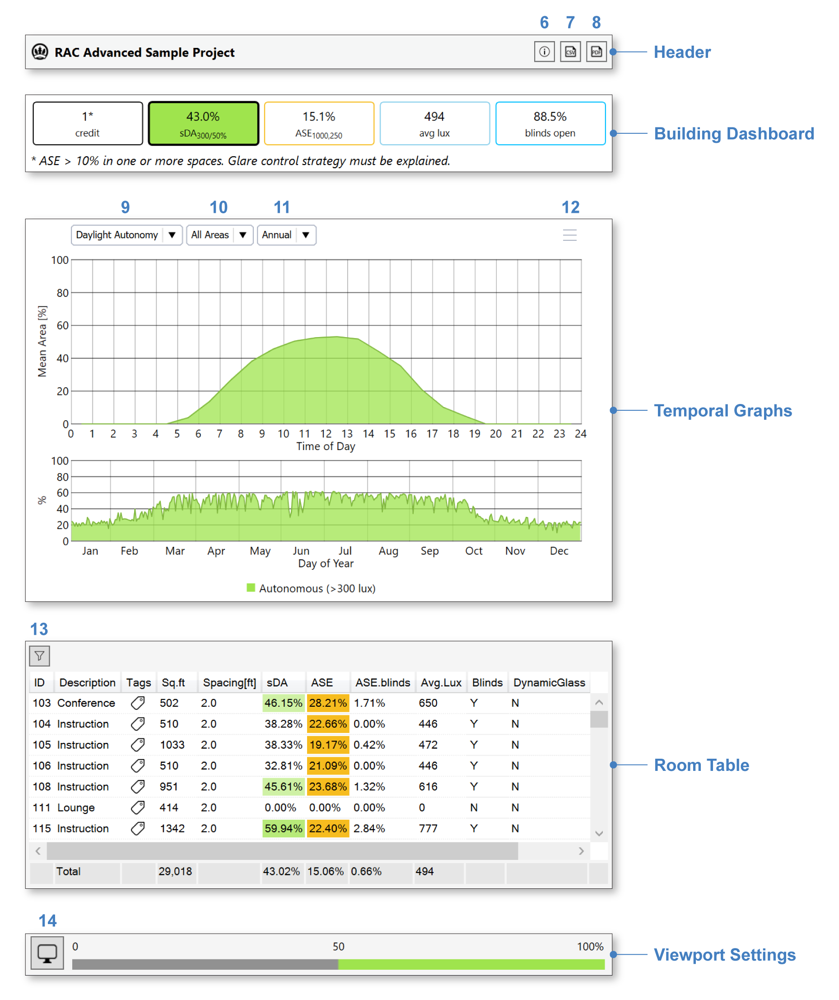
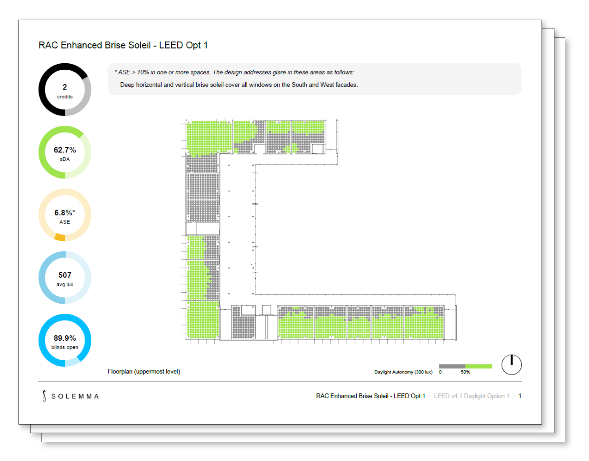
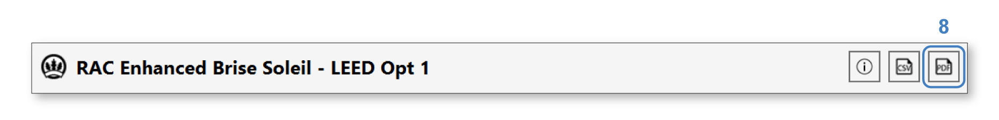
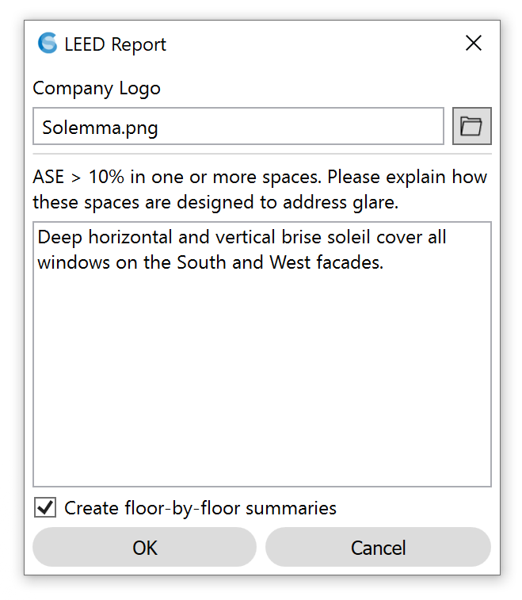

LEED v4 Daylight Option 1
================================================
Leadership in Energy and Environmental Design (`LEED`_) is a green building rating system maintained by the US Green Building Council (`USGBC`_). The system offers two simulation-based options for achieving its Daylight Credit. Option 1, described here, simulates daylight availability throughout the entire year, while `Option 2`_ simulates daylight availability at two specific moments in time. Option 1 yields a more complete description of daylighting performance, offers more potential points under the USGBC's rating system, and is the recommended compliance pathway for the LEED Daylight Credit.

.. _LEED: https://www.usgbc.org/leed
.. _USGBC: https://www.usgbc.org/
.. _Option 2: daylightLEEDOpt2.html

Upon completion of the first simulation pass (`setup instructions here`_), or upon loading a saved result, the `results panel`_ will show a dashboard with five key metrics:

.. _setup instructions here: daylightAvailability.html
.. _results panel: results.html

1. **Credits**: The number of points the building qualifies for. Points are based on the total spatial daylight autonomy (sDA) of all qualifying areas. Areas that receive too much direct sunlight (ASE) are automatically disqualified from the total under LEED version 4.0, though not under version 4.1. In the latter case, please note that ASE values above 10% must be justified in writing as part of the submitted report. 
   

2. **Spatial Daylight Autonomy (sDA)**: The percentage of the regularly occupied floor area that is "daylit." In this context, "daylit" locations are those meeting target illuminance levels (300 lux) using daylight alone for at least 50% of occupied hours. Such locations are said to be 50% *daylight autonomous*. sDA calculations are based on annual, climate-based simulations of thousands of different sky conditions throughout the year. Per LM-83 guidelines, dynamic shading devices such as blinds or electrochromic glazings **must** be specified for all exterior window units.

3. **Annual Sunlight Exposure (ASE)**: The percentage of the regularly occupied floor area that is "overlit." In this context, "overlit" locations are those receiving direct sunlight (>1000 lux directly from the solar disc) for more than 250 occupied hours. LEED versions 4.0 and 4.1 differ in how strictly ASE limits are enforced. It is worth pointing out that ASE is calculated for the dynamic shading system fully opened all year, whereas sDA takes the operation of dynamic shading into account. This distinction can cause confusion, but is meant to encourage passive design strategies that minimize visual and thermal discomfort without relying on manual shade operation. In the displayed model, the static brise soleil were augmented to reduce ASE to acceptable levels. Another strategy might involve specifying automated blinds or electrochromic glazing systems, which trigger ASE exemptions for adjoining rooms.

4. **Mean Illuminance**: The average illuminance over the regularly occupied floor area over all occupied hours. Selecting the metric in the dashboard enables perusal of both mean and hourly illuminance data in the Rhino viewport.
 

   
5. **Blinds Open**: The average percentage of dynamic window area that is *unshaded* during occupied hours. This metric is an important indication of the frequency of blinds use in response to direct solar exposure. Lower numbers here indicate higher rates of blinds use, which correspond to lower daylight levels and reduced views to the outside. As with ASE, blinds operation can be minimized through passive design strategies such as building orientation, static shading, and reduced window-to-wall ratio.

Interface Components
--------------------------

The results interface has five sections:

- The **Header** includes the result name, an information dialog (6), which provides an accounting of simulation inputs, a CSV export (7), and a `report generator`_ (8), which produces a PDF report for accreditation submission.

.. _report generator: #reporting

- The **Building Dashboard** provides a performance summary of the entire building, as discussed above. Clicking on items 2-5 will update the temporal graphs and (except in the case of the blinds) the viewport legend and preview.

.. _report generator: #reporting

- The **Temporal Graphs** show daylight levels or blinds operation binned by hour of day and day of year. The sDA and ASE graphs show the percentage of floor area that is daylit (300 lux) or overit (1000 lux direct), respectively, for each temporal bin. The graphed floor area(s) can be altered using the dropdown (10) or by filtering and/or selecting areas in the Room Table. The rightmost dropdown (11) permits switching between annual and single-day statistics. In the latter mode, time sliders let you scrub through individual hours of year, which causes timestep illuminance data and shading states to be previewed in the Rhino viewport.

.. _report generator: #reporting

- The **Room Table** lists results for each regularly occupied floor area in the building. Selecting rooms by filtration (13) or row selection isolates their preview in the Rhino viewport, and updates the statistics in the "Totals" row at the bottom of the table.

.. _report generator: #reporting

- The **Viewport Settings** bar contains a viewport preview legend and viewport settings menu (14), which provides options for customizing the falsecolor display.

Reporting
-----------

A key ClimateStudio feature is its ability to create automated simulation reports in PDF format. To generate a report, click the PDF button (8) in the result header. 

The report generator allows you to customize your report by adding your company logo. You may also be prompted to provide a reason for ASE exceedance, if applicable.

An example report can be `downloaded here`_. As of summer 2020, the US Green Building Council accepted ClimateStudio reports for compliance for LEEDv4 Daylighting Credit Option 1. Follow the procedure below during submission. The LEED Online form will soon be updated to allow for this option.

	**Add this language to the “Special Circumstances” section of the LEED Online credit form**: 

	Thank you for your request for approval of the Solemma ClimateStudio daylight simulation report for LEED EQ credit: Daylight documentation. The ClimateStudio report may be used in lieu of the Daylight and Quality Views Calculator documentation requirements outlined in the LEED Online credit form.  The report or supporting documentation must include daylight details for all regularly occupied spaces in the project. 

	GBCI reviewer questions may be directed to Larissa Oaks at USGBC (loaks@usgbc.org)

	

.. _downloaded here: https://climatestudiodocs.com/ExampleFiles/RAC_Enhanced_Brise_Soleil-LEEDv4.1_Daylight_Report.pdf

