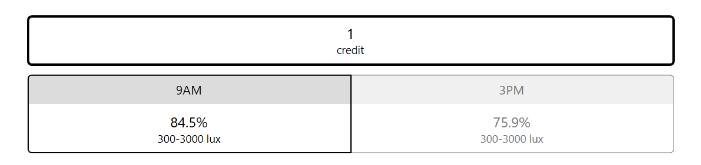
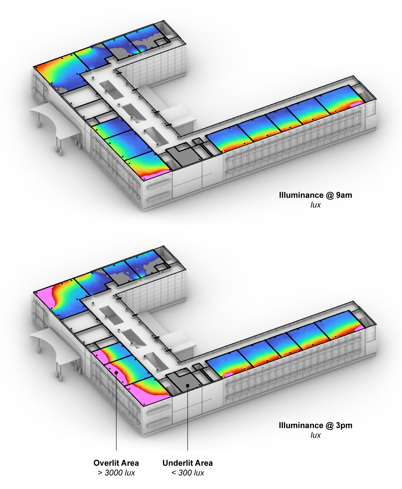
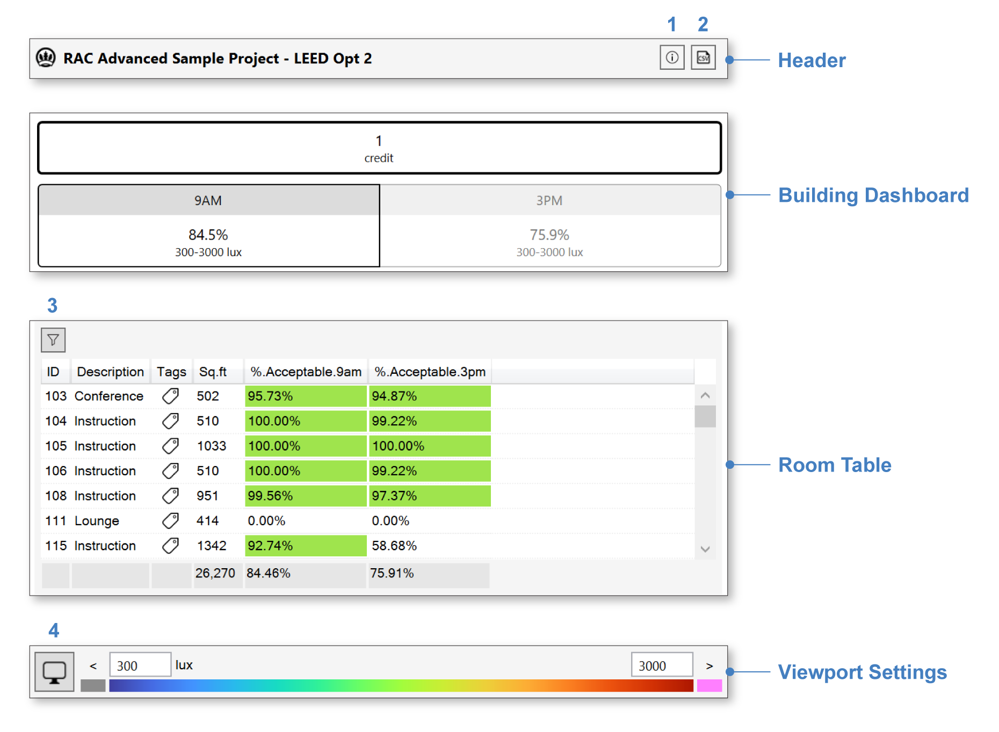

LEED v4 Daylight Option 2
================================================
Leadership in Energy and Environmental Design (`LEED`_) is a green building rating system maintained by the US Green Building Council (`USGBC`_). The system offers two simulation-based options for achieving its Daylight Credit. `Option 1`_ simulates daylight availability throughout the entire year. Option 2, described here, simulates daylight availability at two specific moments in time: 9am and 3pm on the equinox. In each case, the sky condition assumes the brightest day in the weather file within 15 days of March 21 or September 21. 

.. _LEED: https://www.usgbc.org/leed
.. _USGBC: https://www.usgbc.org/
.. _Option 1: daylightLEEDOpt1.html

Upon completion of the first simulation pass (`setup instructions here`_), or upon loading a saved result, the `results panel`_ will show a dashboard with three key metrics:

.. _setup instructions here: daylightAvailability.html
.. _results panel: results.html

The number of credits earned is based on the percentage of the regularly occupied floor area receiving between 300 and 3000 lux -- a Goldilocks zone in which daylight is neither too dim for work tasks, nor too bright for visual comfort. One point is awarded if the 9am and 3pm conditions both achieve compliance areas of at least 75%. Two points are awarded if both areas exceed 90%. Clicking on the 9AM or 3PM dashboard button will show the corresponding falsecolor map in the Rhino viewport:

Interface Components
--------------------------

The results interface has four sections:

- The **Header** includes the result name, a CSV export (2), and an information dialog (1), which provides an accounting of simulation inputs.

.. _report generator: #reporting

- The **Building Dashboard** provides a performance summary of the entire building, as discussed above.

.. _report generator: #reporting

- The **Room Table** lists results for each regularly occupied floor area in the building. Selecting rooms by filtration (3) or row selection isolates their preview in the Rhino viewport, and updates the statistics in the "Totals" row at the bottom of the table.

.. _report generator: #reporting

- The **Viewport Settings** bar contains a viewport preview legend and viewport settings menu (4), which provides options for customizing the falsecolor display.

