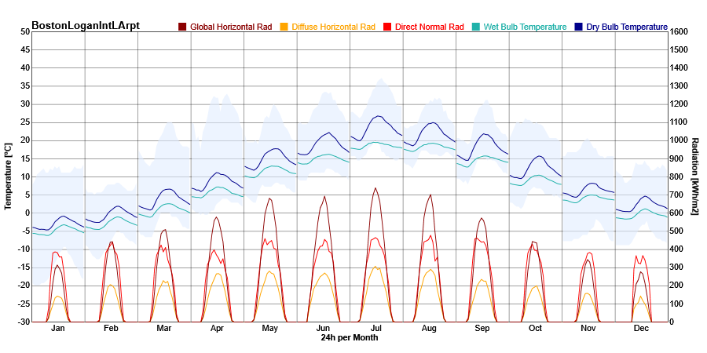

Diurnal Averages
================================================

Diurnal Averages Graph displays monthly averages of temperature and radiation across the 24 hours of the day. It shows what a "typical day" would look like in a particular month. 

- **Hovering** on specific data points will show precise data
- **Clicking** on the rectangle of legend color blocks can hide/display the respective category of data