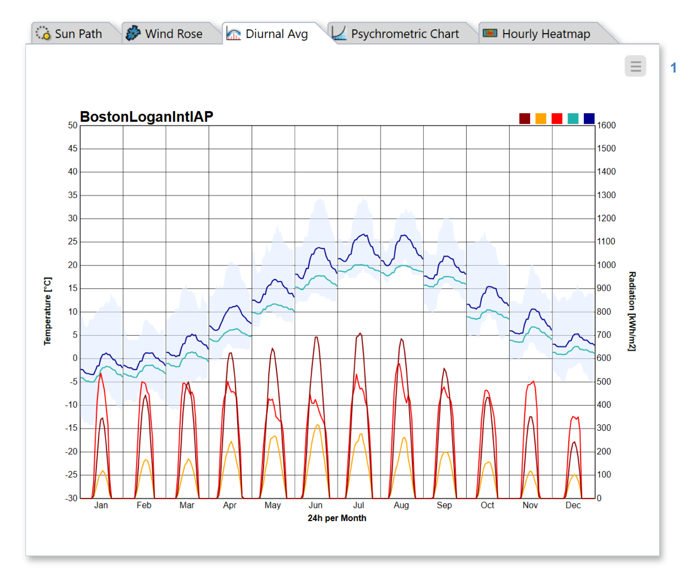

Diurnal Averages
================================================

The Diurnal Averages tab displays monthly averages of temperature and radiation across the 24 hours of the day. It shows what a "typical day" looks like in a particular month. 

Hover over specific data points to show precise values. To hide or show data series, click on the legend color swatches in the upper right. Use the menu (1) to change units or `export`_ the plot to PNG or PDF.

.. _export: exportPlots.html