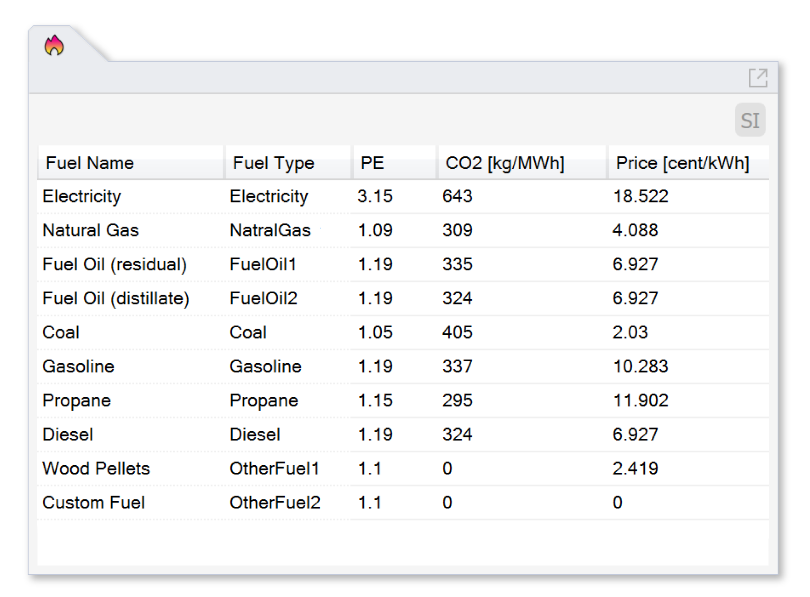

Energy Sources and Emission Factors
================================================

   

This panel sets global energy sources and emission factors for `Thermal Analysis`_. (This information used to be entered at the zone level.)

Double click on cels in *Fuel Name*, *PE*, *CO2*, and *Price* columns to edit values. 

Click on unit switch icon on the top right corner of the table to toggle between SI and Imperial unit systems. 

.. _Thermal Analysis: thermalAnalysis.html

Default Value Sources
----------------

**PE** and **CO2** emission references `ANSI/ASHRAE/ICC/USGBC/IES Standard I89.I-2020`_ *Table 7.5.2 Source Energy Conversion Factors and CO2e Emissions Factors*. 

**Prices** are highly volatile and region dependent. Our values reference `NYSERDA energy annual prices`_. 
Default prices are from *New York State Residential Energy Prices in Nominal Dollars* from the year 2018 with the exception of Coal and Gasoline prices. 
Coal price is from 2007 adjusted to 2018 dollar value based on GDP deflator. 
The gasoline price is from `2022 New York State Weekly Motor gasoline prices`_  for Dec. 2022 Statewide converted into $/kWh based on the assumption of 113.45 btu/gallon energy density of Gasoline as reported by `National Service Center for Environmental Publications Fuel Economy Impact Analysis of RFG`_. 

**Diesel** is assumed to be equavalent to Fuel Oil (distillate) from ASHRAE table. 

**Wood Pellets** The PE factor is assumed to be 1 and the CO2 conversion factor is assumed to be 0 (wood from sustainable sources with 0 carbon emissions). 

Resources
----------------

**Electricity CO2** varies depending on country and region.  

- `United States Environmental Protection Agency's power profiler`_ can look up fuel mix and CO2 emission by zip code. 
- `ANSI/ASHRAE/ICC/USGBC/IES Standard 189.1-2020`_ *Standard for the Design of High-Performance Green Buildings - Table 7.5.2 Source Energy Conversion Factors and CO2e Emissions Factors* contains US CO2 emission for each individual grid. 

**Electricity Prices**  

- `U.S. Bureau of Labor Statisitcs average energy prices`_ provides electricity price per kWh by state. 

**Fuel Prices**  

- `NYSERDA energy annual prices`_ provides New York state prices for different fuels. 

.. _ANSI/ASHRAE/ICC/USGBC/IES Standard 189.1-2020: https://www.ashrae.org/technical-resources/standards-and-guidelines/read-only-versions-of-ashrae-standards
.. _United States Environmental Protection Agency's power profiler: https://www.epa.gov/egrid/power-profiler#/
.. _U.S. Bureau of Labor Statisitcs average energy prices: https://www.bls.gov/regions/midwest/data/averageenergyprices_selectedareas_table.htm
.. _NYSERDA energy annual prices: https://www.nyserda.ny.gov/Energy-Prices/Annual-Prices
.. _2022 New York State Weekly Motor gasoline prices: https://www.nyserda.ny.gov/Energy-Prices/Motor-Gasoline
.. _National Service Center for Environmental Publications Fuel Economy Impact Analysis of RFG: https://nepis.epa.gov/Exe/ZyNET.exe/P100B3FL.TXT?ZyActionD=ZyDocument&Client=EPA&Index=1995+Thru+1999&Docs=&Query=&Time=&EndTime=&SearchMethod=1&TocRestrict=n&Toc=&TocEntry=&QField=&QFieldYear=&QFieldMonth=&QFieldDay=&IntQFieldOp=0&ExtQFieldOp=0&XmlQuery=&File=D%3A%5Czyfiles%5CIndex%20Data%5C95thru99%5CTxt%5C00000031%5CP100B3FL.txt&User=ANONYMOUS&Password=anonymous&SortMethod=h%7C-&MaximumDocuments=1&FuzzyDegree=0&ImageQuality=r75g8/r75g8/x150y150g16/i425&Display=hpfr&DefSeekPage=x&SearchBack=ZyActionL&Back=ZyActionS&BackDesc=Results%20page&MaximumPages=1&ZyEntry=1&SeekPage=x&ZyPURL

