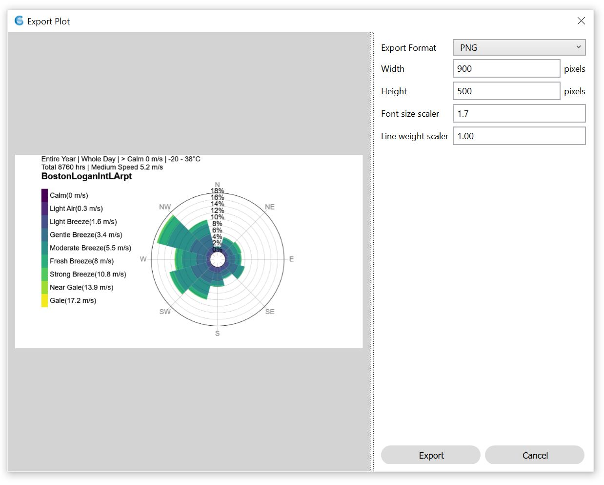
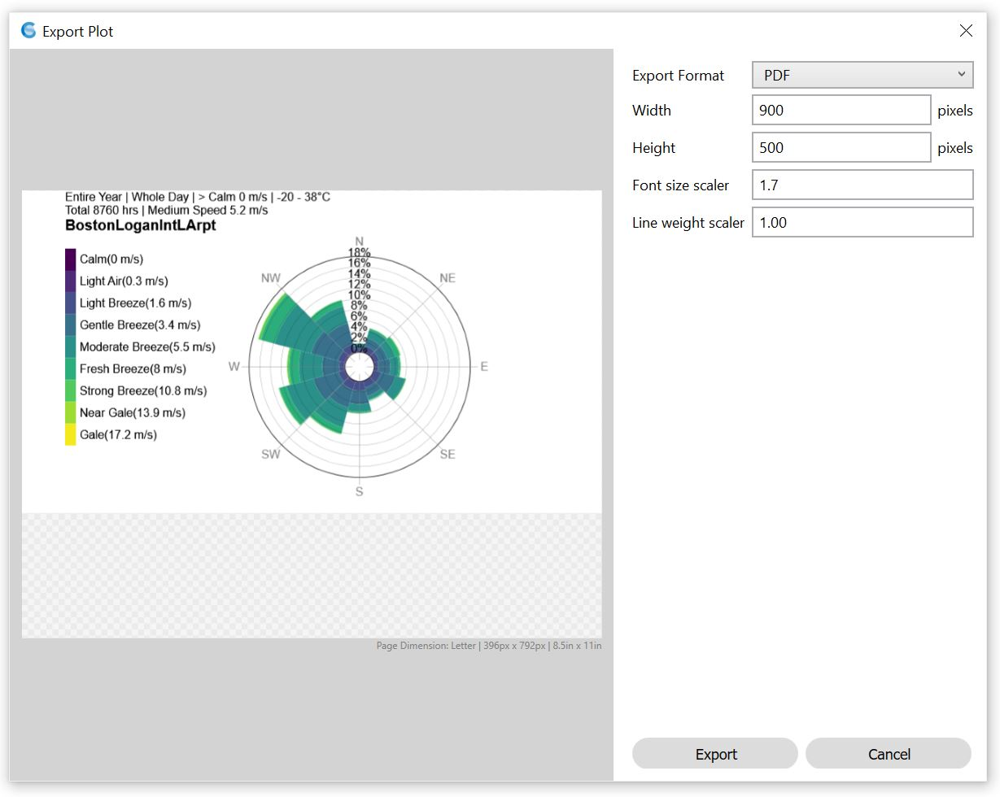

Export Plots
================================================

Allows the export to both a raster image (.png) file and as a vector graphic (.pdf) file (Adobe Illustrator  editable).

The following print settings can be changed: 

- **Width / Height** sets the export image dimensions  when exporting png. when exporting pdf, the image will be scaled back to fit the size of the 8.5'x11' page. 
- **Font Size Scaler** is applied to fonts and sometimes legends to scale up/down the text for readability when exporting. 
- **Line Weight Scaler** is applied to lines to scale up/down the lines for legibility when exporting. 

Clicking the "Export" button will bring up the file location selection box and will export the respective plot to file as defined. 