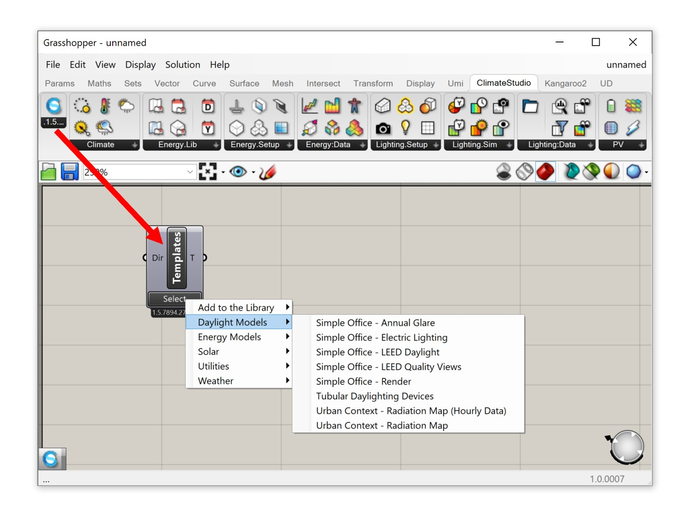

Grasshopper Workflow Templates
=================================
Most ClimateStudio workflows can be run via the Graphical User Interface in Rhino as well as using Rhino’s algorithmic modeling environment Grasshopper. In case you are not already familiar with Grasshopper, please refer to the `McNeel website`_. Otherwise, try out one of our many GH workflow templates. 

To get started, type “grasshopper” in the Rhino command prompt and load the CS Workflow Templates component (see below). Follow the instructions provided on the Grasshopper canvas. In most instances you just have to press “run”.  

.. _McNeel website: https://www.grasshopper3d.com/ 

Site Analysis 
-------------

- Diurnal Averages
- Sun Hours on Surface
- UTCI

Point-in-time illuminace
------------------------

- Simple Office - Electric Lighting
- Tubular Daylighting Devices - Clear Sky

Daylight Availability
---------------------

- Simple Office - LEED Daylight

Annual Glare
------------

- Simple Office - Annual Glare

Radiance Rendering
------------------

- Simple Office - Rendering

Thermal Model
-------------

- Airflow network Model

- Add to Library

	Create Material and Construction

	Create Schedules

	Glazing Construction Workflows

- Green Roof Example
- Massing Analysis with Autozoner
- Massing Analysis
- Natural Ventilation	
- Parametrize Zone Settings
- Shading Masks for Urban Context 
- Shoebox Model
- Simulation Game
- Spatial Thermal Comfort
- Zone From Surfaces	

Radiation Map & PV
------------------

- PV Simulation
- System with battery
- Urban Context - Radiation Map (Hourly Data)
- Urban Context - Radiation Map 

View Analysis
-------------

- Simple Office - LEED Quality Views
