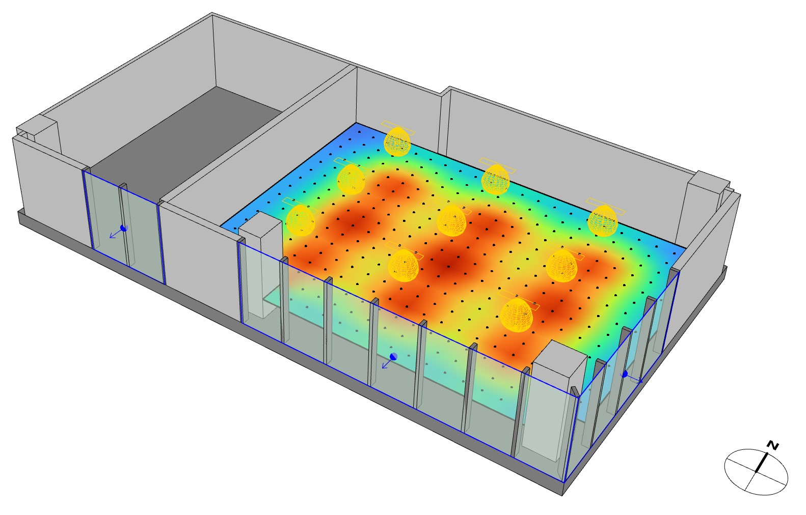
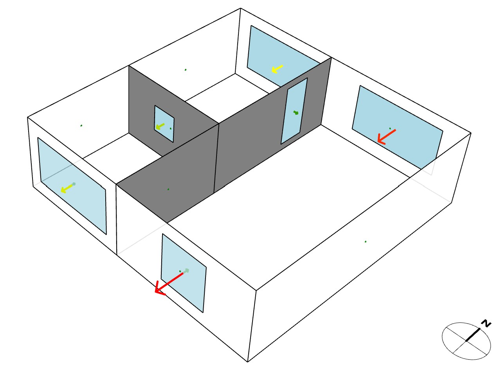
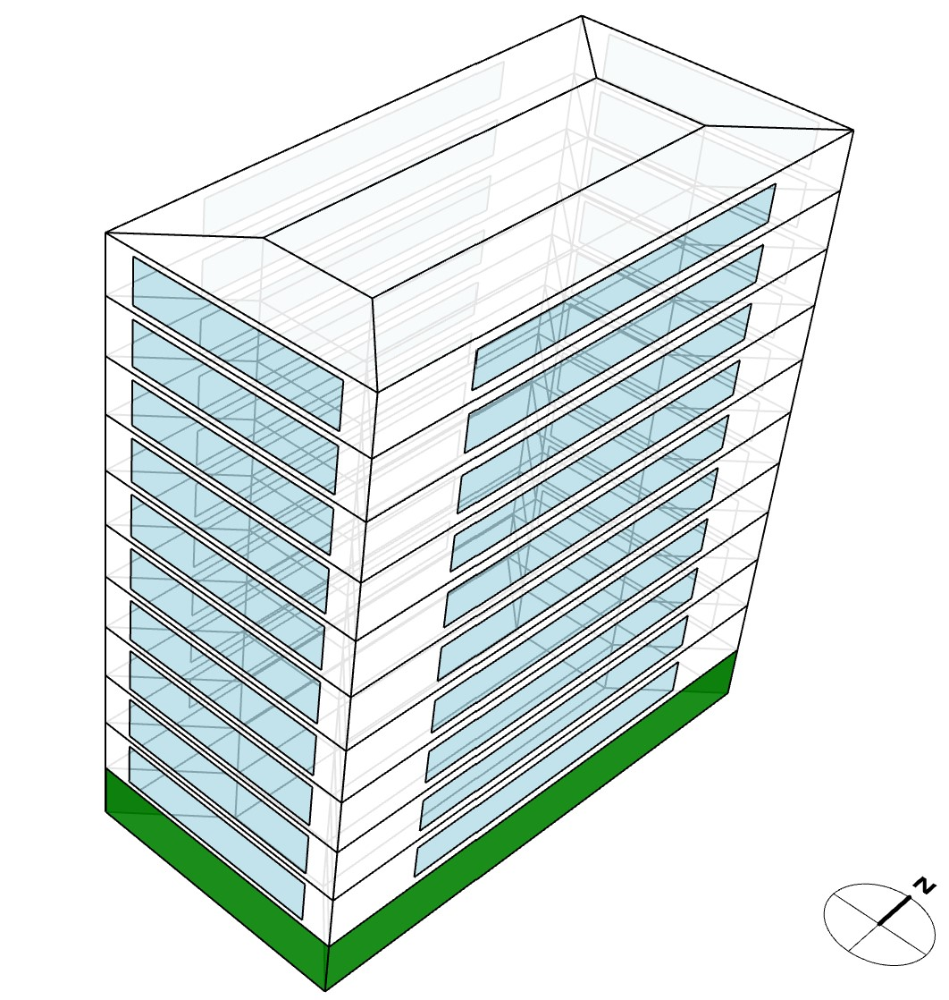
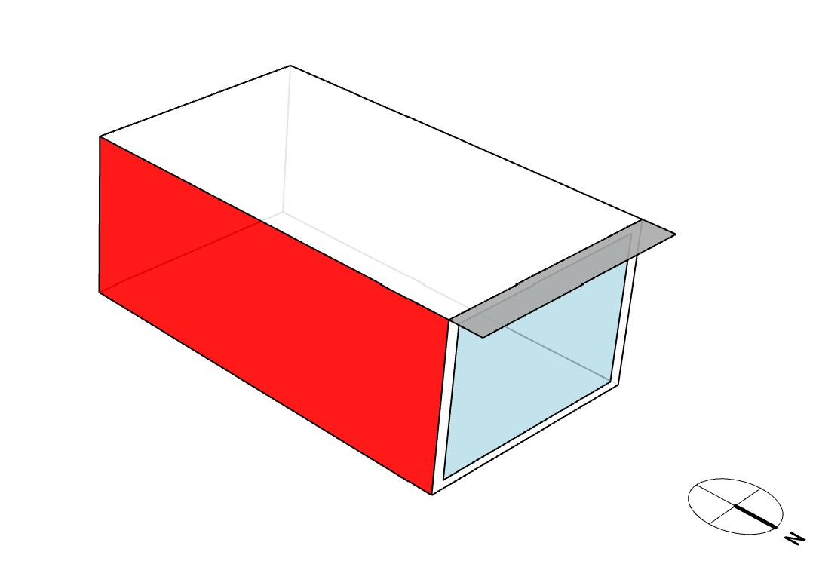
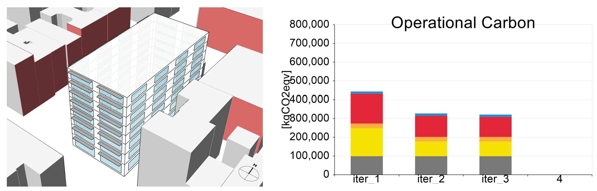
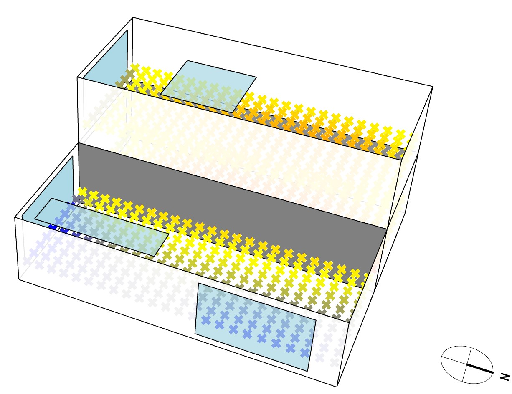
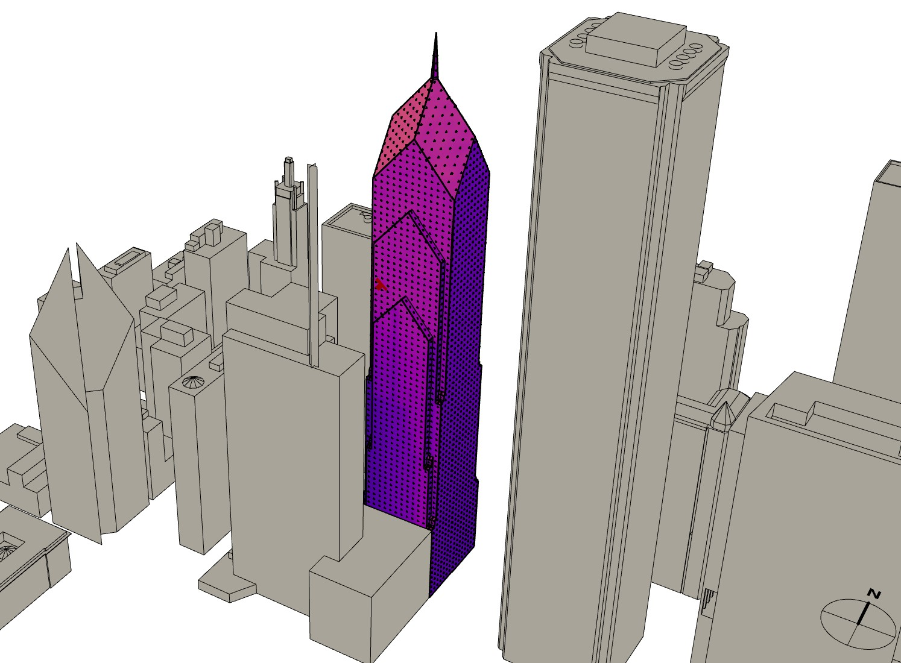

Grasshopper Workflow Templates
=================================
Most ClimateStudio workflows can be run via the Graphical User Interface in Rhino as well as using Rhino’s algorithmic modeling environment Grasshopper. In case you are not already familiar with Grasshopper, please refer to the `McNeel website`_. Otherwise, try out one of our many GH workflow templates. 

To get started, type “grasshopper” in the Rhino command prompt and load the CS Workflow Templates component (see below). Follow the instructions provided on the Grasshopper canvas. In most instances you just have to press “run”.  

.. figure:: images/GH_WorkflowTemplates.jpg
   :width: 900px
   :align: center

.. _McNeel website: https://www.grasshopper3d.com/ 

Site Analysis 
-------------

- *Diurnal Averages* Displays monthly mean diurnal averages for temperature and solar radiation based on a climate (EPW) file.
- *Sun Hours on Surface* Calculates the number of hours a custom surface is exposed to direct sunlight on a given day.
- *UTCI* Provides an annual hourly heat map of Universal Thermal Climate Indices (UTCI) assuming a point that is any combination of permanently shaded from or exposed to wind and/or direct sunlight. 

Point-in-time illuminace
------------------------

- *Simple Office - Electric Lighting* Calculates workplan illuminances in a corner office for a 3x3 grid of ceiling-mounted luminaires. Press “run” to start simulation and show results.

   
- *Tubular Daylighting Devices - Clear Sky* Calculates workplan illuminances in a corner office for a 2x3 grid of tubular skylights on a clear day in Boston on Sep 21 at noon. Press “run” to start simulation and show results.

Daylight Availability
---------------------

- *Simple Office - LEED Daylight* Calculates spatial daylight autonomy (sDA), annual solar exposure (ASE) or mean illuminances for two sidelit spaces. Press “run” to start simulation and show results.

Annual Glare
------------

- *Simple Office - Annual Glare* Calculates a grid of annual spatial daylight glare probability (DGP) values for two sidelit spaces. Press “run” to start simulation and show results.

Radiance Rendering
------------------

- *Simple Office - Rendering* Generates an indoor rendering of two sidelit spaces. Press “run” to start simulation and show results. 

Thermal Model
-------------

- *Airflow Network Model* Uses the airflow network in EnergyPlus to calculate airflows in a three-zone, naturally ventilated building on July 4/5 in Boston. Press “Run Analysis” to start simulation and visualize airflows.

- *Add to Library | Create Material and Construction* Shows how to create custom construction assemblies and add them to the ClimateStudio library. 
- *Add to Library | Create Schedules* Shows how to create custom schedules and add them to the ClimateStudio library. 
- *Add to Library | Glazing Construction Workflows* Shows how to create custom glazing assemblies and add them to the ClimateStudio library. 
- *Green Roof Example* Uses the Green Roof Model from EnergyPlus to define a vegetated roof for a two-story building. Press “Run Analysis” to start simulation and show results.
- *Massing Analysis with Autozoner* Parametric massing study of a multi-floor building. Individual floor are automatically divided into perimeter and core zones using the Autozoner algorithm. Press “Run” to start simulation and show results.

- *Massing Analysis* Parametric massing study of a multi-floor building with surrounding urban context. Press “Run” to start simulation and show results.
- *Natural Ventilation* Natural ventilation study of a two-zone building using auto-generated availability schedules based on local climate. Press “Run Analysis” to start simulation and show results.	
- *Parametrize Zone Settings* Demonstration script of how to parametrize a variety of thermal zone settings.
- *Shading Masks for Urban Context* Script that converts a complex urban geometry intro an equivalent ring of shading surfaces for a thermal simulation. 
- *Shoebox Model* Energy Use Intensity study of a single zone thermal model (good beginner script). Press “Run Analysis” to start simulation and show results.

- *Simulation Game* Parametric massing study of a multi-floor building with surrounding urban context. Press “Run” to start simulation and show results. Go through various iterations and rerun the simulation. Previous results are stored and displayed.

- *Spatial Thermal Comfort* This definition calculates distributions of Predicted Mean Vote and Mean Radiant Temperature across the floor area of a three-zone thermal model. Press the run button  to start simulation and show results.

- *Zone From Surfaces* This definition shows how to build an EnergyPlus thermal zone out of multiple individual surfaces and assign custom construction assemblies to each surface individually. Press “Run Analysis” to start simulation and show results.	

Radiation Map & PV
------------------

- *PV Simulation* Calculates monthly electricity generated by a photovoltaic (PV) system that consists of six solar arrays based on EnergyPlus. The system is located in Boston. Press “run” to start simulation and show results.
- *System with Battery* Workflow to design/size a PV system plus battery that complements the electric load of a office building that consists of four thermal zones. As a first step press the “Run Analysis” button to calculate the hourly loads for heating, cooling, lighting and equipment for the office building.  The results are displayed for a week in the middle of the year, starting day 111. Then press the “Run This” button to model the PV/battery system. You can study how different system sizes will modify the amount of electricity met by the system without the use of the local electric grid.
- *Urban Context - Radiation Map (Hourly Data)* Calculates hourly solar radiation falling on a highrise in a dense urban setting. Press “run” to start simulation and show results. Please note that storing hourly results leads to greatly increased ClimateStudio result (CSR) files. 
- *Urban Context - Radiation Map* Calculates annual solar radiation falling on a highrise in a dense urban setting. Press “run” to start simulation and show results.

View Analysis
-------------

- *Simple Office - LEED Quality Views* Calculates view quality metrics for two sidelit spaces. Press “run” to start simulation and show results.
