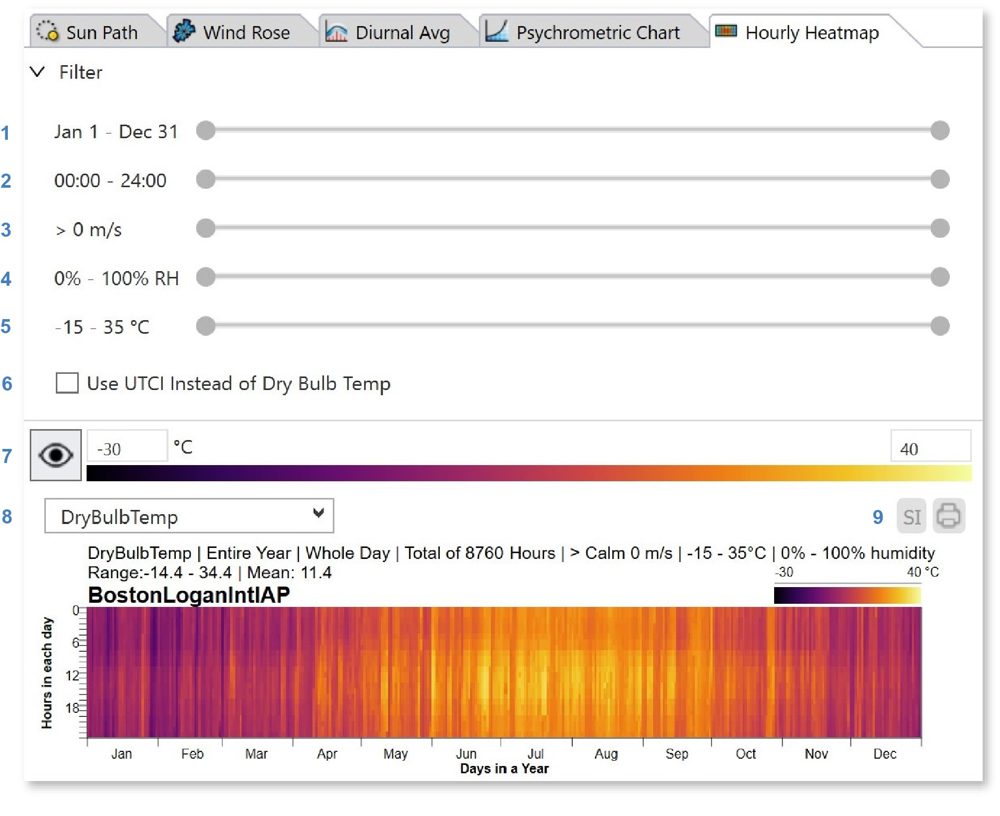
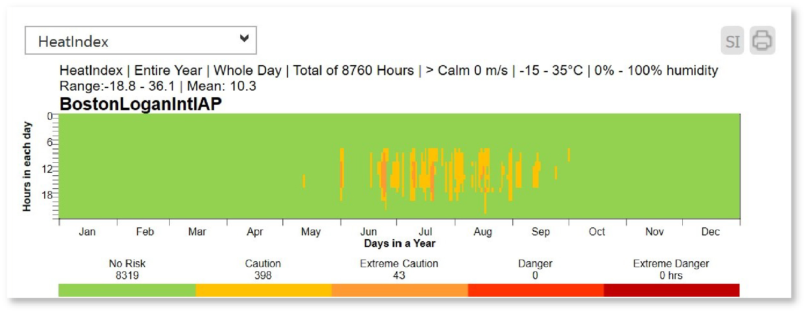

Hourly Heatmap
================================================
The Hourly Heatmap tab plots weather data using a gridded falsecolor map, which displays a data cell for every hour of the year. Hours of day are plotted along the y-axis, and days of year along the x-axis.

To isolate time periods in the weather file, use the range sliders at the top of the panel, which constrain the data by date (1), hour (2), windspeed (3), relative humidity (4), and temperature (5). The sliders are *wrappable*, meaning the start and end anchors can be dragged past one another to select winter or nighttime periods. Change between using UTCI and dry bulb temperature for the calculations using the checkbox (6). Use the display settings (7) to change the falsecolor scale, and the menu (9) to change units or `export`_ the plot to PNG or PDF. The metric dropdown (8) lets you select among the following parameters:

.. _export: exportPlots.html

- **Dry Bulb Temperature**
- **Wet Bulb Temperature**
- **Relative Humidity**
- **Wind Speed**
- **Direct Normal Radiation**
- **Diffuse Horizontal Radiation**
- **Global Horizontal Radiation**
- **UTCI** 
- **Heat Index** 

UTCI, or Universal Thermal Climate Index, measures the heat stress on the human body induced by a set of climatic conditions -- including air temperature, humidity, wind, and radiation. The metric includes filters for wind protection and sun shading, which remove the impact of wind and direct solar radiation, respectively, for each timestep in the weather file:

.. figure:: images/result_panelHeatmapUTCI.png
   :width: 900px
   :align: center
   

Heat Index (HI) is another measure of heat stress that uses relative humidity and dry bulb temperature to deduce the likelihood of heat disorders with prolonged exposure or strenuous activity . The metric is based off the `National Weather Service’s (NWS) heat forecast tools`_. For each timestep in the climate file, the HI heatmap gives an indication of date, time, temperature, and a heat index of either no risk, caution, extreme caution, danger, or extreme danger.

.. _National Weather Service’s (NWS) heat forecast tools: https://www.weather.gov/safety/heat-index

