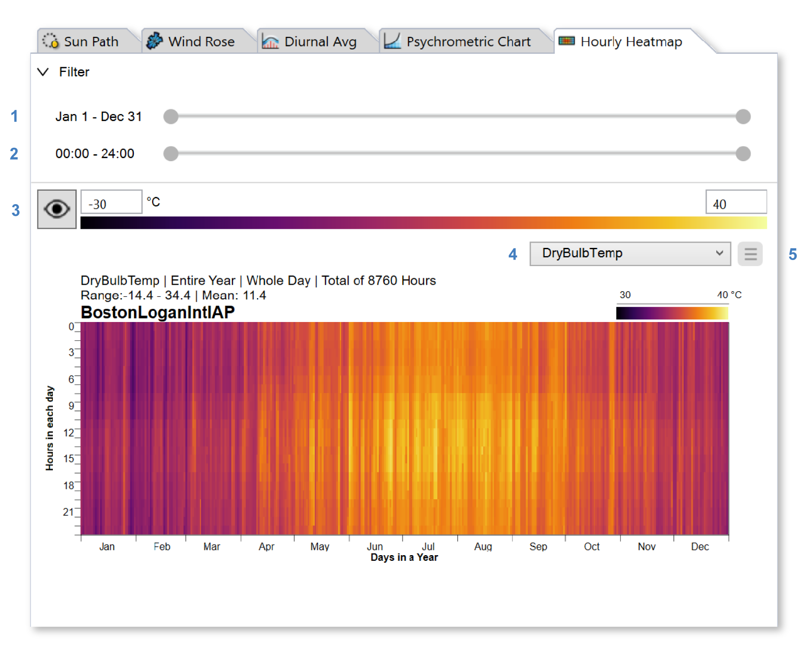
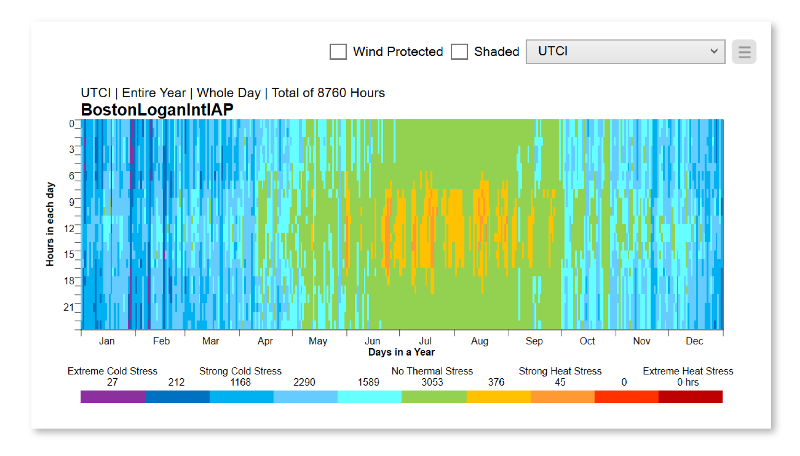

Hourly Heatmap
================================================
The Hourly Heatmap tab plots weather data using a gridded falsecolor map, which displays a data cell for every hour of the year. Hours of day are plotted along the y-axis, and days of year along the x-axis.

To isolate time periods in the weather file, use the range sliders at the top of the panel, which constrain the data by date (1) and hour (2). The sliders are *wrappable*, meaning the start and end anchors can be dragged past one another to select winter or nighttime periods. Use the display settings (3) to change the falsecolor scale, and the menu (5) to change units or `export`_ the plot to PNG or PDF. The metric dropdown (4) lets you select among the following parameters:

.. _export: exportPlots.html

- **Dry Bulb Temperature**
- **Relative Humidity**
- **Wind Speed**
- **Direct Normal Radiation**
- **Diffuse Horizontal Radiation**
- **Global Horizontal Radiation**
- **UTCI** 

UTCI, or Universal Thermal Climate Index, measures the heat stress on the human body induced by a set of climatic conditions -- including air temperature, humidity, wind, and radiation. The metric includes filters for wind protection and sun shading, which remove the impact of wind and direct solar radiation, respectively, for each timestep in the weather file:

