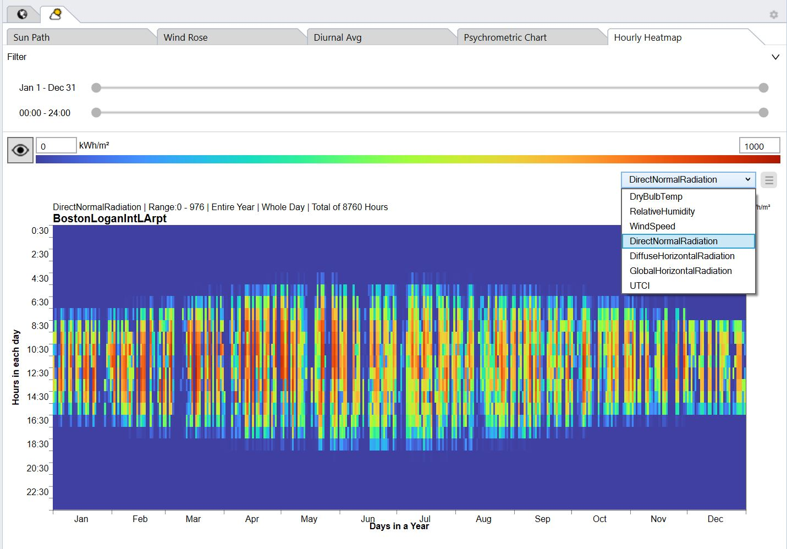

Hourly Heatmap
================================================

The Hourly Heatmap plot shows every single hour of the year by color for a given data set. 

It supports the following data: 

- **Dry Bulb Temperature**
- **Relative Humidity**
- **Wind Speed**
- **Direct Normal Radiation**
- **Diffuse Horizontal Radiation**
- **Global Horizontal Radiaion**
- **UTCI** including filters for with/without wind protection, and with/without sun shading

Clicking on the drop-down menu switches between different data sets. 

Clicking on the button to the left of the legend switches the false color used for data visualization. 

Changing the min/max number above the legend will update the graph's colors. 

Two `filters`_ may be applied to the Hourly Heatmap: 

- **Days** of the year as a range (wraps around)
- **Hours** of the day as a range (wraps around)

.. _filters: doubleSliderFilters.html