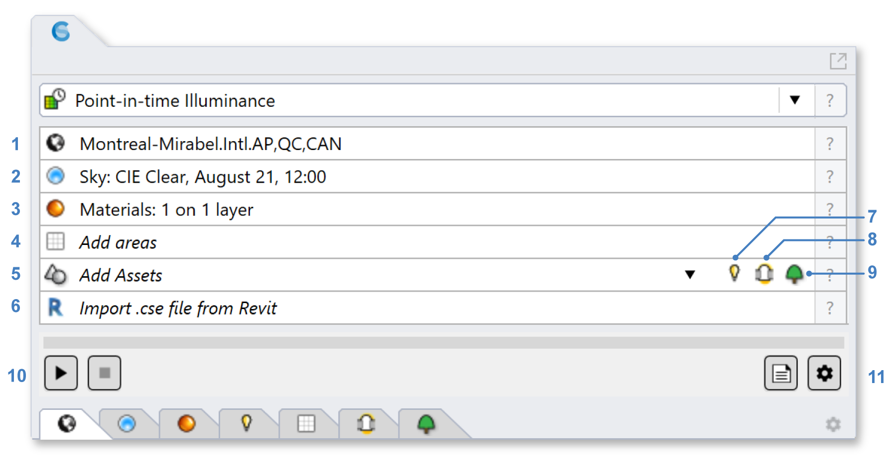
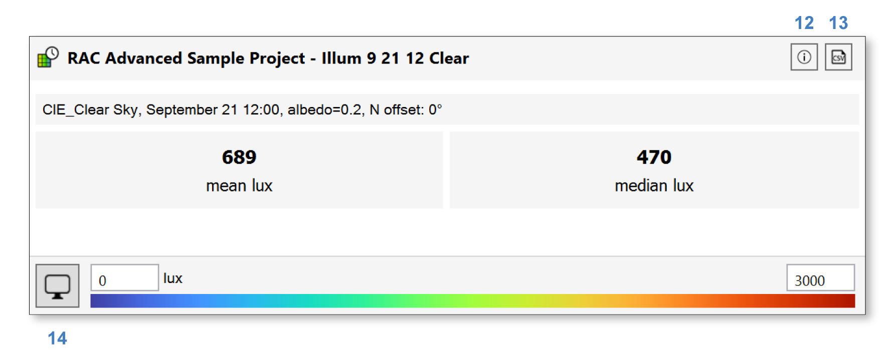
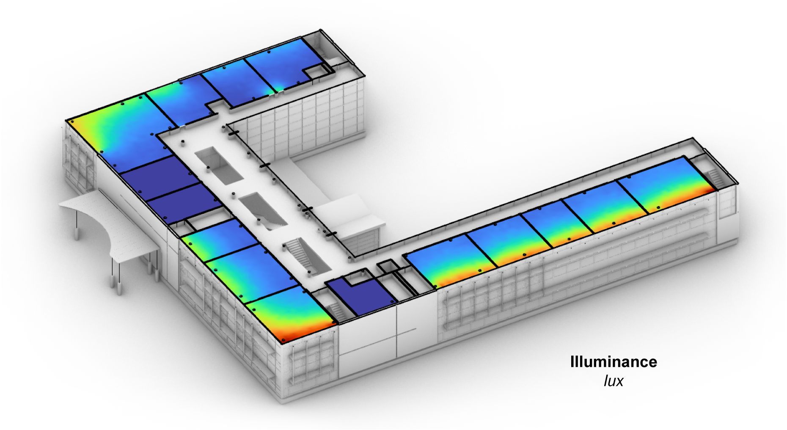

Point-in-Time Illuminance
================================================
This workflow supports the calculation of illuminance distributions for electric lighting and/or daylight at specific moments in time.

Simulation Setup
-----------------------

To prepare a model for simulation, work your way through the six subpanels labeled 1-6 in the figure above.

| 1 - `Location`_
| 2 - `Sky`_
| 3 - `Materials`_
| 4 - `Scene Objects`_ (optional): `Luminaires`_ (7),  `Tubular Daylighting Devices`_ (8), and `Trees`_ (9)
| 5 - `Occupied Areas`_ 
| 6 - `Import .cse file from Revit`_ (optional)

.. _Location: location.html

.. _Sky: sky.html

.. _Materials: materials.html

.. _Luminaires: luminaires.html

.. _Occupied Areas: occupiedAreas.html

.. _Tubular Daylighting Devices: TDDs.html

.. _Import .cse file from Revit: revitImporter.html

.. _Trees: tree.html

.. _Scene Objects: sceneObjects.html

If you have not done any lighting simulations in ClimateStudio, it is recommended that you initially go through the `Lighting Model Setup`_ video tutorial (5 minutes). 
The Rhino file used in the tutorial is available for `download`_.

.. _Lighting Model Setup: https://vimeo.com/392379928 
.. _download: https://climatestudiodocs.com/ExampleFiles/CS_Two_Zone_Office.3dm
 

Once all required inputs have been populated, a simulation is invoked by pressing the start button (10). ClimateStudio uses a `progressive path-tracing`_ version of the Radiance raytracer to simulate illuminance distributions. 
While a simulation is in progress, traced light paths accumulate until the user-specified number of passes has been reached. 
Details on the simulation settings can be found by opening the `settings dialog`_ (11).
 
.. _progressive path-tracing: https://www.solemma.com/blog/why-is-climatestudio-so-fast
.. _settings dialog: pathTracingSettings.html

Simulation Results
------------------------
Upon completion of the first pass, or upon loading a saved result, the `results panel`_ will show a dashboard with the mean and median illuminance for all simulated floor areas. 

.. _results panel: results.html

At the top of the panel, an info dialog (12) reports simulation inputs, while a CSV export (13) saves results to an Excel-readable format. At the bottom, a legend and settings menu (14) provide options for customizing the falsecolor display, which is shown in the Rhino viewport:

