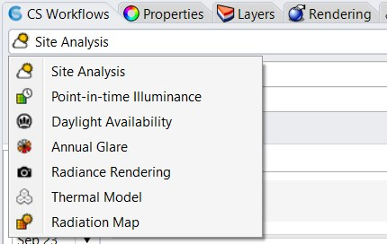

Learning ClimateStudio
================================================
To get started using ClimateStudio we recommend that you watch the video tutorials on the `Solemma web site.`_ Start with the 3 minute `Interface Overview`_ and then go to any 
of the design analysis workflows:

.. _Solemma web site.: https://solemma.com/TrainingClimateStudio.html

.. _Interface Overview: https://vimeo.com/392379382

- `Site Analysis`_ 
- `Radiation Map`_
- `Point-in-time Illuminance`_
- `Daylight Availability`_
- `Annual Glare`_
- `Radiance Render`_
- `Thermal Model`_ 

.. _Site Analysis: siteAnalysis.html 

.. _Radiation Map: radiationMap.html 

.. _Point-in-time Illuminance: point-in-timeIlluminance.html

.. _Daylight Availability: daylightAvailability.html 

.. _Annual Glare: annualGlare.html

.. _Radiance Render: radianceRender.html

.. _Thermal Model: thermalModel.html

To get to any of these workflows, open Rhino, search for the ClimateStudio toolbar (see below) and select a workflow. If the toolbar is not visible after you installed ClimateStudio,
type "Toolbar" on the Rhino command line, find ClimateStudio and switch the toolbar on. 

.. image:: images/CS_toolbar.gif
   :width: 400px
   :align: center

.. figure:: images/workflows.jpg
   :width: 200px
   :align: center
   
After selecting any of these workflows, the CS workflow panel will open up. The panel is dockable, meaning that you can drag and drop it to make it part of your Rhino workspace. You can switch between workflows via the ClimateStudio toolbar or by using the top pull-down menu in the CS workflow panel.

As a side note, if you are unfamiliar with computer aided design (CAD) software in general or Rhino in particular, you might want to go through online training such as the `Lynda tutorials for Rhino.`_ 

If you are interested in learning more about the theory underlying the different ClimateStudio workflows, some of the material provided below might be useful:

- `MIT open courseware`_ for 4.401/4.464 Environmental Technologies in Buildings (lecture notes from MIT)
- EdX course on `Sustainable Building Design`_ (free course that runs about twice a year)
- `Daylighting Handbooks`_ (designer-friendly textbooks for students and practitioners)

.. _Lynda tutorials for Rhino.: https://www.lynda.com/Rhino-training-tutorials/302-0.html

.. _MIT open courseware: https://ocw.mit.edu/courses/architecture/4-401-environmental-technologies-in-buildings-fall-2018/

.. _Sustainable Building Design: https://www.edx.org/course/environmental-technologies-in-buildings

.. _Daylighting Handbooks: https://buildingtechnologypress.com/Books.html

