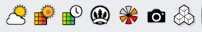
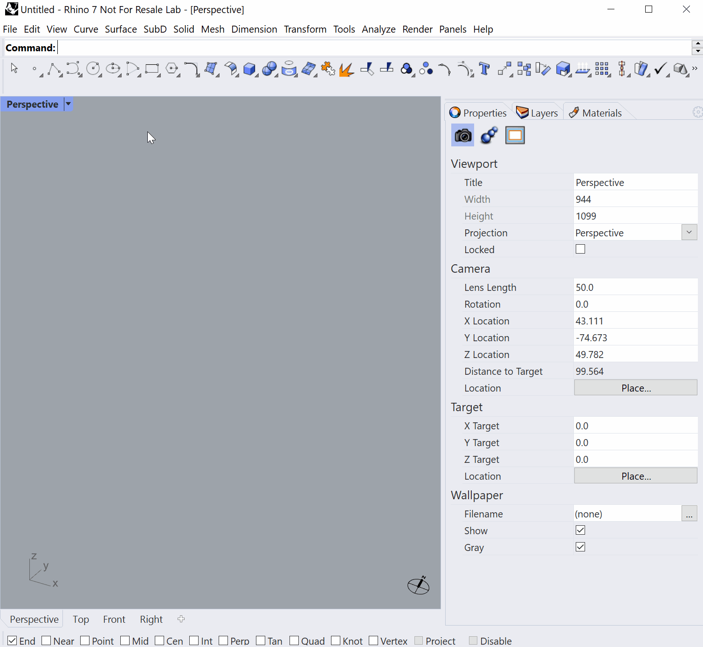

Learning ClimateStudio
================================================
Watching the short video tutorials on the `Solemma web site`_ will get you up and running with ClimateStudio in less than an hour. 

Most new users learn ClimateStudio through the graphical user interface (GUI) within Rhinoceros 3D. However, if you prefer working in Grasshopper, we have prepared dozens of `GH definitions`_ to get you started quickly. 

Begin with the 3 minute `Interface Overview`_. After that you are ready to explore any of the workflows:

.. _Solemma web site: https://solemma.com/TrainingClimateStudio.html

.. _Interface Overview: https://vimeo.com/392379382

- `Site Analysis`_ 
- `Radiation Map`_
- `Point-in-time Illuminance`_
- `Daylight Availability`_
- `Annual Glare`_
- `Radiance Render`_
- `Thermal Analysis`_ 
- `View Analysis`_ 

.. _Site Analysis: siteAnalysis.html 

.. _Radiation Map: radiationMap.html 

.. _Point-in-time Illuminance: point-in-timeIlluminance.html

.. _Daylight Availability: daylightAvailability.html 

.. _Annual Glare: annualGlare.html

.. _Radiance Render: radianceRender.html

.. _Thermal Analysis: thermalModel.html

.. _View Analysis: viewAnalysis.html

.. _GH definitions: grasshopperTemplates.html 

================================================

Start using ClimateStudio by opening Rhino and look for the ClimateStudio toolbar.

If the toolbar is not there, type 'toolbar' into the Rhino command line and checkmark the visibility. Once visible, the toolbar can also be floated in the viewport or docked as a panel.

