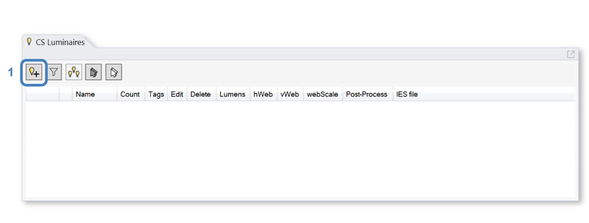
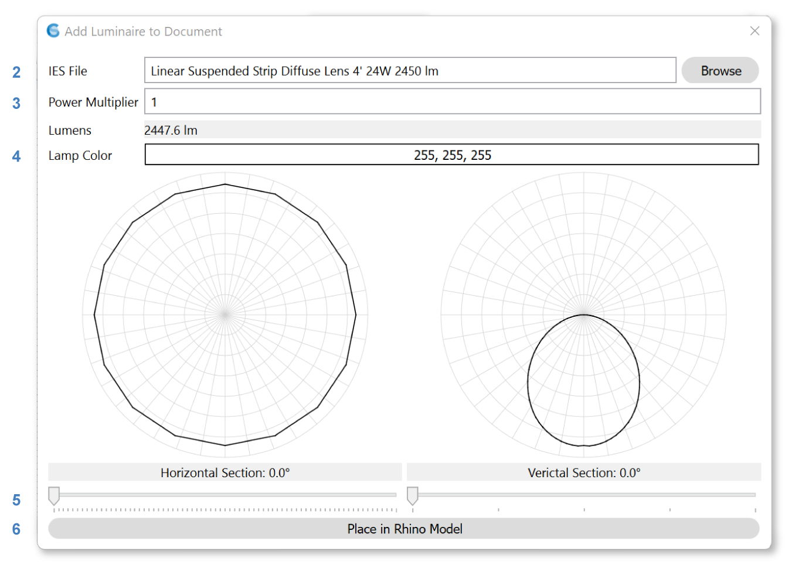
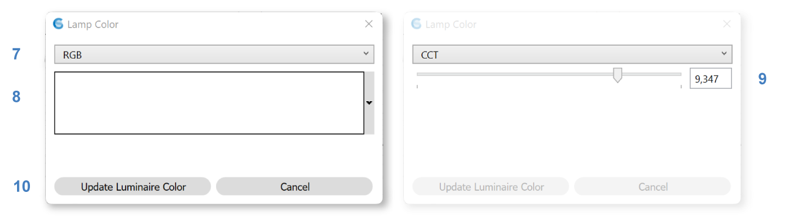
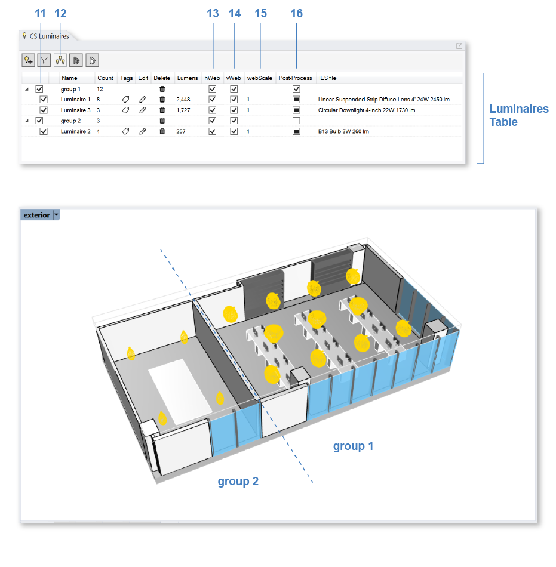
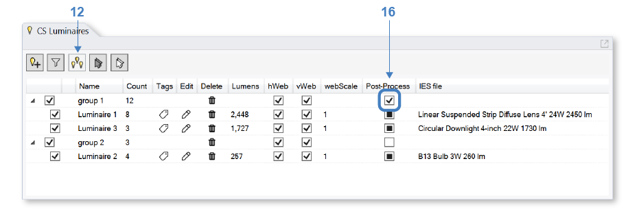
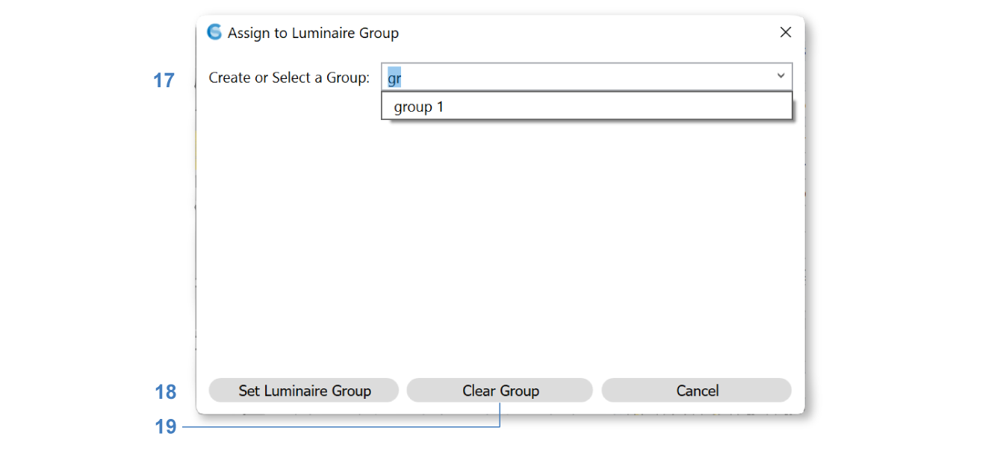

Luminaires
================================================
ClimateStudio supports lighting calculations for daylit and electrically lit scenes. The daylight source is defined in the `Sky panel`_. For electric-lighting-only simulations, the sky can simply be set to nighttime. 

.. _Sky panel: sky.html

The Luminaires panel is used to select real-world luminaire products and place them in the Rhino model, either individually or in groups. To place a luminaire, left-click on the *Add Luminaire* button (**1**).

   
A dialog will appear, allowing the user to browse through a series of IES files (**2**) that come with ClimateStudio. 
An IES file is a manufacturer-supplied text file that provides the luminous intensity distribution of a lighting product on a spherical grid. 
This data is usually displayed three-dimensionally as a photometric web or in horizontal and vertical sections (**5**). 
Most lighting manufacturers provide IES files of their products on their websites. 
If you are experiencing difficulty locating an IES file for a specific product, try the `IES library`_. 

.. _IES library: https://ieslibrary.com/en/home

In addition to selecting an IES file, the dialog provides a multiplier field (**3**) for scaling its total brightness (this is sometimes referred to as a loss factor).

Luminaire Color
<<<<<<<<<<<<<<<<<<<<<<<<<<<<<<<

Click on the RGB value (**4**) to change the luminaire's color. 

A dialog will appear with a drop-down (**7**) to switch between RGB color space and CCT, which generates a Planckian-locus color at the specified temperature. 
RGB colors are edited by clicking on the color box (**8**). 
CCT colors are set by typing a color temperature value or adjusting the slider (**9**). Color changes will affect the spectrum of the luminaire but not its luminous power.
Click *Update Luminaire Color* (**10**) to commit changes. 

Once luminaire selection is complete, click the *Place in Rhino Model* button (**6**), 
which places the luminaire in the Rhino model at a user-specified point.
To create additional copies of the luminaire, simply use the *copy* or *array* commands in Rhino. 
Copying luminaires creates multiple instances of the same object (using block instances), 
allowing the entire set of instances to be edited in concert. 

Luminaires Table
<<<<<<<<<<<<<<<<<<<<<<<<<<<<<<<

The Luminaires Table lists all luminaire objects in the model, and facilitates editing and deleting groups, as well as controlling their display in the viewport. 

The checkbox in the table's far left column (**11**), along with the visibility of the luminaire blocks in Rhino, 
determines whether a luminaire is included in renderings and point-in-time illuminance calculations. 
**Only luminaires that are visible and enabled at the moment a simulation starts are included in the analysis.**

The *hWeb* (**13**) and *vWeb* (**14**) toggles control the visibility of the 3d photometric web preview, while the *webScale* (**15**) column controls its size. 

In the scene above, eight instances of *Luminaire 1* have been arranged in a 4x2 grid in the larger office space, 
three instances of *Luminaire 3* are placed at the center of the larger office space, 
and four instances of *Luminaire 2* are arranged in the small meeting room. 

Luminaire Groups for Post-Processing
<<<<<<<<<<<<<<<<<<<<<<<<<<<<<<<<<<<<<

Luminaires can be grouped to better organize the model or to control different luminaire objects together in the post-processing of a rendered scene. 
In the model above, *Luminaire 1* and *Luminaire 3* are placed into group 1, and *Luminaire 2* is placed into group 2. 
If a group's *Post-Process* box (**16**) is checked, its rendered brightness and color will be independently controllable during post-processing, as described `here`_.

.. _here: radianceRender.html#post-processing-of-luminaire-groups

To assign luminaires to a group, select the luminaire item(s) in the table and click the *Assign to Luminaire Group* button (**12**). 

A dialog will appear, allowing you to set, edit, or clear group assignments. Choose an existing group by clicking on the drop-down or create a new group by typing in a new group name (**17**).
Click on *Set Luminaire Group* (**18**) to commit changes or click on *Clear Group* (**19**) to remove the luminaire from any group. 

